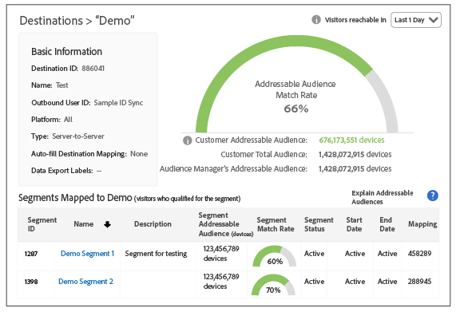

# [!UICONTROL Addressable Audiences] {#addressable-audiences}

En översikt över funktionen [!UICONTROL Addressable Audience] och användningsexempel.

## Vad är en [!UICONTROL Addressable Audience]? {#addressable-audience-description}

Funktionen [!UICONTROL Addressable Audiences] visar överlappningen mellan de målgrupper du ser i alla dina egenskaper där [!DNL Audience Manager] samlar in data och det valda målet. Ta en titt på bilden nedan för att få en förståelse för detta koncept. Överlappningen mellan varje cirkel representerar olika typer av adresserbara målgrupper.

| Mått | Beskrivning |
|---|---|
| [!UICONTROL Audience Manager Addressable Audience] för en [!UICONTROL Destination] | Antal alla enheter som har interagerat med alla [!DNL Audience Manager]-kunder på plattformsnivå under rapportens kontrollperiod och som kan matchas med din valda [!UICONTROL destination].   Det här måttet är användbart eftersom det visar dig: <ul><li>Storleken på det totala [!UICONTROL addressable audience] som [!DNL Audience Manager] kan nå för ett visst mål [!UICONTROL destination].</li><li>Hur stor profilpoolen [!DNL Audience Manager] är för en målplattform och deras målgrupper.</li></ul> |
| [!UICONTROL Customer Total Audience] | Antal enheter som antingen har fått en [!UICONTROL rule-based trait] på dina egenskaper eller en [!UICONTROL onboarded trait] från dina offlinefiler under kontrollfönstret. |
| [!UICONTROL Customer Addressable Audience] | Antal överlappningar av enheter som antingen har fått en [!UICONTROL rule-based trait] eller en [!UICONTROL onboarded trait] under kontrollfönstret och enheter som har en ID-synkronisering med den valda [!UICONTROL destination] oavsett synkroniseringstidpunkten.  Detta mått representerar enheter som:<ul><li>Har antingen fått ett [!UICONTROL rule-based] eller ett [!UICONTROL onboarded trait] under summeringsfönstret `AND`</li><li>Ha en ID-synkronisering med den valda [!UICONTROL destination] oavsett synkroniseringstidpunkten.</li> |
| [!UICONTROL Customer Match Rate] | [!UICONTROL Customer Addressable Audience]‡ [!UICONTROL Customer Total Audience] uttryckt i procent. |
| [!UICONTROL Total Segment Population] | Antal alla enheter som var medlemmar i [!UICONTROL segment] under rapportens kontrollperiod. |
| [!UICONTROL Segment Addressable Audience] | Antalet användare som har tillhört [!UICONTROL segment] under rapportens summeringsperiod och har en aktiv ID-synkronisering på din plats. [!UICONTROL Segments] kan innehålla egna data från första part samt data från andra och tredje part, via [!UICONTROL traits] som du har köpt i [Audience Marketplace](../features/audience-marketplace/marketplace-data-buyers/marketplace-data-buyers.md).   Tips! När du använder det här måttet med en dagars summeringsperiod kan det hjälpa dig att förstå det aktuella läget för [!UICONTROL segments]. Detta beror på att måttet [!UICONTROL Segment Addressable Audience] representerar de användare som stannat i [!UICONTROL segment] under föregående dag. Kombinera det här med det faktum att [!DNL Audience Manager] uppdaterar [!UICONTROL Addressable Audiences] dagligen, och kombinerar den här mätnings- och uppslagsperioden, vilket ger den senaste ögonblicksbilden av [!UICONTROL segments]. |
| [!UICONTROL Segment Match Rate] | [!UICONTROL Segment Addressable Audience]‡ [!UICONTROL Total Segment Population] uttryckt i procent. |

## Gränssnitt för [!UICONTROL Addressable Audiences] {#addressable-audience-interface}

Funktionen [!UICONTROL Addressable Audience] förvandlar det här abstrakta konceptet till kvantifierbara data. I [!DNL Audience Manager] visar den här funktionen målgrupper som överlappar datavisualiseringar som ger snabböverskådlig information tillsammans med numeriska data i tabellform.

[!UICONTROL Addressable Audiences] finns i **[!UICONTROL Audience Data > Destinations]**. Välj **[!UICONTROL Integrated Platforms > Device-Based]** om du vill se adresserbara målgruppsmått.

De tre mätvärdena som du kan se på [!UICONTROL Addressable Audiences]-landningssidan representerar:

| Mått | Beskrivning |
|---------|----------|
| **[!UICONTROL Addressable Audience (Device)]** | Detta mått representerar [!UICONTROL Customer Addressable Audience] (som beskrivs i tabellen ovan) *för de senaste 30 dagarna.* |
| **[!UICONTROL Match Rate]** | Det här måttet representerar [!UICONTROL Addressable Audience Match Rate] (som beskrivs i tabellen ovan) *för de senaste 30 dagarna*. |
| **[!UICONTROL Lifetime Addressable Audience (Device)]** | Antal alla enheter som har interagerat med alla [!DNL Audience Manager]-kunder på plattformsnivå under rapportens kontrollperiod och som kan matchas med denna [!UICONTROL destination]. Mer information finns i [Metrisk på plattformsnivå](/help/using/features/addressable-audiences.md#platform-level-metrics). |

Klicka på namnet på en [!UICONTROL server-to-server destination] för att visa dina adresserbara målgruppsdata. Obs! Den här funktionen returnerar endast data för [!UICONTROL server-to-server destinations] och åtkomst kräver administratörsbehörighet.

Genom att granska dessa data kan du

* **Prognos och planering:** [!UICONTROL Segment Addressable Audience] data ger dig mer detaljrikedom i de segment som du planerar att skicka till ett mål för målgruppsanpassning och aktivering.

* **Prestandagranskningar:** Funktionen [!UICONTROL Addressable Audiences] är också ett felsökningsverktyg. Ni kan granska kampanjens resultat, förstå kampanjens räckvidd och dubbelkontrollera med målgrupps-/aktiveringspartners om ni inte ser de resultat ni förväntar er.

### Prospektera med data från tredje part och effekter för matchningsfrekvenser

Innan man köper data från tredje part för att värva målgrupper kan man validera överlappningen med andra dataleverantörer. Detta kan hjälpa er att fatta ett välgrundat beslut innan ni köper nya data. ID-synkroniseringen för inköpt information från tredje part är inte bara beroende av att dina data överlappar varandra, utan även av tredjepartsleverantörernas fotavtryck med alla andra [!DNL Audience Manager]-kunder. Din [!DNL Adobe]-konsult kan hjälpa dig att identifiera ytterligare relevanta datakällor för att optimera prospekteringskampanjer.

### Mobilanvändare och matchningsfrekvenser

Det finns luckor när du försöker ansluta [!DNL Safari] eller mobilappsanvändare där det inte finns någon [!DNL cookies] från tredje part. Det gör det svårt att synkronisera användare med vissa partner, eftersom endast dessa [!DNL Adobe] ID:n för synkroniserad tredje part [!DNL cookies] anges i medieleveransloggarna. Detta är en orsak till att du kanske ser [låga matchningsfrekvenser](../features/addressable-audiences.md#low-match-rates) för din [!UICONTROL destinations].

## Datumintervall i [!UICONTROL Addressable Audiences] och [!UICONTROL Destinations] {#date-ranges}

Läs avsnitten nedan om tillgängliga datumintervall och hur data lagras utifrån varje intervall i rapporter för en [!UICONTROL Addressable Audience] eller [!UICONTROL Destination].

## Tillgängliga datumintervall och tidszoner {#available-date-ranges}

<!-- addressable-audience-dates.xml -->

Rapporter för dina [!UICONTROL Addressable Audiences]- och [mål](../features/destinations/destinations.md) använder samma datumintervall. Alternativen för datumintervall är:

* [!UICONTROL Last 1 Day] (Det här intervallet går från Midnight till Midnight under den föregående 24-timmarsperioden. Det är inte ett reellt mått eller ett mått för aktuell tid.)
* [!UICONTROL Last 7 Days]
* [!UICONTROL Last 14 Days]
* [!UICONTROL Last 30 Days]
* [!UICONTROL Last 60 Days]
* [!UICONTROL Last 90 Days]
* [!UICONTROL Lifetime]

Alla datum och datumintervall anges i tidszonen [!DNL UTC]. Se [Tidszoner i Audience Manager](../reference/aam-time-zones.md).

## Data i datumintervallintervall {#date-range-intervals}

Måtten [!UICONTROL Addressable Audience] och [!UICONTROL Destination] returnerar antalet unika användare för det valda tidsintervallet. En besökare räknas till exempel bara en gång, även om de kommer till platsen flera gånger. Det första besöket är det unika besöket och registreras. De följande besöken är återkommande besök och räknas inte eftersom de inte är unika.

Datumintervall innehåller data för det valda tidsintervallet eller äldre. Och data försvinner från varje rapportintervall när tiden går. Låt oss anta att du ser 2 besökare efter att du har valt alternativet [!UICONTROL Last 30 Days]. I rapporterna kan följande besökare:

* *Kommer att* inkluderas i resultaten som returneras av de längre tidsintervallen (60 dagar, 90 dagar och Livstid).
* *Ingår inte i* i de kortare intervall som föregår alternativet [!UICONTROL Last 30 Day] (Aktuell, 7 dagar och 14 dagar).

Och på dag 31 visas de här besökarna bara på 60 dagar, 90 dagar och [!UICONTROL Lifetime] resultat. De har åldrats utanför 30-dagarsintervallet. Besökarna åldras inte utanför intervallet [!UICONTROL Lifetime].

## [!UICONTROL Addressable Audiences] mått {#addressable-audience-metrics}

I det här avsnittet beskrivs de typer av mått som tillhandahålls av [!UICONTROL Addressable Audiences].

### Kundnivåstatistik {#customer-level-metrics}

<!-- addressable-audience-metrics.xml -->

Dessa mått returnerar data för egenskaper som realiseras när besökare kommer till din webbplats eller när du skickar inkommande datafiler till [!DNL Audience Manager]. Dessa mått ger en heltäckande bild av målgruppens storlek för ditt konto.

| Mått | Beskrivning |
|---|---|
| [!UICONTROL Customer Addressable Audience] | Antal överlappningar av enheter som antingen har fått en [!UICONTROL rule-based trait] eller en [!UICONTROL onboarded trait] under kontrollfönstret och enheter som har en ID-synkronisering med den valda destinationen oavsett synkroniseringstidpunkten.  Detta mått representerar enheter som:<ul><li>Har antingen fått ett [!UICONTROL rule-based] eller ett [!UICONTROL onboarded trait] under summeringsfönstret `AND`</li><li>Ha en ID-synkronisering med den valda [!UICONTROL destination] oavsett synkroniseringstidpunkten.</li></ul> |
| [!UICONTROL Customer Total Audience] | Antal enheter som antingen har fått en [!UICONTROL rule-based trait] på dina egenskaper eller en [!UICONTROL onboarded trait] från dina offlinefiler under kontrollfönstret. |
| [!UICONTROL Customer Match Rate] | [!UICONTROL Customer Addressable Audience]‡ [!UICONTROL Customer Total Audience] uttryckt i procent. |

### Matchningsmått på segmentnivå {#segment-level-metrics}

Dessa mått returnerar data för [!UICONTROL segment]-medlemskap. De ger en mer detaljerad och korrekt bild av målgruppens storlek för var och en av dina [!UICONTROL segments].

>[!NOTE]
>
>Det sätt som fönstret för att titta tillbaka tillämpas på [!UICONTROL segment]-nivån skiljer sig från det på kundnivå. Besökarna kan komma till webbplatsen för [!UICONTROL trait] 10 dagar sedan och kan kvalificera sig för en [!UICONTROL segment] sedan dess och sedan lämna webbplatsen för [!UICONTROL segment] för 2 dagar sedan. När 7-dagars summering används räknas dessa besökare på [!UICONTROL segment]-nivå men inte på kundnivå.

| Mått | Beskrivning |
|---|---|
| [!UICONTROL Segment Addressable Audience] | Antalet användare som har tillhört [!UICONTROL segment] under rapportens summeringsperiod och har en aktiv ID-synkronisering på din plats. Segment kan innehålla egna data från första part samt data från andra part och från tredje part, via [!UICONTROL traits] som hämtas i [Audience Marketplace](../features/audience-marketplace/marketplace-data-buyers/marketplace-data-buyers.md).  Tips! När du använder det här måttet med en dagars summeringsperiod kan det hjälpa dig att förstå det aktuella läget för [!UICONTROL segments]. Detta beror på att måttet [!UICONTROL Segment Addressable Audience] representerar de användare som stannat i [!UICONTROL segment] under föregående dag. Kombinera det här med det faktum att [!DNL Audience Manager] uppdaterar [!UICONTROL Addressable Audiences] dagligen, och kombinerar den här mätnings- och uppslagsperioden, vilket ger den senaste ögonblicksbilden av [!UICONTROL segments]. |
| [!UICONTROL Total Segment Population] | Antal alla enheter som var medlemmar i [!UICONTROL segment] under rapportens kontrollperiod. |
| [!UICONTROL Segment Match Rate] | [!UICONTROL Segment Addressable Audience]‡ [!UICONTROL Total Segment Population] uttryckt i procent. |

### Plattformsnivåstatistik {#platform-level-metrics}

Det här måttet returnerar data om aktiviteter som samlats in över alla [!DNL Audience Manager]-kunder. De kan ge en bredare bild av kundens målgrupp jämfört med de samlade [!DNL Audience Manager]-kunderna.

| Mått | Beskrivning |
|---|---|
| [!DNL Audience Manager] [!UICONTROL Addressable Audience] | Antal alla enheter som har interagerat med alla [!DNL Audience Manager]-kunder på plattformsnivå under rapportens kontrollperiod och som kan matchas med din valda [!UICONTROL destination].   Det här måttet är användbart eftersom det visar dig:<ul><li>Storleken på [!UICONTROL total addressable audience] som [!DNL Audience Manager] kan nå på ett visst målmål.</li><li>Hur stor profilpoolen [!DNL Audience Manager] är för en målplattform och deras målgrupper.</li></ul> |

## Jämför [!UICONTROL Customer] och [!UICONTROL Segment Addressable Audiences] {#comparing-metrics}

Du bör inte jämföra måtten [!UICONTROL Customer Addressable Audience] och [!UICONTROL Segment Addressable Audience] för att avgöra om ett är större än det andra. Dessa är separata, olika och oberoende mätvärden. Såsom beskrivs i definitionerna ovan, härleds vart och ett av dessa från olika datauppsättningar. Därför bör du undvika att dra några slutsatser om ett mätvärde är större än det andra. Allt du kan säga när du jämför dessa är att:

* [!UICONTROL Customer Addressable Audiences] baseras på [!UICONTROL trait] realisationer *för dina egna förstapartsdata*. Detta mätresultat ger en bred, heltäckande bild av er integrering med en datapartner.

* [!UICONTROL Segment Addressable Audiences] baseras på segmentkvalifikationer *för dina egna data, plus data från andra och tredje part*. Det här måttet ger en mer detaljerad och korrekt vy av [!UICONTROL addressable audiences] på en målplattform.

## Orsaker till låg matchningsfrekvens för [!UICONTROL Addressable Audiences] {#low-match-rates}

Vanliga element som ligger bakom låga [!UICONTROL Addressable Audience] matchningsfrekvenser eller avvikelser i rapporterade tal.

| Orsak | Beskrivning |
|---|---|
| Mobiltrafik | De flesta [!UICONTROL server-to-server]-integreringar är beroende av synkroniseringsprocesser som hanteras av tredje part [!DNL cookies]. I mobilmiljöer används dock inte [!DNL cookies] från tredje part. Därför kan dina [!UICONTROL Addressable Audiences]-tal verka låga jämfört med storleken [!UICONTROL segment].   Från och med januari 2018 kan du aktivera mobila målgrupper i samma [!DNL Google] - och [!DNL Adobe Advertising Cloud] -mål som har konfigurerats för [!UICONTROL cookie-based] målgrupper. Detta innebär att du kan skicka [!UICONTROL segments] med kombinerat medlemskap för [!DNL cookie] och mobilt ID till dina mål för [!DNL Google] och [!DNL Advertising Cloud], men tänk på att [!UICONTROL Addressable Audiences] bara visar överlappningen mellan [!DNL cookie] ID:n och mål. [!DNL Audience Manager] skickar 100 % av de mobila målgrupperna till [!UICONTROL destinations], men de mobila målgrupperna mäts inte av [!UICONTROL Addressable Audience]-måttet.   **Obs!**: Ta till exempel en [!UICONTROL segment] med en befolkning på 1 000 000. Om du mappar denna [!UICONTROL segment] till ett [!DNL Google]- eller [!DNL Adobe Advertising Cloud]-mål kanske du ser en [!UICONTROL Addressable Audience] på 700 000 enheter och en [!UICONTROL Match Rate] på 70 %. Medlemskapet på 700 000 består av [!DNL cookie] ID:n som har en ID-synkronisering med [!UICONTROL destination]. [!UICONTROL Addressable Audience] kan faktiskt vara mycket högre eftersom adresserbara mobil-ID:n inte visas i det här måttet. |
| [!DNL Safari]-trafik | [!DNL Safari] blockerar tredje part [!DNL cookies]. Detta förhindrar [!DNL Audience Manager] från att synkronisera ID:n med [!UICONTROL destination]. I och med introduktionen av [ITP 2.0](https://webkit.org/blog/8311/intelligent-tracking-prevention-2-0/) kan du förvänta dig att [!UICONTROL addressable audiences] inte inkluderar [!DNL Safari] användare. |
| Spårade mediaexponeringar | På grund av de bästa metoderna för annonsservrar görs inga ID-synkroniseringar i annonstaggar. Kunder som gör en stor mängd annonsering utanför webbplatsen synkroniserar inte användare med tredjepartsintegreringar i dessa miljöer. Dessutom kan ett stort antal insamlade mediainvisningsdata minska antalet [!UICONTROL addressable audience]. |

## Felsökning med [!UICONTROL Addressable Audiences] {#troubleshooting}

Förutom att använda matchningsfrekvenser på ytan kan du även använda [!UICONTROL Addressable Audiences] som ett felsökningsverktyg.

Anta att du skickar ett segment till en [!UICONTROL destination] och att [!UICONTROL destination] visar låga rapporteringssiffror. Om du kontrollerar [!UICONTROL Addressable Audience]-resultaten visas om det är ett tekniskt problem eller bara ett fall med låg matchningsfrekvens. En låg matchningsfrekvens visar att din [!UICONTROL destination] inte är så bra för dina valda segment. En skillnad i [!UICONTROL total addressable audience]-numren mellan [!DNL Audience Manager] och [!UICONTROL destination] indikerar emellertid ett integrerings-, synkroniserings- eller annat tekniskt problem. Kontakta i så fall din kontoansvarige.
