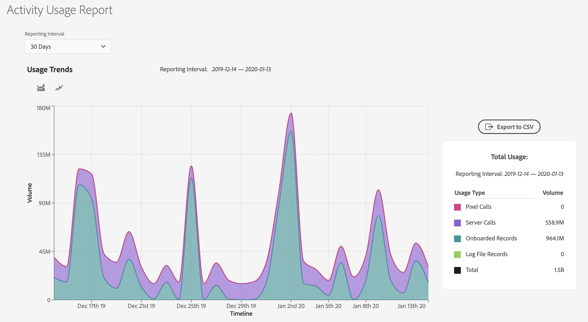

# [!UICONTROL Activity Usage Reporting] {#activity-usage-reporting}

## Översikt {#overview}

Med [!UICONTROL Activity Usage Report] kan du visa och spåra aktivitetsanvändningen för din Audience Manager-instans, vilket ger dig en tydlig uppfattning om hur aktivitetsanvändningen ser ut jämfört med ert avtalsåtagande.

Dessutom kan du ladda ned [!UICONTROL Activity Usage Report] när du behöver för registrering och anpassad analys.

## Överväganden {#considerations}

[!UICONTROL Activity Usage Report] är tillgänglig för alla Audience Manager-användare med [administratörsbehörighet](edit-account-settings.md).

>[!IMPORTANT]
>
>[!UICONTROL Activity Usage Report] visar aktivitetsanvändningsstatistik för din Audience Manager-instans. Om du har några faktureringsfrågor som rör din aktivitetsanvändning kan du kontakta din Adobe-representant.

## Användningsexempel {#use-cases}

Det finns två huvudsakliga användningsfall för [!UICONTROL Activity Usage Report]:

* **Spårning av faktisk instansaktivitetsanvändning jämfört med ditt användningsåtagande för aktivitet**: De flesta kunder har ett uppskattat aktivitetsåtagande per månad och Audience Manager, som sedan kumuleras till ett årligt aktivitetsåtagande för alla instanser. Även om den här rapporten inte är en faktureringsrapport kan den ge användbar vägledning om du överskrider den allokerade aktivitetsanvändningen.
* **Verifiering för implementeringsändringar**: Om du nyligen har uppdaterat implementeringen, t.ex. konfigurerat vidarebefordran på [!DNL Adobe Analytics] server eller ändrat inställningarna för serversamtal på [!DNL Adobe Target] kan den här rapporten hjälpa dig att kontrollera om den nya aktivitetsvolymen är i linje med den förväntade aktivitetsvolymen.

## Använda [!UICONTROL Activity Usage Report] {#using}

Om du vill visa [!UICONTROL Activity Usage Report] loggar du in på ditt Audience Manager-konto och går till **[!UICONTROL Administration]** > **[!UICONTROL Usage]**.

Använd sedan filtret **[!UICONTROL Reporting Interval]** för att välja tidsintervall för att generera rapporten. Du kan välja mellan 30, 60, 90 dagar eller ett anpassat datumintervall.

När rapporten har lästs in kan du se en beskrivning av din [!UICONTROL Activities] för den valda perioden.

[!UICONTROL Activities] definierar den sammanlagda summan av alla interaktioner på plats och utanför webbplatsen med Audience Manager, uppdelat i följande kategorier:

* **[!UICONTROL Server Calls]**: Alla datainsamlings- eller hämtningshändelser som skickas till Audience Manager från webbplatser, servrar, e-post, mobilprogram eller andra system.
* **[!UICONTROL Pixel Calls](tidigare [!UICONTROL Impression Server Calls])**: Data som samlats in från annonser (till exempel visningsvolym från en målinriktningsplattform) eller e-postvisningsanrop till Audience Manager. Dessa kräver att parametern `d_event` finns i frågesträngen.
* **[!UICONTROL On-Boarded Records]**: Unika poster som hämtas från ditt eget CRM-system eller andra offlinedatafiler, till exempel callcenters poster, enhets-ID:n och anpassade dataflöden från externa dataleverantörer.
* **[!UICONTROL Log File Records]**: Unika poster från loggfiler som har hämtats till Audience Manager från en målplattform.

>[!NOTE]
>
>En unik post definierar varje enskild datapost i en fil som lagras av Adobe för en Audience Manager-kunds räkning.

Du kan dessutom använda diagramtyperna [!UICONTROL Activity Usage Trends] för att växla mellan två typer av diagram.

Du kan också hålla markören över ett visst datum på tidslinjen för att se hur det datumet används i detalj.

## Exporterar [!UICONTROL Activity Usage Reports] {#export}

Om du vill få en bättre översikt över din aktivitetsnivå i Audience Manager kan du exportera [!UICONTROL Activity Usage Report] baserat på vilken typ av poster som du vill inkludera.

Rapporterna **[!UICONTROL Onboarded Records Breakdown]** och **[!UICONTROL Onsite Server Calls Breakdown]** ger den mest detaljerade insikten om källdata som är tillgängliga för dessa aktiviteter. Den volym som tilldelas dessa uppdelningar baseras på implementeringen.

### [!UICONTROL Onboarded Records Breakdown] {#onboarded-breakdown}

Den här rapporten innehåller onboardade poster uppdelade efter datakälla.

### [!UICONTROL Onsite Server Calls Breakdown] {#onsite-breakdown}

Den här rapporten innehåller en beskrivning av serveranrop från tre källor: [!UICONTROL Analytics], [!UICONTROL Target] och [!UICONTROL Other].

* **[!UICONTROL Analytics]**: Det här är fakturerbara serveranrop som skickas från alla [!UICONTROL Adobe Analytics]-instanser till Audience Manager, inklusive vidarebefordran på serversidan. Sekundära serveranrop eller dubblettserveranrop (som vid vidarebefordran på serversidan från flera rapportsviter) är inte fakturerbara aktiviteter, så de ingår inte i den här uppdelningen.
* **[!UICONTROL Target]**: Det här är anrop på serversidan från [!UICONTROL Adobe Target] till Audience Manager för att hämta segmentdata från Audience Manager som en del av en server-till-server-integrering.
* **[!UICONTROL Other]**: Inkluderar samtal från andra webbplatser eller system (partnerwebbplatser, direkta serversamtal osv.), mobilwebbläsare/appsamtal via [!DNL SDK], [!DNL DIL], händelsesamtal och [!DNL DCS] samtal. Inkluderar även samtal från [!DNL Target] om de har konfigurerats som en cookie-integrering (i stället för server-till-server).
