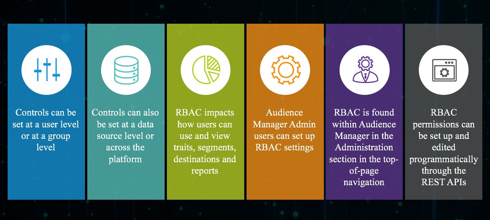

# Administration (RBAC-kontroller) {#administration}

Med alternativen på [!UICONTROL Administration] menyn kan du skapa Audience Manager-användare och tilldela dem till grupper. Du kan också visa gränser (egenskaper, segment, mål och modeller).

Företagskunder som använder [!DNL Audience Manager] en enda datahanteringsplattform för alla sina data, men måste kunna styra synligheten av olika dataelement för specifika affärsenheter. Du kan uppnå detta med gruppbehörigheter, som också kallas [!UICONTROL Role-Based Access Control] ([!UICONTROL RBAC]).

[!DNL Audience Manager] använder grupper för att tilldela behörigheter. Behörigheter tilldelas inte på användarnivå. Gruppbehörigheter är knutna till objekt (egenskaper, segment osv.) och åtgärder som du kan utföra på dessa objekt (redigera, visa, osv.). Dessa kontroller är också tillgängliga via Audience Manager REST API:er. Se API-metoder för [användarhantering](/help/using/api/rest-api-main/aam-api-user-group-permission/aam-api-user.md), [grupphantering](/help/using/api/rest-api-main/aam-api-user-group-permission/aam-api-group.md)och [behörighetshantering](/help/using/api/rest-api-main/aam-api-user-group-permission/aam-api-permissions.md) .

## Skapa användare {#create-users}

<!-- t_create_users.xml -->

Skapa användare i [!DNL Audience Manager] och ange användarinformation, inloggningsstatus och tilldela användare till grupper.

1. Klicka på **[!UICONTROL Administration]** > **[!UICONTROL Users]**.
1. Klicka  för att visa [!UICONTROL Create New User] sidan.
1. Under **[!UICONTROL User Details]** Fyll i fälten:
   * **Användarnamn:** Ange ett unikt användarnamn för Audience Manager.
   * **Förnamn:** Ange användarens förnamn.
   * **Efternamn:** Ange användarens efternamn.
   * **E-postadress:** Ange användarens e-postadress. [!DNL Audience Manager] skickar inte vanliga meddelanden till användarna. [!DNL Audience Manager] administratörer har tillgång till användarnas e-postadresser och kan manuellt skicka e-post till användare efter behov. Om en användare t.ex. glömmer sitt lösenord, används den e-postadress som anges i det här fältet för att skicka ett tillfälligt lösenord och instruktioner för att återställa lösenordet.
   * **Telefonnummer:** Ange användarens telefonnummer.
   * **Är administratör:** Ange om användaren är [!DNL Audience Manager] administratör. Administratörsanvändare kan hantera användare (skapa, redigera osv.) och grupper (skapa, tilldela behörigheter osv.). Användare som inte är administratörer kan bara styra sina egna användarprofiler, inklusive redigera sina e-postadresser och återställa sina egna lösenord. Mer information finns i [Redigera dina kontoinställningar](../../features/administration/edit-account-settings.md).
1. Under **[!UICONTROL Login]** väljer du önskad status:
   * **Aktiv:**  Aktiva användare kan komma åt [!DNL Audience Manager] och ha de behörigheter som beviljas genom gruppmedlemskap.
   * **Inaktiverad:**  Inaktiverade användare kan inte komma åt [!DNL Audience Manager] och har inga behörigheter. Om du inaktiverar användare finns användarinformationen kvar [!DNL Audience Manager] och du kan enkelt återaktivera dem om det behövs. Om du tar bort användare måste du återskapa dem om de behöver använda dem [!DNL Audience Manager] igen i framtiden.
   * **Utgånget:** En användares lösenord är äldre än 90 dagar.
   * **Väntande:** Användaren har ett tillfälligt lösenord, antingen efter en lösenordsåterställning eller som ett helt nytt konto, och har ännu inte angett ett permanent lösenord.
   * **Utelåst:** 5 felaktiga inloggningsförsök låser en användare.
1. I **[!UICONTROL Assigned Groups]**listrutan väljer du de grupper som du vill tilldela användaren till.
Mer information om grupper och behörigheter finns i [Skapa en grupp](../../features/administration/administration-overview.md#create-group).
1. Klicka på **[!UICONTROL Save]**.

## Skapa en grupp {#create-group}

En *grupp* är en samling användare som delar åtkomsträttigheter till mål-, segment- och trait-objekt. Du kan begränsa grupper till endast enskilda objekt eller ge dem bred åtkomst till kombinationer av olika objekt.

<!-- t_create_groups.xml -->

Så här skapar du en grupp:

1. Klicka på **[!UICONTROL Administration]** > **[!UICONTROL Groups]**.
1. Klicka  för att öppna [!UICONTROL Group Settings] sidan.
1. I [!UICONTROL Group Details]:
   * Ge gruppen ett namn.
   * Ange en kort gruppbeskrivning.
1. I [!UICONTROL Group Members]klickar du på en användare bland **[!UICONTROL Add Users]** alternativen för att lägga till dem i gruppen.
1. I [!UICONTROL Group Permissions]väljer du en [egenskap](../../features/traits/trait-details-page.md), ett [segment](../../features/segments/segments-purpose.md)eller ett [mål](../../features/destinations/destinations.md) från **[!UICONTROL Add Object]**.
Då öppnas ett behörighetsfönster för det markerade objektet.
1. Markera kryssrutan för de behörigheter som du vill att gruppmedlemmar ska ha.
1. *(Valfritt)* Tilldela behörigheter [för](../../features/administration/administration-overview.md#wild-card-permissions) jokertecken till gruppen.
1. Klicka på **[!UICONTROL Save Group]**.

## Förstå behörigheter för jokertecken {#wild-card-permissions}

Förenkla hanteringen av grupprättigheter med [!UICONTROL Wild Card Permissions].

<!-- c_wildcard_permissions.xml -->

[!UICONTROL Wild Card Permissions] ge gruppmedlemmar automatisk åtkomst till alla datakällor som är kopplade till ett segment, mål eller egenskap. I vanliga behörigheter kan du bara tilldela specifika datakällor till ett av dessa objekt. Och när du lägger till nya datakällor får gruppmedlemmarna inte tillgång till de nya källorna.

Du måste öppna gruppbehörigheterna och tilldela de nya datakällorna till gruppen. [!UICONTROL Wild Card Permissions] kan du undvika den här manuella uppdateringsprocessen för datakällor. Grupper med [!UICONTROL Wild Card Permissions] åtkomst till nya datakällor utan explicit behörighet.

Nedan finns en beskrivning av vad varje jokerbehörighet betyder:

**Trait**

* `MAP_ALL_TRAITS_TO_MODELS` - Användare kan välja egenskaper som baslinje för modeller.
* `EDIT_ALL_TRAITS` - Användare kan redigera alla egenskaper som har ställts in i deras företagskonto.
* `VIEW_ALL_TRAITS` - Användare kan visa alla egenskaper som har konfigurerats i deras företagskonto.
* `DELETE_ALL_TRAITS` - Användare kan ta bort alla egenskaper som har ställts in i deras företagskonto.
* `CREATE_ALL_ALGO_TRAITS` - Användare kan skapa algoritmiska egenskaper.
* `MAP_ALL_TO_SEGMENTS` - Användare kan lägga till egenskaper som tillhör deras företag till segment.
* `CREATE_ALL_TRAITS` - Användare kan skapa egenskaper.

**Rapporter**

* `PTRREPORTS` - Denna jokerbehörighet refererar till föråldrade funktioner och kommer att tas bort från användargränssnittet i Audience Manager inom kort.

**Modeller**

* `VIEW_MODELS` - Användare har behörighet att visa modeller som tillhör deras företag.

**Härledda signaler**

* `VIEW_DERIVED_SIGNALS` - Användare kan visa alla härledda signaler som tillhör deras företag.
* `CREATE_DERIVED_SIGNALS` - Användare kan skapa härledda signaler.
* `EDIT_DERIVED_SIGNALS` - Användare kan redigera alla härledda signaler som tillhör deras företag.
* `DELETE_DERIVED_SIGNALS` - Användare kan ta bort alla härledda signaler som tillhör deras företag.

**Mål**

* `EDIT_ALL_DESTINATIONS` - Användare kan redigera alla destinationsinställningar som gjorts i deras företagskonto.
* `CREATE_DESTINATIONS` - Användare kan skapa mål.
* `VIEW_ALL_DESTINATIONS` - Användare kan visa alla destinationer som är konfigurerade i deras företagskonto.
* `DELETE_ALL_DESTINATIONS` - Användare kan ta bort alla destinationer som är inställda i deras företagskonto.

**Taggar**

* `VIEW_TAGS` - Användare kan göra allt (visa, skapa, redigera, ta bort) i sina taggbehållare.

**Audience Lab**

* `MANAGE_SEGMENT_TEST_GROUPS` - Användare kan göra allt (visa, skapa, redigera, ta bort) i sina Audience Lab-testgrupper.

**Segment**

* `CREATE_ALL_SEGMENTS` - Användare kan skapa segment.
* `DELETE_ALL_SEGMENTS` - Användare kan ta bort alla segment som har konfigurerats i deras företagskonto.
* `MAP_ALL_TO_DESTINATIONS` - Användare kan mappa alla segment som tillhör deras företag till destinationer.
* `EDIT_ALL_SEGMENTS` - Användare kan redigera alla segment som har konfigurerats i deras företagskonto.
* `MAP_ALL_SEGMENTS_TO_MODELS` - Användare kan välja segment som baslinje för modeller.
* `VIEW_ALL_SEGMENTS` - Användare kan visa alla segment som har konfigurerats i deras företagskonto.

**Signaler**

* `VIEW_ALL_SIGNALS` - Användare kan visa alla signaler som samlats in i [Data Explorer](/help/using/features/data-explorer/data-explorer-overview.md).

## Användningsexempel {#use-cases}

### Övervaka användaråtkomst {#monitoring-user-access}

[!UICONTROL Role-Based Access Control] kan hjälpa dig att övervaka inloggningsstatus och ge dig en tydlig bild av vem som har åtkomst till din Audience Manager-instans.

Beroende på dina affärskrav kan du aktivera och inaktivera användarkonton efter behov.

### Skydda känsliga datakällor {#protect-sensitive-data-sources}

Du kan konfigurera [!UICONTROL Role-Based Access Control] på trait-, segment- och målnivå för varje användargrupp.

Med den här funktionen kan du hantera hur användarna visar, skapar, läser, skriver och redigerar specifika datauppsättningar och till och med hindra användare från att komma åt datauppsättningar som inte ska vara tillgängliga för dem.

