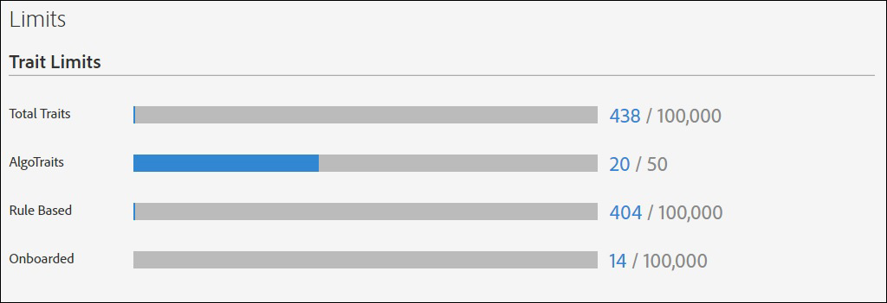

# Användningsgränser {#usage-limits}

Audience Manager sätter en maxgräns för antalet egenskaper, segment, mål och algoritmiska modeller som du kan skapa för ett konto. Begränsningar gäller för de här objekten oavsett om de har skapats i användargränssnittet eller via [!DNL API]-metoder. Användningsbegränsningar skyddar Audience Manager mot automatiserade processer som kan äventyra våra [!DNL API]s- eller användargränssnitt.

## Gränser för ID-mappning {#id-mapping-limits}

Tabellen nedan visar gränserna för [ID-mappning](../../integration/sending-audience-data/batch-data-transfer-explained/id-sync-http.md) för enhets-ID:n. När ett ID når någon av gränserna nedan lägger Audience Manager till nya ID-mappningar som baseras på en FIFO-logik (först in, först ut) genom att ta bort den äldsta lagrade ID-mappningen och lägga till den nya. Mer information om vilka ID:n som stöds av Audience Manager finns i [Index för ID:n](../../reference/ids-in-aam.md) i Audience Manager.

| ID-mappning | Maximal gräns |
|-----------|-------------- |
| Enhetens annonserings-ID ([DAID](../../reference/ids-in-aam.md)) till enhets-ID ([DPUID](../../reference/ids-in-aam.md)) | 100 ID för enhetsannonsering ([DAID](../../reference/ids-in-aam.md)) till 1 ID för olika enheter ([DPUID](../../reference/ids-in-aam.md)) |
| Enhets-ID ([DPUID](../../reference/ids-in-aam.md)) till enhets-ID ([DAID](../../reference/ids-in-aam.md)) | 10 enhets-ID ([DPUID](../../reference/ids-in-aam.md)) till 1 enhets-ID ([DAID](../../reference/ids-in-aam.md)), för varje [DPID](../../reference/ids-in-aam.md) |
| Cookie/browser ID to cookie/browser ID | 1000 cookie/browser IDs to 1 cookie/browser ID |

## Objektgränser {#item-limits}

Tabellerna visar de aktuella gränserna per objekttyp. Du kan inte skapa nya egenskaper, segment, mål eller [!UICONTROL Algorithmic Models] om du når en viss gräns för något av dessa objekt. Om du når en gräns måste du ta bort ett äldre objekt innan du kan skapa ett nytt.

### Trait Limits

| Trait Type | Maximal gräns |
| -------------------------- | ------------------------------------- |
| Totalt antal egenskaper | 100 000 |
| Kompetens totalt | 150 000. Mer information om kvalificering av trait finns i Gräns för trait-kvalificering i [Referens för trait-kvalificering](/help/using/features/traits/trait-and-segment-qualification-reference.md#trait-qualification-limit). |
| Algoritmisk | 50 |
| Regelbaserad | 100 000 |
| Anonboarding | 100 000 |
| Mappegenskaper | 2 000 |

{style=&quot;table-layout:auto&quot;}

### Segmentgränser

| Segmenttyp | Maximal gräns |
| -------------- | ------------- |
| Totalt antal segment | 20 000 |

### Målgränser

| Måltyp | Maximal gräns |
| ------------------ | ------------- |
| Totalt antal destinationer | 1 000 |
| Cookie | 1 000 |
| URL | 1 000 |
| S2S | 100 |
| Adobe Analytics | 10 |

### Begränsningar för algoritmiska modeller

| Objekt | Maximal gräns |
| -------- | ----- |
| Aktiv [!UICONTROL Look-Alike Models] | 20. Endast Audience Manager räknar *aktiva* algoritmiska modeller mot gränsen. |
| [!UICONTROL Look-Alike Models] maximal målgruppsstorlek | 25 000 000.  Observera att den här gränsen inte kan ökas. Du kan minska målgruppsstorleken genom att välja färre datakällor för modellen eller genom att välja ett kortare fönster för att titta tillbaka. |
| Maximalt antal uteslutna egenskaper för en [!UICONTROL Look-Alike Model] | 500. Se [Trait Exclusion in Algorithmic Modeling](/help/using/features/algorithmic-models/trait-exclusion-algo-models.md). |
| Maximalt [!UICONTROL Predictive Audiences Models] | 10 |
| Högsta antal baslinjeprofiler för [!UICONTROL Predictive Audiences Models] | 50 |

{style=&quot;table-layout:auto&quot;}

### Mappbegränsningar

| Objekt | Maximal gräns |
| ------------- | ------------------ |
| Trait Folders | 2 000.  Mappstrukturen kan vara högst fem nivåer djup. |

### Begränsningar för härledda signaler

| Objekt | Maximal gräns |
| --------------- | ------------- |
| Härledda signaler | 50 000. |

### Begränsning av företagskonton

| Objekt | Maximal gräns |
| ----------- | ------------- |
| Maximalt antal användarkonton för ett företag | 1000. |

## Bildskärmsanvändning {#monitor-usage}

Du kan se användning och begränsningar för ditt konto genom att gå till **[!UICONTROL Administration > Limits]**. Åtkomst kräver administratörsbehörighet.

## Öka objektgränser {#increase-item-limits}

De standardgränser som anges här bör ge tillräcklig kapacitet för dina affärsbehov. Om din organisation konsekvent når dessa gränser kontaktar du din kontorepresentant för att diskutera en ökning.