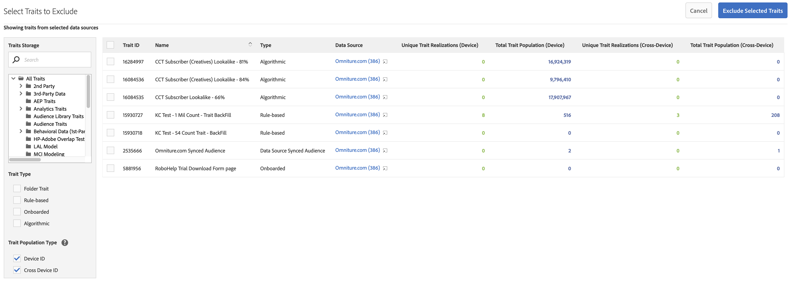

# Look-Alike Modeling: Uteslutning av trait {#algorithmic-models-trait-exclusion}

[!UICONTROL Trait Exclusion] har ytterligare kontroller i modelleringsarbetsflödet, vilket gör att du kan lägga till nödvändiga skyddsspår till modellen, baserat på din domänexpertis och lagstadgade krav. Använd alternativet [!UICONTROL Exclusions] för att välja vilka egenskaper som ska ignoreras när du skapar modeller från en eller flera datakällor.

## Användningsexempel {#use-cases}

Här är några exempel du kan ta upp med [!UICONTROL Trait Exclusion]:

* [!UICONTROL Trait Exclusion] Med kan du utesluta vissa egenskaper som fångar upp alla, t.ex. egenskaper för besökare på platsen, så att du inte missar modellen, vilket leder till platta resultat.
* Du kan ta bort egenskaper som du inte känner till eller inte litar på från en datakälla för att bättre förstå de inflytelserika egenskaperna.
* Ni kan utesluta vissa egenskaper, t.ex. demografiska egenskaper, för att hjälpa till med eventuella efterlevnadskrav.

>[!IMPORTANT]
>
>En viktig kommentar om det tredje användningsfallet. Om tredjepartsleverantören av data lägger till en ny demografisk egenskap i dataflödet *efter att du har skapat modellen*, hämtas egenskapen automatiskt upp av modellen. Du kan inte utesluta egenskaper från modelleringen när du har skapat modellen. Se [Viktiga aspekter och begränsningar](../../features/algorithmic-models/trait-exclusion-algo-models.md#important-aspects-and-limitations). Var försiktig när du använder den här funktionen och samarbeta med dataleverantören för att försäkra dig om att du får information om eventuella ändringar i flödesstrukturen.

## Så här använder du undantag {#how-to-use}

Använd [Skapa ett modellarbetsflöde](../../features/algorithmic-models/create-model.md#build-model) för att skapa nya algoritmiska modeller.

1. Markeringen är nedtonad tills du väljer en eller flera datakällor för modellering. [!UICONTROL Exclusions]
2. När du har valt en eller flera datakällor för modellering trycker du på **[!UICONTROL Browse All Traits]**.
3. I **[!UICONTROL Select Traits to Exclude]** fönstret ser du alla egenskaper som är kopplade till de datakällor du valde tidigare. Välj de egenskaper som du vill utesluta.
4. Du kan filtrera egenskaperna efter trait-typ, trait-populationstyp ([enhets-ID](../../reference/ids-in-aam.md) och [Cross-Device ID](../../reference/ids-in-aam.md)) eller bläddra bland trait-mapparna. Observera att trait-mappar bara visar de egenskaper som är kopplade till de valda datakällorna.
5. Tryck **[!UICONTROL Exclude Selected Traits]**.

>[!TIP]
>
>Du kan utesluta hela mappar genom att utesluta mappens egenskaper i stället för att utesluta egenskaperna i mappen, en efter en. I en mapp med 20 egenskaper behöver du t.ex. bara utesluta mappens egenskaper i stället för att exkludera alla egenskaper en i taget.

Om du föredrar videosjälvstudiekurser kan du titta på vår videodemonstration om undantag för trait:

>[!VIDEO](https://video.tv.adobe.com/v/25569/?quality=12)

Titta dessutom på videon nedan för att få en detaljerad bild av hur enhetsövergripande mätvärden fungerar.

>[!VIDEO](https://docs.adobe.com/content/help/en/audience-manager-learn/tutorials/build-and-manage-audiences/profile-merge/understanding-cross-device-metrics-in-audience-manager.html)

## Viktiga aspekter och begränsningar {#important-aspects-and-limitations}

Observera följande aspekter och begränsningar i samband med [!UICONTROL Trait Exclusion]:

<table id="table_BA5C3545BC9E4717BD567B00C803AA53"> 
 <thead> 
  <tr> 
   <th colname="col1" class="entry"> Objekt </th> 
   <th colname="col2" class="entry"> Beskrivning </th>
  </tr> 
 </thead>
 <tbody> 
  <tr> 
   <td colname="col1"> 
Exkluderade egenskaper i modellsammanfattningsvyn 
 </td>
   <td colname="col2"> 
De uteslutna egenskaperna visas <i>inte</i> i vyn Sammanfattning av modeller. Du kan bara se de undantagna egenskaperna i arbetsflödet <b> Redigera modell</b> . 
 </td>
  </tr> 
  <tr> 
   <td colname="col1"> 
Rollbaserade åtkomstkontroller (RBAC) 
 </td>
   <td colname="col2"> 
Observera följande begränsningar för företag som använder <a href="../../features/administration/administration-overview.md#administration"> RBAC</a>: 
 

     <ul id="ul_38A4056C235B428C822EA4A353893786"> 
      <li id="li_2624FB35581F4807B8530910D63FFDBF">Om du inte har åtkomst till att visa ett spår <i>kan du inte</i> välja det som ska uteslutas från modellen. </li>
      <li id="li_3FD7A12AAAA8462EA84A760C05F20379">Om du inte har åtkomst till att visa ett spår <i>kan du inte</i> visa det i listan med undantagna egenskaper. </li>
     </ul> 
 </td>
  </tr> 
  <tr> 
   <td colname="col1"> 
Ändra undantagna egenskaper efter att du sparat modellen 
 </td>
   <td colname="col2"> 
Du kan inte ändra de uteslutna egenskaperna när du har skapat och sparat en modell. Om du vill justera resultatet kan du klona modellen och ändra de uteslöta egenskaperna. 
 </td>
  </tr> 
  <tr> 
   <td colname="col1"> 
Maximalt antal egenskaper som du kan utesluta 
 </td>
   <td colname="col2"> 
Det maximala antalet egenskaper som du kan utesluta från en modell är 500. Använd mappegenskaper för att maximera dina undantag. 
 </td>
  </tr> 
  <tr> 
   <td colname="col1"> 
Uteslut baslinjetrafik 
 </td>
   <td colname="col2"> 
Baslinjetrafiken är som standard exkluderad, så den visas inte i listan <b> Undantag</b> när modellen skapas. 
 </td>
  </tr>
 </tbody>
</table>

Titta på videon nedan för att lära dig hur och varför du ska exkludera vissa egenskaper från en [!UICONTROL Look-Alike Model].

>[!VIDEO](https://video.tv.adobe.com/v/25569/)

## Relaterade länkar

* [Om algoritmiska egenskaper](/help/using/features/algorithmic-models/understanding-models.md)
* [Uteslutning av trait - självstudiekurs](https://helpx.adobe.com/audience-manager/kt/using/excluding-traits-look-alike-model-feature-video-use.html)