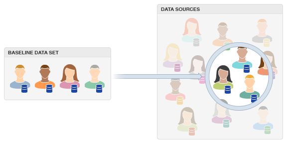

# Förstå [!UICONTROL Look-Alike Modeling] {#about-algorithmic-models}

## Hitta nya användare med [!UICONTROL Look-Alike Modeling] {#find-new-users}

[!UICONTROL Look-Alike Modeling] hjälper er att identifiera nya, unika målgrupper genom automatiserad dataanalys. Processen startar när du väljer en [!UICONTROL trait] eller [!UICONTROL segment], ett tidsintervall samt första och tredje part [!UICONTROL data sources]. Dina val innehåller indata för den algoritmiska modellen. När analysprocessen körs letar programmet efter berättigade användare baserat på delade egenskaper från den valda populationen. När uppgifterna är klara finns de i [Trait Builder](../../features/traits/about-trait-builder.md) där du kan använda den för att skapa egenskaper baserat på [exakthet och räckvidd](../../features/traits/trait-accuracy-reach.md). Dessutom kan du skapa segment som kombinerar algoritmiska egenskaper med [!UICONTROL rules-based traits] och lägga till andra kvalifikationskrav med [!DNL Boolean] uttryck och jämförelseoperatorer. [!UICONTROL Look-Alike Modeling] ger dig ett dynamiskt sätt att extrahera värde från alla tillgängliga trait-data.

## Fördelar {#advantages}

De största fördelarna med att använda [!UICONTROL Look-Alike Modeling] inkludera:

* **Noggrannhet:** Algoritmen körs regelbundet, vilket bidrar till att hålla resultaten aktuella och relevanta.
* **Automatisering:** Du behöver inte hantera en stor uppsättning statiska regler. Algoritmen hittar målgrupper åt er.
* **Spara tid och minska arbetet:** Med vår modelleringsprocess behöver du inte gissa vad [!UICONTROL traits]/[!UICONTROL segments] kan arbeta eller lägga tid på att hitta nya målgrupper i kampanjer. Modellen kan göra detta åt dig.
* **Tillförlitlighet:** Modellering fungerar med processer för identifiering och kvalificering på serversidan som utvärderar dina egna data och utvalda tredjepartsdata som du har tillgång till. Det innebär att du inte behöver se besökarna på din webbplats för att kvalificera dem för ett yrke.

## Arbetsflöde {#workflow}

Du hanterar modeller i **[!UICONTROL Audience Data > Models]**. På en hög nivå omfattar arbetsflödesprocessen följande:

* Markera de baslinjedata som du vill att algoritmen ska utvärdera. Detta inkluderar [!UICONTROL trait] eller [!UICONTROL segment], tidsintervall och [!UICONTROL data sources] (egna data och data från tredje part som ni redan har tillgång till via [!DNL Audience Manager]). I arbetsflödet för att skapa modeller kan du utesluta [!UICONTROL traits] som du inte vill störa din modell.
* Spara modellen. När den har sparats körs den algoritmiska utvärderingsprocessen automatiskt. Observera att det kan ta upp till 7 dagar innan den här processen är klar. [!DNL Audience Manager] skickar ett e-postmeddelande till dig när algoritmen är klar och resultaten är tillgängliga för [!UICONTROL trait] skapa.
* Skapa algoritmisk [!UICONTROL traits] in [!UICONTROL Trait Builder].
* Kombinera [!UICONTROL traits] till [!UICONTROL segments] in [!UICONTROL Segment Builder].
* Skapa och skicka [!UICONTROL segment] data till [!UICONTROL destination].

## Felsökning {#troubleshooting}

Vi inaktiverar alla [!UICONTROL Look-Alike Model] som inte kan generera data för tre på varandra följande körningar. Observera att du inte kan ange status för modellen till aktiv i efterhand. Vi rekommenderar att du bygger modeller från datakällor med tillräcklig kapacitet för att dina modeller ska kunna generera data [!UICONTROL traits] att samla in data från.

## Förstå [!UICONTROL TraitWeight] {#understanding-traitweight}

[!UICONTROL TraitWeight] är en egen algoritm som är utformad för att upptäcka nya [!UICONTROL traits] automatiskt. Jämför [!UICONTROL trait] data från din nuvarande [!UICONTROL traits] och [!UICONTROL segments] mot alla andra data från första och tredje part som du har tillgång till via [!DNL Audience Manager]. I det här avsnittet finns en beskrivning av [!UICONTROL TraitWeight] process för algoritmisk upptäckt.

Följande steg beskriver [!UICONTROL TraitWeight] utvärderingsprocess.

### Steg 1: Skapa en baslinje för [!UICONTROL Trait] Jämförelse

Så här skapar du en baslinje: [!UICONTROL TraitWeight] alla [!UICONTROL traits] associeras med en publik med ett intervall på 30, 60 eller 90 dagar. Härnäst rankas det [!UICONTROL traits] utifrån frekvens och korrelation. Frekvensantalet mäter gemensamma värden. Korrelationsmått sannolikheten för en [!UICONTROL trait] som bara finns i baslinjen. [!UICONTROL Traits] som ofta verkar vara mycket lika, en viktig egenskap som används för att ställa in ett viktat poängvärde i kombination med [!UICONTROL traits] har identifierats i dina valda [!UICONTROL data sources].

### Steg 2: Sök samma [!UICONTROL Traits] i [!UICONTROL Data Source]

När algoritmen har skapat en baslinje för jämförelse söker den efter identiska [!UICONTROL traits] i dina valda [!UICONTROL data sources]. I det här steget [!UICONTROL TraitWeight] utför ett frekvensantal för alla identifierade [!UICONTROL traits] och jämför dem med baslinjen. Till skillnad från baslinjen är dock mindre vanliga [!UICONTROL traits] rangordnas högre än de som visas oftare. Sällsynta [!UICONTROL traits] De sägs vara mycket specifika. [!UICONTROL TraitWeight] utvärderar kombinationer av gemensam baslinje [!UICONTROL traits] och mindre vanliga (mycket specifika) [!UICONTROL data source] [!UICONTROL traits] som mer inflytelserik eller önskvärd än [!UICONTROL traits] som är gemensamma för båda datauppsättningarna. Vår modell känner faktiskt igen dessa stora, vanliga [!UICONTROL traits] och tilldelar inte alltför hög prioritet till datauppsättningar med höga korrelationer. Sällsynta [!UICONTROL traits] får högre prioritet eftersom det är mer sannolikt att de representerar nya, unika användare än [!UICONTROL traits] med hög enhetlighet över hela linjen.

### Steg 3: Tilldela bredd

I det här steget [!UICONTROL TraitWeight] rankar som nyligen upptäckts [!UICONTROL traits] i fråga om påverkan eller önskvärdhet. Viktskalan är ett procentvärde mellan 0 % och 100 %. [!UICONTROL Traits] rankas närmare 100 % betyder att de är mer som målgruppen i din baslinjepopulation. Dessutom, kraftigt viktad [!UICONTROL traits] är värdefulla eftersom de representerar nya, unika användare som kan bete sig på samma sätt som er etablerade, grundläggande målgrupp. Kom ihåg: [!UICONTROL TraitWeight] anser [!UICONTROL traits] med hög enhetlighet i baslinjen och hög specificitet i de jämförda datakällorna är mer värdefull än [!UICONTROL traits] som är gemensamma i varje datauppsättning.

### Steg 4: Poänganvändare

Varje användare i det markerade [!UICONTROL data sources] får ett poängvärde som är lika med summan av alla vikter för den inflytelserika [!UICONTROL traits] på den användarens profil. Användarpoängen normaliseras sedan till mellan 0 och 100 %.

### Steg 5: Visa och arbeta med resultat

[!DNL Audience Manager] visar viktade modellresultat i [!UICONTROL Trait Builder]. När du vill skapa en [!UICONTROL algorithmic trait], [!UICONTROL Trait Builder] låter dig skapa [!UICONTROL traits] baserat på den viktade poäng som genereras av algoritmen under en datakörning. Du kan välja en högre precision om du bara vill kvalificera användare som har mycket höga användarpoäng och därför är mycket lika den ursprungliga målgruppen, i stället för den övriga målgruppen. Om du vill nå en större publik (räckvidd) kan du minska noggrannheten.

### Steg 6: Utvärdera betydelsen av en [!UICONTROL Trait] Över flera bearbetningscykler

Regelbundet, [!UICONTROL TraitWeight] utvärderar vikten av en [!UICONTROL trait] baserat på storleken och förändringen i populationen av [!UICONTROL trait]. Detta inträffar när antalet användare är kvalificerade för det [!UICONTROL trait] ökar eller minskar över tid. Detta beteende syns tydligast i egenskaper som blir mycket stora. Anta att algoritmen använder [!UICONTROL trait A] för modellering. Som befolkningen i [!UICONTROL trait A] ökningar, [!UICONTROL TraitWeight] utvärderar vikten av det [!UICONTROL trait] och kan tilldela en lägre poäng eller ignorera den. I detta fall [!UICONTROL trait A] är för vanligt eller för stort för att säga något om befolkningen. Efter [!UICONTROL TraitWeight] minskar värdet för [!UICONTROL trait A] (eller ignorerar det i modellen) minskar populationen av den algoritmiska egenskapen. Listan över inflytelserika [!UICONTROL traits] återspeglar utvecklingen av baslinjepopulationen. Använd listan över inflytelserika [!UICONTROL traits] för att förstå varför dessa förändringar inträffar.

Relaterade länkar:

* [Model Builder](../../features/algorithmic-models/create-model.md)
* [Precision och räckvidd](../../features/traits/trait-accuracy-reach.md)

## Uppdatera schema för [!UICONTROL Look-Alike Models] och [!UICONTROL Traits] {#update-schedule}

Skapa och uppdatera scheman för nya eller befintliga [!UICONTROL algorithmic models] och [!UICONTROL traits].

### [!UICONTROL Look-Alike Model] Schema för att skapa och uppdatera

<table id="table_E75A2B334A7F47ED9DFFBD6DF8636641"> 
 <thead>
  <tr>
   <th colname="col1" class="entry"> Typ av aktivitet </th>
   <th colname="col2" class="entry"> Beskrivning </th>
  </tr>
 </thead>
 <tbody>
  <tr> 
   <td colname="col1"> <b>Skapa eller klona en modell</b> </td>
   <td colname="col2"> 
För nya eller klonade [!UICONTROL Look-Alike Models]körs skapandet en gång om dagen på: 
     <ul id="ul_97333AC409AF4760A91D90A06050122B"> 
      <li id="li_3A43809F924341FCAC3A85E3825E0F61"> 17:00 EST (november - mars) </li> 
      <li id="li_C07D22AB192D4E0191D9EBF6426EC73D"> 6:00 EDT (mars - november) </li> 
     </ul> 
 
Modeller som byggts eller klonats efter att tidsgränsen för skapandet har uppnåtts behandlas följande dag. 
 
Om den första körningen av en modell inte genererar några data körs den en andra gång, nästa dag. Om det andra försöket inte genererar några data kommer det att göras ett tredje försök nästa dag. Modellen kommer att sluta köras om det tredje försöket inte genererar några data. I det här fallet inaktiverar vi modellen. Se mer i <a href="../../features/algorithmic-models/understanding-models.md#troubleshooting"> Felsöka stilliknande modeller</a>. 
 </td>
  </tr>
  <tr> 
   <td colname="col1"> <b>Uppdatera en modell</b> </td> 
   <td colname="col2"> 
Under idealiska förhållanden körs befintliga modeller på vardagar, minst en gång var sjunde dag. Om du t.ex. skapar en modell (med deadline) på måndag, uppdateras den följande måndagen senast. 
 
En modell körs igen om den uppfyller något av följande villkor: 
 

     <ul id="ul_7B0442F6E840415B82705C7B7419D079"> 
      <li id="li_27DCB92CE61F4388B5D253C13BD030BE">Den senaste körningen misslyckades. </li> 
      <li id="li_9887E50D291446AC868A8FCE6295536E">Den har körts innan OCH har inte körts alls under de senaste 7 dagarna OCH modellen har minst en aktiv egenskap kopplad till sig. </li>
     </ul> 
 </td>
  </tr>
 </tbody>
</table>

### [!UICONTROL Look-Alike Trait] Schema för att skapa och uppdatera

<table id="table_92A908818C4F4F2287EA56C786CD0BBD"> 
 <thead> 
  <tr> 
   <th colname="col1" class="entry"> Typ av aktivitet </th> 
   <th colname="col2" class="entry"> Beskrivning </th> 
  </tr> 
 </thead>
 <tbody> 
  <tr> 
   <td colname="col1"> <b>Skapa ett spår</b> </td> 
   <td colname="col2"> 
Processen att skapa egenskaper körs varje dag, måndag till fredag. I allmänhet visas nya algoritmiska egenskaper i användargränssnittet inom 48 timmar. 
 </td> 
  </tr> 
  <tr> 
   <td colname="col1"> <b>Uppdatera ett spår</b> </td> 
   <td colname="col2"> 
Befintliga egenskaper uppdateras minst en gång var 7:e dag och följer schemat för modelluppdateringar. 
 </td> 
  </tr> 
 </tbody> 
</table>

## Modelllistvy {#models-list-view}

Listvyn är en central arbetsyta som du kan använda för att skapa, granska och hantera modeller.

The [!UICONTROL Models] listsidan innehåller funktioner och verktyg som hjälper dig att:

* Skapa nya modeller.
* Hantera befintliga modeller (redigera, pausa, ta bort eller klona).
* Sök efter modeller efter namn.
* Skapa [!UICONTROL algorithmic traits] med en given modell.

## Sammanfattningsvy för modeller {#models-summary-view}

Sammanfattningssidan visar modellinformation som namn, räckvidd/precision, bearbetningshistorik och [!UICONTROL traits] som har skapats från modellen. Sidan innehåller även inställningar som gör att du kan skapa och hantera modeller. Klicka på ett modellnamn i sammanfattningslistan för att se information om det.

Modellsammanfattningssidan innehåller följande avsnitt.

<table id="table_14AE8B324115442589E3F993101F72EA"> 
 <thead> 
  <tr> 
   <th colname="col1" class="entry"> Avsnitt </th> 
   <th colname="col2" class="entry"> Beskrivning </th> 
  </tr> 
 </thead>
 <tbody> 
  <tr>
   <td colname="col1"> 
  Grundläggande information 
 </td>
   <td colname="col2"> 
Innehåller grundläggande information om modellen, till exempel dess namn och när den senast kördes. 
 </td>
  </tr> 
  <tr> 
   <td colname="col1"> 
  Modellområde och precision 
 </td> 
   <td colname="col2"> 
Visar <a href="../../features/traits/trait-accuracy-reach.md"> exakthet och räckvidd</a> data för den senaste modellkörningen. 
 </td>
  </tr> 
  <tr> 
   <td colname="col1"> 
  Modellbearbetningshistorik 
 </td> 
   <td colname="col2"> 
Visar bearbetningsdatum och -tid för de senaste 10 körningarna och om data har genererats på dessa körningar. 
 </td>
  </tr> 
  <tr> 
   <td colname="col1"> 
  Influentiella egenskaper 
 </td> 
   <td colname="col2"> 
The  Influentiella egenskaper tabell: 
 
 
     <ul id="ul_FB15A554CADC40D09F9AC6D384D54ECD"> 
      <li id="li_343E25E8B3584D38B1E2BCB211033DBF"> Visar de 50 mest inflytelserika egenskaperna som bäst representeras i modellens baslinjepopulation. </li> 
      <li id="li_44957F46C0744A84A987D8F25D93E24E">Ordnar varje egenskap efter dess  Relativ vikt rankning. The  Relativ vikt sorterar nyligen upptäckta egenskaper efter påverkan eller önskvärdhet. Viktskalan är ett procentvärde mellan 0 % och 100 %. Fällor rankade närmare 100 % innebär att de är mer som målgruppen i din baslinjepopulation. Se <a href="../../features/algorithmic-models/understanding-models.md#understanding-traitweight"> TraitWeight - introduktion</a>. </li> 
      <li id="li_260151E23B1E484BA06C8494552A04F0">Visar en 30-dagars unix och den totala trait-populationen för varje egenskap. </li> 
     </ul> 
 </td> 
  </tr> 
  <tr> 
   <td colname="col1"> 
  Traits Using Model 
 </td>
   <td colname="col2"> 
Visar en lista över algoritmiska egenskaper baserat på den valda modellen. Klicka på ett trait-namn eller trait-ID om du vill ha mer information om trait. Välj <b> Skapa nytt spår med modell</b> för att gå till processen för att skapa algoritmiska egenskaper. 
 
Avsnittsetiketten ändras baserat på modellens namn. Anta att du skapar en modell och ger den namnet Modell A. När du läser in sammanfattningssidan ändras namnet på det här avsnittet till  Traits Using Model A. 
 </td>
  </tr>
 </tbody>
</table>

>[!MORELIKETHIS]
>
>* [Destinationer ](../../features/destinations/destinations.md)
>* [Traits ](../../features/traits/trait-details-page.md)
>* [Segment ](../../features/segments/segments-purpose.md)

