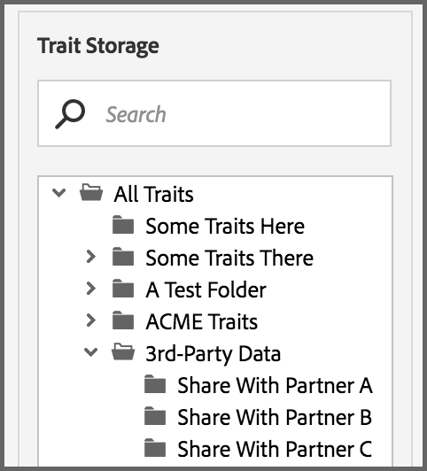

# Privata dataflöden {#private-data-feeds}

En privat datafeed är ett alternativ som gör att leverantörerna kan begränsa köparåtkomsten till sina data. Dataleverantörer och köpare bör granska informationen innan de skapar och prenumererar på privata dataflöden.

<!-- c_marketplace_privatefeed.xml -->

## Privata datafeeds för providrar {#private-data-feeds-providers}

Som leverantör kan dina dataflöden vara offentliga eller privata. Med ett privat dataflöde kan du begränsa köparens åtkomst till dina data, inklusive namnet på dataförsäljaren. Du kanske vill skapa en privat datafeed för att kunna erbjuda specialerbjudanden, rabatter eller när sekretess och åtkomstkontroll är viktigt. Med en privat datafeed kan ni granska och godkänna köparförfrågningar. När du har godkänt en begäran ser flödet ut precis som en offentlig datafeed till köparen. Du kan visa och hantera alla dina feeds i **[!UICONTROL Audience Marketplace > My Shared Data]**. Som framgår nedan är den här typen av feed markerad &quot;Privat&quot; i statuskolumnen.

### Hantera flödesbegäranden

Om du klickar på namnet på en privat datafeed från [!UICONTROL My Shared Data] kommer du till en sida som innehåller flera flikar. Klicka på en flik för att hantera dina förfrågningar om privat datafeed.

I följande tabell definieras rollen eller funktionerna som tillhandahålls av varje åtgärdsflik.

<table id="table_AFB429CA52A34658859448D9A5215F9F"> 
 <thead> 
  <tr> 
   <th colname="col1" class="entry"> Tabb </th> 
   <th colname="col2" class="entry"> Beskrivning </th> 
  </tr> 
 </thead>
 <tbody> 
  <tr> 
   <td colname="col1"> 
 <b> Aktuella prenumeranter</b> 
 </td> 
   <td colname="col2"> 
Visar en lista över godkända köpare som har prenumererat på en privat datafeed. 
 </td> 
  </tr> 
  <tr> 
   <td colname="col1"> 
 <b> Potentiella prenumeranter</b> 
 </td> 
   <td colname="col2"> 
Visar en lista över godkända köpare som inte har prenumererat på en privat datafeed. 
 
Med ett godkännande kan köpare visa en datafeed som om den vore offentlig. Detta ger dem möjlighet att granska och utvärdera dina feeds innan de prenumererar. Du kan även erbjuda rabatter på dataflöden till köpare som anges som potentiella prenumeranter. När köparen prenumererar flyttas deras profil till <b> Aktuella prenumeranter</b>. 
 </td>
  </tr> 
  <tr> 
   <td colname="col1"> 
 <b> Åtkomstbegäranden</b> 
 </td>
   <td colname="col2"> 
Visar nya prenumerationsbegäranden för en privat datafeed. Klicka på den här fliken om du vill granska, godkänna eller avvisa köparförfrågningar. 

    <ul id="ul_BE0A835A90B14C05B3F63226B79D052D"> 
     <li id="li_2C5686CEB6F4430BA18AED5AD75C330A">Godkända köpare flyttar till <b> potentiella prenumeranter</b>. </li>
     <li id="li_929591FCF81E43A3881813BDBD3AC278">Avvisade köpare flyttar till <b> Nekad åtkomst</b>. </li>
    </ul> </td>
  </tr>
  <tr> 
   <td colname="col1"> 
 <b> Detaljerade förfrågningar</b> 
 </td>
   <td colname="col2"> 
Visar en lista över godkända köpare som ännu inte har prenumererat på en datafeed och som har begärt mer information om dina feeds. 
 
Med ett godkännande kan köpare visa en datafeed som om den vore offentlig. Detta ger dem möjlighet att granska och utvärdera dina feeds innan de prenumererar. Du kan även erbjuda rabatter på dataflöden till köpare som begär åtkomst. Om du svarar på en informationsbegäran tas köparprofilen bort från den här fliken. Om de inte har prenumererat finns köpprofilen fortfarande i <b> potentiella prenumeranter</b>. 
 </td>
  </tr>
  <tr> 
   <td colname="col1"> 
 <b> Nekad åtkomst</b> 
 </td> 
   <td colname="col2"> 
Visar nekade prenumerationsbegäranden för en privat datafeed. 
 
Om du vill omgodkänna nekade köpare ändrar du  avvisningsstatus till <b> Tillåt</b>. Detta flyttar köparen till <b> potentiella prenumeranter</b>. 
 </td> 
  </tr> 
 </tbody> 
</table>

### Nästa steg

Följande dokumentation kan hjälpa dig att komma igång med privata dataflöden.

* [Skapa en offentlig eller privat datafeed](../../features/audience-marketplace/marketplace-data-providers/marketplace-create-manage-feeds.md#create-public-private-data-feed)
* [Granska, godkänn eller avvisa privata flödesbegäranden](../../features/audience-marketplace/marketplace-data-providers/marketplace-create-manage-feeds.md#manage-private-requests)
* [Privata datafeeds för köpare](../../features/audience-marketplace/marketplace-private-feeds.md#private-data-feeds-for-buyers)

## Privata datafeeds för köpare {#private-data-feeds-for-buyers}

Som köpare visas privata dataflöden på [Marketplace](../../features/audience-marketplace/marketplace-data-buyers/marketplace-data-buyers.md#about-marketplace) precis som andra erbjudanden. I det här fallet visar dock matningslistan inte sammanfattningsinformation för traits, unique users, and user overlap. Datasäljaren kan även välja att visa eller dölja sitt namn i kolumnen [!UICONTROL Provider] i [!UICONTROL Marketplace]-listan. När säljaren har godkänt din prenumerationsförfrågan blir alla data i en privat feed tillgängliga för dig (den fungerar precis som en offentlig feed). I [!UICONTROL Marketplace]-exemplet nedan visas de tre olika flödestyper som du kan använda som köpare.

Några flödestyper är:

Tabellen beskriver hur dessa olika flödestyper visar eller döljer data.

<table id="table_41D4A798ACF548A3A03ACB427CA4652D"> 
 <thead> 
  <tr> 
   <th colname="col1" class="entry"> Feed-typ </th> 
   <th colname="col2" class="entry"> Beskrivning </th> 
  </tr> 
 </thead>
 <tbody> 
  <tr> 
   <td colname="col1"> 
<b> Offentlig</b> 
 </td> 
   <td colname="col2"> 
Providerns namn, egenskaper och unika data visas i listan. 
 </td> 
  </tr> 
  <tr> 
   <td colname="col1"> 
<b> Privat utan varumärke</b> 
 </td> 
   <td colname="col2"> 
Leverantörens namn är inställt på "Privat säljare" och du kan inte se antalet trait, unika data och trait-överlappningsdata. 
 </td> 
  </tr> 
  <tr> 
   <td colname="col1"> 
<b> Privat med varumärke</b> 
 </td> 
   <td colname="col2"> 
Providerns namn visas i listan men du kan inte se antalet trait, unika data och trait-överlappningsdata. 
 </td> 
  </tr> 
 </tbody> 
</table>

### Nästa steg

Se [Prenumerera på en privat datafeed](../../features/audience-marketplace/marketplace-data-buyers/marketplace-manage-subscriptions.md#subscript-private-data-feed) för att begära åtkomst.

## Ställa in delningsrelationen mellan Data Provider och Data Buyer {#set-up-sharing-relationship}

### Steg 1 - Aktivera - Dataprovider och Datainköpare

Det första steget i processen kräver ingripande från Adobe Consulting eller kundtjänst. Dataleverantören och datainköparen bör kontakta Adobe Consulting eller kundtjänst för att begära aktiveringen.

### Steg 2 - Dataprovider - Skapa ny datakälla

Skapa en ny cookie-datakälla med:

* **Audience Manager** ID som inkommande nyckel,
* Alternativet **Dela aktiverat** har markerats.

När du har klickat på **Spara** skapas en ny undermapp automatiskt i **Traits Storage > data från tredje part**.

### Steg 3 - Dataprovider - Identifiera egenskaper för delning

I det här steget identifierar du de egenskaper som du vill dela med din partner. Du kan antingen skapa nya egenskaper eller redigera befintliga egenskaper. Du behöver i alla fall egenskaperna:

* Ska kopplas till datakällan som du skapade som en del av steg 2.
* Ska lagras i den nya undermappen, under data från tredje part.

Läs mer om att [skapa egenskaper](/help/using/features/traits/create-onboarded-rule-based-traits.md) och [redigera egenskaper](/help/using/features/traits/manage-trait-rules.md#edit-trait).

### Steg 4 - Dataprovider - Skapa datafeed

Skapa sedan en datafeed för att dela dina egenskaper med dataläsaren. Mer information om hur du skapar en datafeed finns i [Skapa en offentlig eller privat datafeed](/help/using/features/audience-marketplace/marketplace-data-providers/marketplace-create-manage-feeds.md).

>[!IMPORTANT]
>
>Välj alternativet Privat i Inställningar. Om du anger det här fältet som Allmänt kan alla Audience Marketplace-kunder prenumerera på din feed.

### Steg 5 - Datainköpare - Begär åtkomst

Gå till **Audience Marketplace > Marketplace**. Sök efter den datafeed som har skapats av DataProvider i föregående steg. Klicka på **Begär åtkomst**. Den utsedda kontakten från dataleverantörssidan får nu ett e-postmeddelande. Se även [Prenumerera på en privat datafeed](/help/using/features/audience-marketplace/marketplace-data-buyers/marketplace-manage-subscriptions.md#subscript-private-data-feed).

### Steg 6 - Dataprovider - Bevilja åtkomst

Gå till **Audience Marketplace > Mina delade data** och sök efter den feed du skapade i steg 4. Klicka på den nya åtkomstbegäran och klicka på **Tillåt åtkomst** för att godkänna begäran. Se även [Granska, godkänn eller avvisa privata feedbegäranden](/help/using/features/audience-marketplace/marketplace-data-providers/marketplace-create-manage-feeds.md#manage-private-requests).

### Steg 7 - Datainköpare - Aktivera prenumeration

När dataleverantören har beviljat åtkomst till dataflödet kan du se feeden på ditt konto i **Audience Marketplace > Marketplace**. Granska informationen, aktivera prenumerationsknappen och klicka på **Granska och prenumerera**. Mer information om var du hittar tredjepartsegenskaper finns i [Lagring för prenumererade datafeeds](/help/using/features/audience-marketplace/marketplace-data-buyers/marketplace-manage-subscriptions.md#find-subscribed-data-fee).

Observera att dessa egenskaper bara kan redigeras i DataProvider-kontot.

