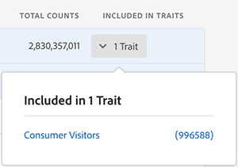

# Skapa egenskaper från signaler

Skapa nya egenskaper utifrån alla signaler, även sådana som redan används i egenskaper, och fånga framtida målgrupper som kvalificerar sig efter att ha skapat egenskaper. Se videon för en snabb demonstration eller läs vidare för mer information:

>[!VIDEO](https://video.tv.adobe.com/v/25169/?quality=12)

## Skapa egenskaper från den signalbaserade kontrollpanelen {#create-traits-from-signal-dashboard}

Med [!UICONTROL Signal Dashboard] den kan du skapa nya egenskaper från [!UICONTROL Top Unused Signals]och [!UICONTROL New Unused Signals]dina sparade sökningar.

När du skapar ett nytt trait-uttryck förinställs trait-typen baserat på signaltypen:

* **[!UICONTROL Rule-based]** egenskaper för realtidssignaler, användbara loggfiler och [!DNL Adobe Analytics] signaler,

* **[!UICONTROL Onboarded]** egenskaper för onboardsignaler.

Om du vill skapa nya egenskaper från **[!UICONTROL Signal Dashboard]** symbolen identifierar du signalen som du vill använda i egenskapen och klickar sedan på motsvarande **[!UICONTROL Create Rule-Based Trait]** eller **[!UICONTROL Create Onboarded Trait]** länk.

Du omdirigeras till **[Trait Builder](../../features/traits/about-trait-builder.md)**för att skapa dina nya egenskaper.

## Skapa egenskaper från den enskilda sökningen {#create-traits-from-signal-search}

Skapa egenskaper baserat på använda eller oanvända signaler som inte visas i [!UICONTROL Signal Dashboard].

Sök efter specifika signaler och skapa regelbaserade eller anpassade egenskaper baserat på resultatet. Så här gör du:

1. Gå till **[!UICONTROL Audience Data > Signals > Search]** och kör en sökning baserat på de nyckelvärdepar du söker, eller klicka **[!UICONTROL Search]** utan att ange något nyckelvärdepar för att visa alla resultat.
2. Identifiera de signaler som du vill använda i egenskapen i resultatlistan.
   * Om du vill skapa ett drag från en signal klickar du på motsvarande **[!UICONTROL Create Rule-Based Trait]** eller **[!UICONTROL Create Onboarded Trait]** länk.
   * Om du vill skapa en egenskap från flera signaler klickar du i motsvarande kryssruta för varje signal och klickar sedan på **[!UICONTROL Create Trait from Multiple Signals]**.
   >[!NOTE]
   >Du kan bara skapa egenskaper från signaler av samma typ. Du kan inte skapa en egenskap baserat på en kombination av en realtidssignal och en inbyggd signal.
   >
   > 
   >Du kan också skapa egenskaper utifrån använda signaler. Signaler som redan används i traits har det antal egenskaper som visas i **[!UICONTROL Included in Traits]** kolumnen. Klicka på pilen för att se vilka egenskaper som innehåller signalen.
   >
   >

3. Använd **[Trait Builder](../../features/traits/about-trait-builder.md)**för att skapa nya egenskaper.
