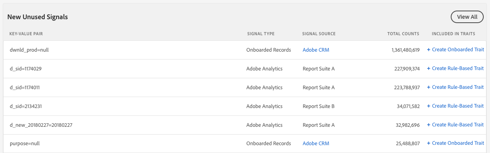

# Kontrollpanel för signaler {#signals-dashboard}

Få en översikt över oanvända signaler som Audience Manager tagit emot under de senaste 7 dagarna och identifiera potentiella nya egenskaper. Oanvända signaler når Audience Manager från dina online-egenskaper, men används inte i dina befintliga egenskaper. Om du vill visa [!UICONTROL Signals Dashboard]filen går du till [!UICONTROL Audience Data] > [!UICONTROL Signals]. Här [!UICONTROL Signals Dashboard] visas åtgärdbara insikter baserat på dina mest aktiva oanvända signaler.

>[!IMPORTANT]
>
>I avsnitten **[!UICONTROL Top Unused Signals]** och **[!UICONTROL New Unused Signals]** visas endast poster med fler än **100 förekomster/timme**. Signaler under det tröskelvärdet ingår i [!UICONTROL Signals Search].

## De vanligaste oanvända signaturerna {#top-unused-signals}

I det här avsnittet visas de 50 mest oanvända signalerna (både nya och gamla) som skickats till [!DNL Audience Manager] under de senaste 7 dagarna, baserat på deras totala antal. Beroende på vilka data som [!DNL Audience Manager] tas emot kan den här tabellen innehålla några eller alla poster i tabellen **Nya oanvända signaler** .

## Nya oanvända signaler {#new-unused-signals}

I det här avsnittet visas de 50 bästa nya oanvända signalerna som tagits emot under de senaste 7 dagarna.

## Sparade sökningar {#saved-searches}

[!DNL Audience Manager] visar alla dina [sparade sökningar](../../features/data-explorer/data-explorer-signals-search/data-explorer-save-search.md) på [!UICONTROL Dashboard] och läser in dem igen varje gång du läser in [!UICONTROL Dashboard].

Sparade sökningar visar de 50 främsta resultaten för motsvarande villkor.

Titta på videon nedan för att lära dig hur du använder [!UICONTROL Signals Dashboard].
>[!VIDEO](https://video.tv.adobe.com/v/25151/)