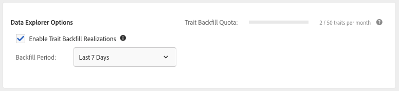

# Realiseringar av bakåtfyllnad {#backfill-trait-realizations}

Återfyll implementeringar av trait-egenskaper för att fånga in historiska målgrupper och undvika förlust av relevanta data före datumet då trait skapades.

>[!IMPORTANT]
>
> [!UICONTROL Data Explorer Trait Backfill] är en premiumfunktion som förbättrar Audience Manager-upplevelsen genom att låsa upp ytterligare användningsfall. Backfill kräver extra processorkraft och är tillgänglig för alla Audience Manager-kunder till en tillkommande kostnad. Kontakta din Adobe-återförsäljare för mer information.

När du skapar egenskaper utifrån oanvända signaler kan du välja att fylla i trait-implementeringarna igen under en viss tidsperiod. [!DNL Audience Manager] samlar in historiska data om målgrupper som kvalificerar sig för det nya varumärket och lagrar dem på motsvarande profil. Du kan se informationen **[!UICONTROL Backfill Options]** i [!UICONTROL Trait Expression] delen av **[Trait Builder](../../features/traits/about-trait-builder.md)**.

>[!NOTE]
>
>Ni kan återfylla trait-implementeringar för regelbaserade och onboardbaserade egenskaper.

Så här fyller du i trait-implementeringar baklänges:

1. Gå till [!UICONTROL Audience Data > Signals > Search] och kör en signalsökning eller använd [signalkontrollpanelen](../../features/data-explorer/data-explorer-signals-dashboard.md) för att identifiera de signaler som ska användas i det nya traktet.
1. Skapa ett nytt spår baserat på de önskade signalerna.
1. Använd **[!UICONTROL Backfill Options]** i **[!UICONTROL Trait Expression]** avsnittet för att välja det tidsintervall för vilket du vill återfylla trait-realisationer. Fördefinierade intervall för bakgrundsfyllning omfattar 1, 7, 14 och 30 dagar. Du kan också välja ett anpassat datumintervall på upp till 30 dagar.

   

1. (Valfritt) Klicka **[!UICONTROL Estimate Realizations]** i **[!UICONTROL Estimated Trait Realizations]** avsnittet för att se beräknade [!UICONTROL Unique Trait Realizations] värden och [!UICONTROL Total Trait Population] värden för den efterfyllda egenskapen under de senaste 7 dagarna.

   

   >[!IMPORTANT]
   >
   >Bakåtfyllning och uppskattning av trait är inte tillgängliga för traits med uttryck som använder följande operatorer:
   >    * `!=`
   >    * `matchesregex`
   >    * `matcheswords`

1. Skapa trait.

När du är klar med att skapa ditt varumärke kommer du att se de efterfyllda realisationerna i implementeringsstatistiken.

Titta på videon nedan om du vill se en videogenomgång av hur du fyller ut traits baklänges.

>[!VIDEO](https://video.tv.adobe.com/v/25169/)

## Svarstid för bakåtfyllnad av fack {#trait-backfilling-latency}

Nyligen skapade egenskaper som börjar fånga målgrupper två till tre timmar efter att de skapats. På grund av den stora datavolym som dagligen [!DNL Audience Manager] utför återspeglas emellertid inte den efterfyllda populationen omedelbart i grafer [!UICONTROL Unique Trait Realizations] och [!UICONTROL Total Trait Population] diagram.

Audience Manager uppdaterar bilden [!UICONTROL Trait Graph] med den förifyllda populationen inom 48 timmar efter att trait har skapats.

## Gräns för bakåtfyllnad av trait {#trait-backfilling-limit}

[!UICONTROL Data Explorer] Med kan du fylla upp till 50 traits per månad med backfill-räknaren återställd den 1 dagen i varje månad.

>[!NOTE]
>
>Kvoten för bakåtfyllnad av trait överförs inte från tidigare månader. Om du t.ex. fyller 30 traits bakåt den här månaden återställs kvoten för bakåtfyllnad av trait för nästa månad till 50, inte 70.

## Inverkan på rapportering {#reporting-impact}

Omvända implementeringar av egenskaper återspeglas i värdena [!UICONTROL Unique Trait Realizations] och [!UICONTROL Total Trait Population] , vilket [!DNL Audience Manager] omvandlar historiska signaler till implementering av egenskaper.

Men [!UICONTROL Trait Graph], [!UICONTROL General Reports]och [!UICONTROL Trend Reports] uppdateras inte retroaktivt med historisk statistik som fyllts i före datumet då trait skapades.