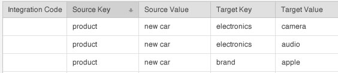

# Härledda signaler {#derived-signals}

En [!UICONTROL derived signal] kvalificerar besökare för ytterligare egenskaper baserat på ett drag de redan har sett. Med andra ord kan ytterligare egenskaper härledas från en egenskap som för närvarande visas, även om en användare aldrig har sett den nya egenskapen tidigare.

<!-- c_tb_derived_signal.xml -->

## Syfte med härledda signaler

I [!DNL Audience Manager]kan du skapa en relation mellan signaler (eller trait-regler) som skickas under ett händelseanrop till andra, angivna signaler eller egenskaper. Anta till exempel att ett händelseanrop skickas i en signal som består av nyckelvärdet [!DNL "product = new_car"] ( `https://<domain alias>/event?product=new_car`). [!DNL Audience Manager] ansluter signalen till andra som skapats med [!UICONTROL derived signals] verktyget. Även om de tillhörande signalerna kan vara valfria nyckelvärden som du anger, är de mest användbara när de länkas till befintliga signaler som redan har konfigurerats som [!UICONTROL Trait Builder] regler. I bilden nedan visar till exempel en användaråtgärd [!DNL "product = new car"] att användaren även kan kvalificera sig för egenskaper som definieras av målnyckeln och värdesignalerna.

## Plats för härledda signaler

Skapa och hantera [!UICONTROL derived signals] i **[!UICONTROL Tools > Derived Signals]** från sidofältsnavigeringen.

## Skapa en härledd signal {#create}

<!-- t_tb_create_derived.xml -->

Så här skapar du en [!UICONTROL derived signal]:

1. Välj **[!UICONTROL Derived Signals]** på [!UICONTROL Tools] menyn.
1. Ange en:
   * *(Valfritt)* [!UICONTROL Integration Code]
   * [!UICONTROL Source Key]
   * [!UICONTROL Source Value]
   * [!UICONTROL Target Key]
   * [!UICONTROL Target Value]
1. Klicka på **[!UICONTROL Add Signal]**.

>[!NOTE]
>
>Teckengränsen för [!UICONTROL Source Key]fälten, [!UICONTROL Source Value], [!UICONTROL Target Key]och [!UICONTROL Target Value] är 228 tecken.

## Redigera en härledd signal {#edit}

<!-- t_tb_edit_derived.xml -->

Så här redigerar du en [!UICONTROL derived signal]:

1. Håll pekaren över signalen och klicka sedan **[!UICONTROL Edit]**.
2. Gör önskade ändringar av kod, nyckel eller värde och klicka sedan på **[!UICONTROL Save]**.

## Ta bort en härledd signal {#delete}

<!-- t_tb_delete_derived.xml -->

Om du vill ta bort en [!UICONTROL derived signal]signal håller du pekaren över signalen och klickar sedan på **[!UICONTROL Delete]**.
