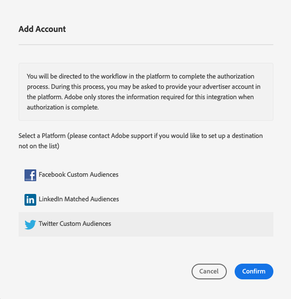

# Lägg till nya enhetsbaserade mål {#add-new-device-based-destinations}

I den här artikeln beskrivs hur du konfigurerar nya enhetsbaserade mål från användargränssnittet i Audience Manager.

>[!IMPORTANT]
>
>För närvarande är de flesta enhetsbaserade mål inte berättigade till arbetsflödet för konfiguration av självbetjäning. Om det enhetsbaserade mål som du behöver lägga till inte visas i mållistan kontaktar du Adobes konsult eller kundsupport för att få hjälp.

## Översikt {#overview}

Processen att lägga till ett nytt enhetsbaserat mål består av två huvudsteg. Först måste du konfigurera integreringen mellan Audience Manager och målpartnern. När du gjort det kan du skapa ett nytt enhetsbaserat mål.

## Förutsättningar {#prerequisites}

När du skapar det första enhetsbaserade målet med en integrerad plattform kontaktar du Adobe Consulting eller Customer Care för att aktivera synkronisering av ID mellan Audience Manager och den integrerade plattformen för ditt konto. Detta krävs för korrekt synkronisering mellan Audience Manager och målplattformen.

## Steg 1. Autentisera med ett Platform-mål {#step1}

Innan du kan skapa ett nytt enhetsbaserat mål måste du konfigurera integreringen mellan Audience Manager och målplattformen. Så här gör du:

1. Logga in på ditt Audience Manager-konto och gå till **[!DNL Administration > Integrated Accounts]**. Om du har en tidigare konfigurerad integrering med en målplattform bör du se den på den här sidan. I annat fall är sidan tom.
1. Klicka på **[!DNL Add Account]**.
1. Välj den målplattform som du vill autentisera med och klicka för **[!DNL Confirm]** att omdirigeras till autentiseringssidan för den valda plattformen.

   

1. När du har autentiserat dig för destinationsplattformskontot omdirigeras du till Audience Manager där du ska se dina associerade annonskonton. Välj det annonserarkonto som du vill använda och klicka på **[!DNL Confirm]**.

## Steg 2. Skapa ett nytt enhetsbaserat mål {#step2}

När du har konfigurerat integreringen av målplattformen kan du skapa det nya målet. Så här gör du:

>[!NOTE]
>
>Du kan inte ändra namnet på ett befintligt enhetsbaserat mål. Ange ett namn som hjälper dig att identifiera målet korrekt.

1. Logga in på ditt Audience Manager-konto, gå till **[!DNL Audience Data > Destinations]** och klicka på **[!DNL Create Destination]**.
1. I **[!DNL Basic Information]** avsnittet anger du ett **[!DNL Name]** och **[!DNL Description]** ett nytt mål och använder inställningarna i listan nedan:

   

   * **[!DNL Category]**: [!DNL Integrated Platforms];
   * **[!DNL Type]**: [!DNL Device-Based];
   * **[!DNL Platform]**: Välj den målplattform som du vill skicka målgruppssegment till.
   * **[!DNL Account]**: välj önskat annonskonto som är kopplat till den valda plattformen.
1. Klicka på **[!DNL Next]**.
1. Välj de [dataexportetiketter](/help/using/features/data-export-controls.md#controls-labels) som du vill ange för det här målet.
1. Klicka på **[!DNL Save]**.
1. I **[!DNL Segment Mappings]** avsnittet markerar du de målgruppssegment som du vill skicka till det här målet.
1. Spara målet.
