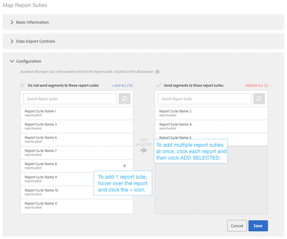

# Konfigurera en Analytics-destination

## Krav {#requirements}

Om du vill konfigurera ett Analytics-mål måste Audience Manager-användaren ha administratörsbehörighet. Se [Skapa användare](/help/using/features/administration/administration-overview.md#create-users) i administrationshandboken. Observera att med `CREATE_DESTINATIONS` [behörighet för jokertecken](/help/using/features/administration/administration-overview.md#wild-card-permissions) räcker inte för att skapa Analytics-mål.
Mer information finns i Krav [Audience Analytics](https://experienceleague.adobe.com/docs/analytics/integration/audience-analytics/mc-audiences-aam.html).

## Din standardanalysdestination och nya analysdestinationer

| Måltyp för analys | Beskrivning |
|---|---|
| Standard | Namnet på standardmålet är &quot;Adobe Analytics&quot;, som du kan redigera. Mappade ID:n för rapporteringsprogramsvit visas i mapplagringen för dina Audience Manager-egenskaper och -segment.    Audience Manager skapar automatiskt ett mål om ditt konto har:    <ul><li>Uppfyll kraven som beskrivs i [Audience Analytics](https://experienceleague.adobe.com/docs/analytics/integration/audience-analytics/mc-audiences-aam.html) dokumentation.</li><li>A [rapportsvit](https://experienceleague.adobe.com/docs/analytics/admin/manage-report-suites/report-suites-admin.html) i Analytics.</li></ul> |
| Nytt | Om du vill skapa nya Analytics-mål går du till Målgruppsdata > Destinationer > Skapa nytt mål och följer stegen för varje avsnitt som beskrivs nedan. |

## Audience Manager i-segmentet i Adobe Analytics {#segment-qualifications}

När du skickar segmentinformation till ett Analytics-mål skickar Audience Manager bara de segment som besökaren är kvalificerad för. Om en besökare slutar kvalificera sig för ett segment är den här informationen _not_ vidarebefordras till Adobe Analytics.

Titta på segmentreglerna nedan:

* Segment A: Fack 1 OCH fack 2
* Segment B: Fack 1 OCH INTE Fack 2

I analysrapporter kan en profil visas som kvalificerad för båda segmenten, även om den slutade kvalificera sig för segment B.

## Steg 1: Ange grundläggande information

Det här avsnittet innehåller fält och alternativ som startar processen att skapa Analytics-mål. Så här slutför du det här avsnittet:

1. Klicka **Grundläggande information** för att visa kontrollerna.
2. Namnge målet. Undvik förkortningar och specialtecken.
3. *(Valfritt)* Beskriv målet. En kort beskrivning är ett effektivt sätt att definiera eller ange mer information om en destination.
4. *(Valfritt)* I **Plattform** list, leave the default set to **Alla**. För närvarande gör dessa alternativ ingenting. De är utformade för att stödja funktioner som kan läggas till vid ett senare tillfälle.
5. I **Kategori** lista, välj **Adobe Experience Cloud**.
6. I **Typ** lista, välj **Adobe Analytics**.
7. Klicka **Spara** för att gå till konfigurationsinställningarna eller klicka på **Dataexportetiketter** om du vill använda exportkontroller på målet.

>[!NOTE]
>
>För en Analytics-destination **Autofyll målmappning** kryssruta och **Segment-ID** som standard är alternativet markerat. Du kan inte ändra de här inställningarna.

## Steg 2: Konfigurera dataexportkontroller

Det här avsnittet innehåller alternativ som kan användas [Dataexportkontroller](/help/using/features/data-export-controls.md) till ett Analytics-mål. Hoppa över det här steget om du inte använder dataexportkontroller. Så här slutför du det här avsnittet:

1. Klicka **Dataexportkontroller** för att visa kontrollerna.
1. Välj en etikett som motsvarar den dataexportkontroll som används på målet (se [Lägg till dataexportetiketter till ett mål](/help/using/features/destinations/add-data-export-labels.md) ). För Analytics-mål är kryssrutan PII markerad som standard.
1. Klicka **Spara**.

## Steg 3: Kartrapportsviter

I avsnittet Konfiguration visas de analysrapportsviter som har aktiverats för vidarebefordran på serversidan. Om du har flera Analytics-destinationer kommer rapportsviterna som tilldelas dessa destinationer att utesluter varandra och tillämpas av Audience Manager. Så här slutför du det här avsnittet:

1. Klicka **Konfiguration** för att visa kontrollerna.
1. Välj en (eller flera) rapportsviter som du vill skicka segment till.
1. Klicka **Spara**.

## Steg 4: Segmentmappningar

I det här avsnittet finns alternativ som gör att du kan mappa segment automatiskt eller manuellt.

| Mappningsalternativ | Beskrivning |
|---|---|
| Mappa automatiskt alla aktuella och framtida segment | Som standard skickas alla segment som en besökare kvalificerar för till Analytics.    Om en besökare tillhör fler än 150 Audience Manager-segment i en enda träff skickas endast de 150 senast kvalificerade segmenten till Analytics, medan den återstående listan trunkeras. En extra flagga skickas till Analytics som anger att segmentlistan trunkerades. Den här åtgärden visas som&quot;Målgruppsgräns nådd&quot; i dimensionen Publiknamn och&quot;1&quot; i dimensionen Publikens ID. Se [Vanliga frågor](https://experienceleague.adobe.com/docs/analytics/integration/audience-analytics/audience-analytics-workflow/mc-audiences-faqs.html) för mer information.    Det här alternativet påverkar även måltillgängligheten i [Segment Builder](/help/using/features/segments/segment-builder.md). Om ett segment till exempel automatiskt mappas till ett Analytics-mål är det målet inte tillgängligt för markering i [målmappningar](/help/using/features/segments/segment-builder.md#segment-builder-controls-destinations) i Segment Builder. Analysmålet visas nedtonat och&quot;Analytics&quot; (Analyser) visas i kolumnen Type i målwebbläsaren. |
| Mappa segment manuellt | Det här alternativet visar sök- och bläddringskontroller där du kan välja vilka segment du vill skicka till Analytics.    Så här söker du efter ett segment:    <ol><li>Skriv segmentnamnet eller ID:t i sökfältet.</li><li>Klicka <b>Lägg till.</b></li><li>Fortsätt att söka efter och lägga till segment eller klicka <b>Klar</b>.</li></ol>   Så här söker du efter ett segment: <ol><li>Klicka <b>Bläddra bland alla segment</b>. Då visas en lista med tillgängliga segment.</li><li>Markera kryssrutan för det segment som du vill använda i listan och klicka på <b>Lägg till markerade segment</b>.</li><li>Klicka <b>Spara</b> i fönstret Lägg till mappningar. Du kan inte ändra mappningar, start- eller slutdatum under betaversionen.</li><li>Fortsätt att bläddra och lägga till segment eller klicka <b>Klar</b>.</li></ol>  |

## Nästa steg

När du har skapat och sparat ett mål kan du arbeta med dessa data i Analytics. Det kan dock ta några timmar innan data är tillgängliga i de rapportsviter du valt. Se [Använda målgruppsdata i analyser](https://experienceleague.adobe.com/docs/analytics/integration/audience-analytics/audience-analytics-workflow/use-audience-data-analytics.html).
