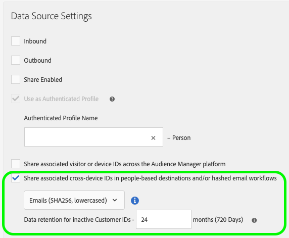

# Förutsättningar och överväganden {#prerequisites-considerations}

>[!IMPORTANT]
>Den här artikeln innehåller produktdokumentation som ska hjälpa dig att konfigurera och använda den här funktionen. Ingenting i det här är juridisk rådgivning. Vänligen kontakta ditt eget juridiska ombud för att få juridisk rådgivning.

Nedan finns en översikt över kundkrav som du måste uppfylla innan du registrerar dig för [!UICONTROL People-Based Destinations].

>[!IMPORTANT]
> Läs igenom den här artikeln noggrant innan du går vidare till implementeringsfasen.

## Registrerar dig för [!UICONTROL People-Based Destinations] {#signing-up}

[!UICONTROL People-Based Destinations] är en premiumfunktion som förbättrar din Audience Manager-upplevelse genom att du kan aktivera dina egna målgruppssegment i personbaserade miljöer genom att rikta in din målgrupp mot anpassade erbjudanden i sociala nätverk eller via e-postmarknadsföring.

Kontakta din Adobe-representant för att få tillgång till denna premiumfunktion.

## Partnerspecifika krav {#partner-prerequisites}

### [!DNL Facebook] {#facebook}

Innan du kan använda [!UICONTROL People-Based Destinations] för att skicka din förstapartsmålgrupp [!UICONTROL segments] till [!DNL Facebook] måste du kontrollera att du uppfyller följande krav:

1. Ditt [!DNL Facebook]-användarkonto måste ha behörigheten **Hantera kampanjer** aktiverad för annonskontot som du tänker använda.
2. Lägg till **Adobe Experience Cloud**-företagskontot som annonspartner i [!DNL Facebook Ad Account]. Använd `business ID=206617933627973`. Mer information finns i [Lägg till partner i din Business Manager](https://www.facebook.com/business/help/1717412048538897).

   >[!IMPORTANT]
   >När du konfigurerar behörigheter för Adobe Experience Cloud måste du aktivera behörigheten **Hantera kampanjer**. Det krävs för [!UICONTROL People-Based Destinations]-integreringen.

3. Läs och signera [!DNL Facebook Custom Audiences] användarvillkoren. Gör det genom att gå till `https://business.facebook.com/ads/manage/customaudiences/tos/?act=[accountID]`, där `accountID` är din [!DNL Facebook Ad Account ID].

### [!DNL LinkedIn] {#linkedin}

Innan du kan använda [!UICONTROL People-Based Destinations] för att skicka dina egna målgruppssegment till [!DNL LinkedIn] måste du se till att ditt [!DNL LinkedIn Campaign Manager]-konto har behörigheten [!DNL Creative Manager] eller högre.

Mer information om hur du redigerar användarbehörigheter för [!DNL LinkedIn Campaign Manager] finns i [Lägg till, redigera och ta bort användarbehörigheter för Advertising-konton](https://www.linkedin.com/help/lms/answer/5753) i dokumentationen för LinkedIn.

Se [Förstå och konfigurera LinkedIn People-Based Destination](https://experienceleague.adobe.com/docs/audience-manager-learn/tutorials/data-activation/people-based-destinations/understanding-and-configuring-the-linkedin-pbd.html) om du vill ha videoinstruktioner.

### [!DNL Google Customer Match] {#gcm}

Innan du kan använda [!UICONTROL People-Based Destinations] för att skicka dina egna målgruppssegment till ett [!DNL Google Customer Match]-mål måste du kontrollera att du läser och följer Google policy för användning av [!DNL Customer Match] som beskrivs i [Google supportdokumentation](https://support.google.com/google-ads/answer/6299717).

Kontrollera sedan att ditt [!DNL Google]-konto är konfigurerat för en [!DNL Standard] eller högre behörighetsnivå. Mer information finns i [dokumentationen för Google Ads](https://support.google.com/google-ads/answer/9978556?visit_id=637611563637058259-4176462731&rd=1).

Kunder med kompatibla konton tillåts automatiskt listade av Google.

## Datainhämtning {#data-onboarding}

>[!IMPORTANT]
>
>Alla Audience Manager-kunder kan importera hashade e-postmeddelanden utan att registrera sig för [!UICONTROL People-Based Destinations].

Inläsning av data för [!UICONTROL People-Based Destinations] stöder för närvarande upp till 10 hash-kodade e-postadresser som är länkade till ett kund-ID ([!DNL CRM ID]) per batchöverföring.

Om du överför mer än 10 hash-kodade e-postadresser som är länkade till ett kund-ID vid flera batchöverföringar kommer Audience Manager att behålla de 10 senaste e-postadresserna som lagts till.

Om du vill importera hash-kodade identifierare [skapar du en datakälla för olika enheter för hash-kodade identifierare](../create-data-source-hashed-emails.md) och aktiverar alternativet **[!UICONTROL Share associated cross-device IDs in people-based destinations and/or hashed email workflows]**.

## Dataintegritet {#data-privacy}

Även om [!UICONTROL People-Based Destinations] tillåter dig att rikta in dig på målgrupper baserat på hash-kodade e-postadresser som du har överfört är det inte tillåtet att överföra direkt identifierbar besöksinformation till Audience Manager. I datainloggningsfasen måste du se till att de e-postadresser som du tänker använda hashas med algoritmen [!DNL SHA256]. Annars kan du inte använda dem i [!UICONTROL People-Based Destinations].

## Dataskärm jämfört med kryptering {#data-hashing-encryption}

Kryptering är en tvåvägsfunktion. All krypterad information kan också dekrypteras med rätt dekrypteringsnyckel. Kryptering av data inom ramen för Audience Manager innebär allvarliga risker, eftersom alla krypterade former av personligt identifierbar information också kan dekrypteras. I motsats till kryptering är [!UICONTROL People-Based Destinations] utformat för att fungera med hashdata i stället.

Hash-funktionen är en envägsfunktion som förvränger indata och ger ett unikt resultat. Genom att använda korrekta hash-algoritmer, som [!DNL SHA256], finns det inget sätt att vända på hash-funktionen och visa den oförändrade informationen. E-postadresserna som du kommer att anlita Audience Manager måste hash-kodas med algoritmen [!DNL SHA256]. På så sätt kan du se till att inga ohanterade e-postadresser når Audience Manager.

## Hash-krav {#hashing-requirements}

När du hash-kodar e-postadresserna måste du se till att följande krav uppfylls:

* Trimma alla inledande och avslutande blanksteg från e-poststrängen, exempel: `johndoe@example.com`, inte `<space>johndoe@example.com<space>`;
* När du hash-kodar e-poststrängarna ska du se till att hash-koda den gemena strängen.
   * Exempel: `example@email.com`, inte `EXAMPLE@EMAIL.COM`;
* Kontrollera att den hash-kodade strängen är i gemener
   * Exempel: `55e79200c1635b37ad31a378c39feb12f120f116625093a19bc32fff15041149`, inte `55E79200C1635B37AD31A378C39FEB12F120F116625093A19bC32FFF15041149`;
* Salt inte strängen.

Titta på videon nedan för att förstå hashkraven för [!UICONTROL People-Based Destinations].

>[!VIDEO](https://video.tv.adobe.com/v/29003/)

Adobe Experience Cloud ger dig möjlighet att hash-koda kund-ID:n via [!DNL Adobe Experience Platform Identity Service (ECID)]. Se [SHA256 Hash-stöd för setCustomerID:n](https://experienceleague.adobe.com/docs/id-service/using/reference/hashing-support.html) för mer information om hur du använder ECID för att hash-koda kund-ID:n.

## Hämtar användarbehörighet {#obtaining-user-permission}

Eftersom [!UICONTROL People-Based Destinations] hjälper dig att aktivera egna målgruppsdata i personbaserade kanaler är det ditt ansvar att informera och inhämta nödvändigt samtycke från dina kunder om hur du kommer att använda deras data för annonsering eller andra syften.

Innan du registrerar dig för [!UICONTROL People-Based Destinations] måste du se till att få dina kunders samtycke innan du använder deras information i annonssyfte.

Om dina kunder vill avanmäla sig från annonskampanjer finns mer information om hur du förhindrar att Audience Manager samlar in data i [Opt-out Management](../../overview/data-security-and-privacy/data-privacy-requests.md) .

## Tvingande aktivering av första parts data {#enforcing-first-party-activation}

När du använder [!UICONTROL People-Based Destinations] kan du bara använda egna data för att aktivera målgruppssegment i personbaserade kanaler. Ni kan inte använda data från andra leverantörer för målgruppsaktivering i personbaserade kanaler.

När du använder [!UICONTROL People-Based Destinations] använder du [ Dataexportkontroller ](../data-export-controls.md) för att märka [!UICONTROL data sources] och [!UICONTROL destinations] enligt riktlinjerna och kraven från målplattformar och dataleverantörer.

## Införliva autentiserade hash-ID:n via deklarerade ID-mål {#onboard-authenticated-declared-id}

Det finns två sätt att överföra offlinedata till Audience Manager för [!UICONTROL People-Based Destinations].

* [Skicka batchdata](../../integration/sending-audience-data/batch-data-transfer-explained/batch-data-transfer-overview.md) till Audience Manager för att importera hashade e-postadresser. Med den här metoden kan du välja att använda hash-kodade e-postadresser från din [!DNL CRM]-databas i [!UICONTROL People-Based Destinations]. När du använder den här metoden kan du dessutom kvalificera de hash-kodade e-postadresserna för [onboarding traits](../traits/trait-and-segment-qualification-reference.md).
* Använd [Deklarerade ID:n](../declared-ids.md) om du vill deklarera hashade e-postadresser när autentiserade kund-ID skickas. När du använder den här metoden skickar Audience Manager, å dina vägnar, bara de streckade e-postadresserna från användare som har autentiserat online till [!UICONTROL People-Based Destinations]. E-postadresserna som aktiveras via personbaserade kanaler är bara de som anges i de deklarerade ID-händelseanropen. Andra e-postadresser som är kopplade till kund-ID:t skickas inte i realtid.
