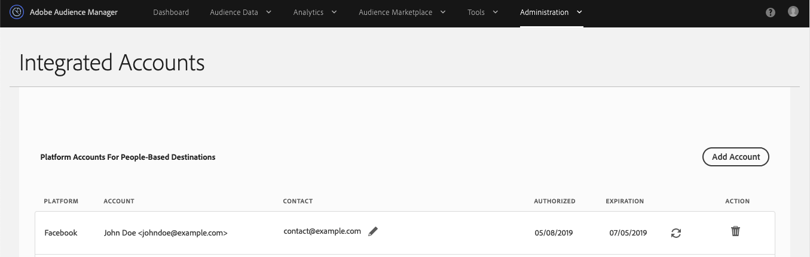

# Arbetsflöde B - Personalisering baserad på data som bara är offline {#workflow-b}

>[!IMPORTANT]
>Den här artikeln innehåller produktdokumentation som ska hjälpa dig att konfigurera och använda den här funktionen. Ingenting i det här är juridisk rådgivning. Vänligen kontakta ditt eget juridiska ombud för att få juridisk rådgivning.

Den här sidan innehåller stegvisa anvisningar om hur du skapar målgruppssegment utifrån kunddata som bara är offline och skickar dem till personbaserade destinationer.

## Steg 1 - Onboard Offline Traits {#step-1-onboard-traits}

Det första steget för att skapa målgruppssegment i det här scenariot är att föra över era offlinekunddata till Audience Manager.

>[!IMPORTANT]
>
> Innan du fortsätter måste du se till att kundaktiviteten du är på väg att anställa redan har definierats i Audience Manager med motsvarande [introduktionsegenskaper](../traits/trait-and-segment-qualification-reference.md).

Oavsett om dina befintliga kund-ID:n för Audience Manager ([DPUID](../../reference/ids-in-aam.md)) är hashas-e-postmeddelanden eller inte, måste du utföra trait onboarding mot datakällan som innehåller dina [DPUID](../../reference/ids-in-aam.md).

### Exempel

Du vill kvalificera kund-ID:n från tabellen nedan för motsvarande anpassade ID:n. Låt oss tänka på att dina [DPUUID](../../reference/ids-in-aam.md) lagras i en datakälla med ID 999999, och att din Audience Manager Partner-ID är 123.

| Kund-ID (DPUID) | ID för introduktionstrafik |
| -------------------------------------- | ------------------- |
| 68079982765673198504052656074456196039 | 12345, 23456 |
| 67412682083411995725538770443620307584 | 45678 |
| 89159024796760343733111707646026765593 | 11223, 93342, 27341 |

<br />

Om du vill kvalificera kund-ID:n i exemplet ovan för motsvarande onboardförmåner måste du överföra en [inkommande datafil](../../integration/sending-audience-data/batch-data-transfer-explained/inbound-file-contents.md) med följande innehåll:

```
68079982765673198504052656074456196039<TAB>d_sid=12345,d_sid=23456
67412682083411995725538770443620307584<TAB>d_sid=45678
89159024796760343733111707646026765593<TAB>d_sid=11223,d_sid=93342,d_sid=27341
```

Filnamnet ser ut så här: `ftp_dpm_999999_123_TIMESTAMP.sync.gz`.
Mer information om filnamnsstrukturen finns i [Amazon S3 Name and File Size Requirements for Inbound Data Files](../../integration/sending-audience-data/batch-data-transfer-explained/inbound-s3-filenames.md) .

## Steg 2 - Konfigurera inställningar för datakälla {#configure-data-source-settings}

Beroende på om dina [DPUUID](../../reference/ids-in-aam.md) är gemener, hash-kodade e-postadresser, kan du behöva konfigurera datakällan som ska lagra de hash-kodade e-postadresserna.

 

**Scenario 1: dina[DPUID](../../reference/ids-in-aam.md)är redan små, hash-kodade e-postadresser.**

I det här fallet måste du märka motsvarande datakälla som sådan:

1. Gå till **[!UICONTROL Audience Data]** -> **[!UICONTROL Data Sources]**.
1. Leta reda på datakällan som innehåller dina [DPUID](../../reference/ids-in-aam.md)och klicka på den.
1. Kontrollera att alternativet **[!UICONTROL Cannot be tied to personally identifiable information]** inte är markerat.
1. Spara inställningarna för datakälla.

 

**Scenario 2: dina[DPUID:n](../../reference/ids-in-aam.md)är inte gemener, hash-kodade e-postadresser.**

I det här fallet måste du skapa en ny datakälla för olika enheter som lagrar dina hashade e-postadresser. Så här gör du:

1. Logga in på ditt Audience Manager-konto och gå till **[!UICONTROL Audience Data]** -> **[!UICONTROL Data Sources]** och klicka **[!UICONTROL Add New]**.
1. Ange en **[!UICONTROL Name]** och **[!UICONTROL Description]** en ny datakälla.
1. In the **[!UICONTROL ID Type]** drop-down menu, select **[!UICONTROL Cross Device]**.
1. Markera både **[!UICONTROL Data Source Settings]** och **[!UICONTROL Inbound]** alternativ i **[!UICONTROL Outbound]** avsnittet och aktivera **[!UICONTROL Share associated cross-device IDs in people-based destinations]** alternativet.
1. Använd den nedrullningsbara menyn för att välja **[!UICONTROL Emails(SHA256, lowercased)]** etiketten för den här datakällan.
   >[!IMPORTANT]
   >
   >Med det här alternativet anges endast att datakällan innehåller data som har hash-kodats med den specifika algoritmen. Audience Manager hash-kodar inte data i det här steget. Kontrollera att de e-postadresser som du planerar att lagra i den här datakällan redan är hashas med [!DNL SHA256] algoritmen. Annars kan du inte använda den för [!DNL People-Based Destinations].

   

   >[!NOTE]
   >
   > Se [Data Onboarding](people-based-destinations-prerequisites.md#data-onboarding) för vanliga frågor om hur du ska överföra offlinedata till Audience Manager för personbaserade destinationer.

I videon nedan finns en videosjälvstudiekurs om hur du skapar en datakälla för [!UICONTROL People-Based Destinations].

>[!VIDEO](https://video.tv.adobe.com/v/29006/)

## Steg 3 - Matcha DPUID:n till Hash-kodade e-postadresser via filbaserad ID-synkronisering {#match-ids-emails}

>[!IMPORTANT]
>
> Det här steget gäller endast [scenario 2](people-based-destinations-workflow-offline.md#configure-data-source-settings) som beskrivs ovan. Om dina befintliga [DPUUID](../../reference/ids-in-aam.md) redan är hash-kodade e-postadresser går du vidare till [steg 4 - Skapa en profilkopplingsregel för segmentering](#create-profile-merge-rule).

Anta att du vill matcha dina befintliga [DPUID](../../reference/ids-in-aam.md) från exemplet i steg 1 till de streckade e-postadresserna från tabellen nedan (höger kolumn) och lagra de streckade e-postadresserna i den nya datakällan som du skapade i [steg 2 - Konfigurera inställningar](#configure-data-source-settings)för datakälla.

Som en påminnelse har du nu två datakällor:

| ID för datakälla | Innehåll i datakälla |
| -------------- | -------------------------- |
| 999999 | Befintliga DPUID (CRM ID) |
| 987654 | Hash-kodade e-postadresser |

| DPUID (CRM ID) | E-postadress | Hash-kodad e-postadress |
| -------------------------------------- | --------------------- | ---------------------------------------------------------------- |
| 68079982765673198504052656074456196039 | `johndoe@example.com` | 55e79200c1635b37ad31a378c39feb12f120f116625093a19bc32fff15041149 |
| 67412682083411995725538770443620307584 | `janedoe@email.com` | 16d72e3edbeb089b299e0d12fc09522fdc5ece2d11dcb1304ecdd6fab4f7193a |
| 89159024796760343733111707646026765593 | `name@mydomain.com` | feec5debcea411f54462a345a0d90c9975415d2d4862745ff8af00c49b6b4ae6 |

 

I det här exemplet skulle din [ID-synkroniseringsfil](../../integration/sending-audience-data/batch-data-transfer-explained/id-sync-file-based.md) ha följande innehåll:

```
68079982765673198504052656074456196039<TAB>55e79200c1635b37ad31a378c39feb12f120f116625093a19bc32fff15041149
67412682083411995725538770443620307584<TAB>16d72e3edbeb089b299e0d12fc09522fdc5ece2d11dcb1304ecdd6fab4f7193a
89159024796760343733111707646026765593<TAB>feec5debcea411f54462a345a0d90c9975415d2d4862745ff8af00c49b6b4ae6
```

 

Synkroniseringsfilen [för](../../integration/sending-audience-data/batch-data-transfer-explained/id-sync-file-based.md) ID måste följa den här namnstrukturen:

`c2c_id_<DPUUID_DATA_SOURCE_ID>_<HASHED_EMAIL_DATA_SOURCE_ID>_TIMESTAMP.sync`

 

I exemplet ovan skulle filnamnet se ut så här:
`c2c_id_999999_987654_1560431657.sync`

[Hämta exempelfilen här](assets/c2c_id_999999_987654_1560431657.sync).

När du har skapat din ID-synkroniseringsfil måste du överföra den till en [!DNL Amazon S3] bucket. Mer information om hur du överför ID-synkroniseringsfiler finns i [Skicka batchdata till Audience Manager](../../integration/sending-audience-data/batch-data-transfer-explained/batch-data-transfer-overview.md).

## Steg 4 - Skapa en profilkopplingsregel för segmentering {#create-profile-merge-rule}

Nästa steg är att skapa en ny sammanfogningsregel som hjälper dig att skapa målgruppssegment som ska skickas till dig [!DNL People-Based Destinations].

1. Logga in på ditt Audience Manager-konto och gå till **[!UICONTROL Audience Data]** -> **[!UICONTROL Profile Merge Rules]**.
2. Klicka på [!UICONTROL Add New Rule].
3. Ange en profilkopplingsregel **[!UICONTROL Name]** och **[!UICONTROL Description]**.
4. I **[!UICONTROL Profile Merge Rule Setup]** avsnittet väljer du **[!UICONTROL All Cross-Device Profiles]** regel i **[!UICONTROL Cross-Device Options]** listan.
5. I **[!UICONTROL Cross-Device Profile Options]** listan väljer du den datakälla som dina egenskaper är kopplade till.
   

## Steg 5 - Skapa målgruppssegment {#create-audience-segments}

Om du vill skapa nya segment från data som bara är offline använder du [Segment Builder](../segments/segment-builder.md) och ser till att du använder den nya profilsammanfogningsregeln som du skapade i föregående steg när du skapade segmentet.

## Steg 6 - Konfigurera personbaserad plattformsautentisering {#configure-authentication}

1. Logga in på ditt Audience Manager-konto och gå till **[!UICONTROL Administration]** > **[!UICONTROL Integrated Accounts]**. Om du har en tidigare konfigurerad integrering med en social plattform bör du se den här sidan. I annat fall är sidan tom.
   
1. Klicka på **[!UICONTROL Add Account]**.
1. Använd den **[!UICONTROL People-Based Platform]** nedrullningsbara menyn för att välja den plattform som du vill konfigurera integreringen med.
   
1. Klicka **[!UICONTROL Confirm]** för att omdirigeras till autentiseringssidan för den valda plattformen.
1. När du har autentiserat dig för ditt konto för sociala plattformar omdirigeras du till Audience Manager där du bör se dina associerade annonskonton. Välj det annonserarkonto som du vill använda och klicka på **[!UICONTROL Confirm]**.
1. Audience Manager visar ett meddelande högst upp på sidan för att tala om för dig om kontot har lagts till eller inte. I meddelandet kan du även lägga till en e-postadress för kontakt för att få meddelanden när autentiseringen för den sociala plattformen håller på att gå ut.

>[!IMPORTANT]
>
>Audience Manager hanterar integreringen med sociala plattformar genom autentiseringstoken som upphör efter en viss tid. Mer information om hur du förnyar utgångna token finns i Förnyelse av autentiseringstoken.

## Steg 7 - Skapa ett personbaserat mål {#create-destination}

1. Logga in på ditt Audience Manager-konto, gå till **[!UICONTROL Audience Data]** > **[!UICONTROL Destinations]** och klicka på **[!UICONTROL Create Destination]**.
1. I **[!UICONTROL Basic Information]** avsnittet anger du en **[!UICONTROL Name]** och **[!UICONTROL Description]** en ny datakälla och använder följande inställningar:
   * **[!UICONTROL Category]**: Integrerade plattformar.
   * **[!UICONTROL Type]**: personbaserade;
   * **[!UICONTROL Platform]**: Välj den personbaserade plattform som du vill skicka målgruppssegment till,
   * **[!UICONTROL Account]**: välj önskat annonskonto som är kopplat till den valda plattformen.
      
1. Klicka på **[!UICONTROL Next]**.
1. Välj det **[!UICONTROL Data Export Labels]** som du vill ange för det här målet.
1. Markera datakällan som innehåller dina hash-kodade datakällor i **[!UICONTROL Configuration]** avsnittet.
1. Markera de segment som du vill skicka till det här målet i **[!UICONTROL Segment Mappings]** avsnittet. Detta är de segment som du skapade i [steg 5 - Skapa målgruppssegment](people-based-destinations-workflow-offline.md#create-audience-segments).
1. Spara målet.
