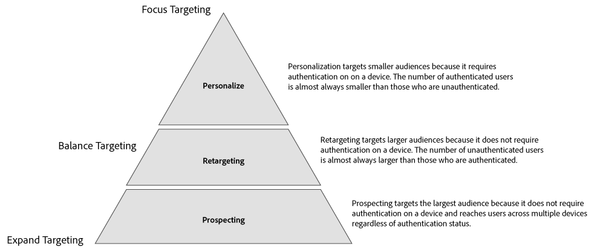

# Användningsexempel för externt enhetsdiagram {#external-device-graph-use-cases}

Rekommendationer och användningsexempel för prospektering, återannonsering och personalisering för okända användare med ett externt enhetsdiagram. Ett externt enhetsdiagram definieras som ett enhetsdiagram som är skilt från Audience Manager. Detta omfattar [!DNL Adobe Experience Cloud Device Co-op] och andra integreringar som Adobe har med tredjepartsföretag för deterministiska eller sannolika enhetsgrafer.

## Rekommendationer {#recommendations}

Överväg alternativen för enhetsdiagram [!DNL Experience Cloud Device Co-op] och tredjepartsdiagram för kampanjer som:

* Har låg autentiseringsnivå över sina digitala resurser. Använd [!UICONTROL Profile Link Device Graph option] om du har ett stort antal autentiserade användare.
* Target stora målgrupper. Enhetsdiagram [!DNL Experience Cloud Device Co-op] och tredjepartsdiagram innehåller autentiserade och icke-autentiserade data.
* Segmentera autentiserade och/eller oautentiserade besökare på individ- och hushållsnivå.

<!-- 
## Prospecting/Branding Use Case {#prospecting-branding-use-cases}

A branding campaign is designed to reach as many people as possible. It places few limits on segment qualification. But, these campaigns can waste budget and impressions by constantly targeting people who see your content multiple times and don't convert. A [!UICONTROL Profile Merge] rule that uses the [!DNL Device Co-op] or third-party option can help you create an efficient branding campaign. For example, you can add these unknown users to a "not in-market" segment after seeing them across multiple devices for your set frequency cap.

<table id="table_00F6EED172574E80A38CADA8A92A23B1"> 
 <thead> 
  <tr> 
   <th colname="col1" class="entry"> Use Case </th> 
   <th colname="col2" class="entry"> Description </th> 
  </tr> 
 </thead>
 <tbody> 
  <tr> 
   <td colname="col1"> 
 <b>Conditions</b> 
 </td> 
   <td colname="col2">This use case assumes these conditions: 
 
     <ul id="ul_F5CA7EE525774F7EBA5FBB5F94E4EDC8"> 
      <li id="li_81AE304924724146A24FAB5B6533AD8E">You want to deliver a maximum of 10 impressions to an anonymous user for a specific ad campaign. </li> 
      <li id="li_E371F989735245B0B82433DE240D56D0">A user has 4 devices and may or may not have authenticated on your site. </li> 
      <li id="li_9231ABE15CA249E6B79D8BF0E511FD33">An anonymous user sees the ad a total of 10 times while browsing in an unauthenticated state on their current device and 3 devices linked to the current device by an external device graph. </li> 
      <li id="li_8C276C07019C49EFA3A0D0D54CF73C31">You have defined an  Audience Manager segment to qualify anonymous users after they have seen 10 impressions. </li> 
     </ul> 
 </td> 
  </tr> 
  <tr> 
   <td colname="col1"> 
 <b>Results</b> 
 </td> 
   <td colname="col2"> 
Given these conditions,  Audience Manager: 
 
 
     <ul id="ul_8E988B1005324526BC6DC6637BBACCFB"> 
      <li id="li_C9DD546754914BACB8F4C92C7D4ED70E">Merges the anonymous, unauthenticated activity collected from the current device and the 3 devices linked by the external device graph (the ad impressions from each device). </li> 
      <li id="li_FB55CB9116074525BA30FF062D1136AE">Evaluates the unauthenticated user for segment qualification based on a combination of anonymous activity across all 3 devices linked by the external device graph and the current device. </li> 
      <li id="li_B28EB32F718145A7ABBDAC0AF75E2AFC">Sends the segment to any real-time destination for use as a suppression segment on the current device and all 3 devices linked by the external device graph. </li> 
     </ul> 
 </td> 
  </tr> 
 </tbody> 
</table>

## Retargeting or Site Personalization Use Case {#retargeting-use-case}

These strategies are designed to bring an unauthenticated or unknown user back to your site or personalize their browsing experience while they're on-site.

<table id="table_0EE2052AA3E744B3B76036FC06B5A453"> 
 <thead> 
  <tr> 
   <th colname="col1" class="entry"> Use Case </th> 
   <th colname="col2" class="entry"> Description </th> 
  </tr> 
 </thead>
 <tbody> 
  <tr> 
   <td colname="col1"> 
 <b>Conditions</b> 
 </td> 
   <td colname="col2">This use case assumes these conditions: 
 
     <ul id="ul_FD0B869B4AF3453FAEC9BA3A45ABF039"> 
      <li id="li_8E30BAED42E94AB3B81FCB1C7464E5FC">You want to deliver a personalized on-site and/or off-site experience to an anonymous user based on their activity on your site while in an unauthenticated state. </li> 
      <li id="li_3DBE53BA94324F1BA1C52A37AD4E426C">A user has multiple devices and may or may not have authenticated to your site. </li> 
      <li id="li_F867AFBDC1A54CD6A68AB0EC196E27C9">A user views multiple pages on your site while browsing in an unauthenticated state on their current device and 3 other devices linked by an external device graph. </li> 
      <li id="li_7E35D77949CE4E69BD51655AA4C40BEE">You have defined an  Audience Manager segment to qualify users after they have viewed multiple pages on your site while browsing in an unauthenticated state.</li>
     </ul> 
 </td> 
  </tr> 
  <tr> 
   <td colname="col1"> 
 <b>Results</b> 
 </td> 
   <td colname="col2"> 
Given these conditions,  Audience Manager: 
 
 
     <ul id="ul_301339426B0643B295DC5B17E1939CFB"> 
      <li id="li_7E8BC3B179804F4A929497DE81E76911">Merges the anonymous, unauthenticated activity collected from the current devices and the 3 devices linked by the external device graph (the multiple page views from each device). </li> 
      <li id="li_803EFD58AA124A5BBC8279C4DC695544">Evaluates the unauthenticated user for segment qualification based on a combination of anonymous activity across all 3 devices linked by the external device graph and the current device. </li> 
      <li id="li_98D749268CC5456CBC9CF3BF5EB91BA8">Sends the segment to any real-time destination to deliver a personalized on-site and/or off-site experience across the current device and all 3 devices linked by the external device graph. </li>
     </ul> 
 </td>
  </tr>
 </tbody>
</table> -->

## Utökad målinriktning {#audience-expansion}

Det här användningsexemplet visar hur ni kan utöka storleken på den adresserbara publiken med korrekt personalisering på olika enheter via [!DNL Adobe Co-Op Device Graph] eller andra [!DNL External Device Graphs].

Låt oss säga att Jane äger tre enheter som hon regelbundet använder för att söka efter semesterpaket: hennes bärbara dator ([!DNL Device 1]), hennes smartphone ([!DNL Device 2]) och hennes surfplatta ([!DNL Device 3]). När Jane använde den bärbara datorn sökte han efter flyg, hotell och guidade turer. När hon använde smarttelefonen och surfplattan besökte hon bara resebyråns hemsida.

Med [!UICONTROL No Cross-Device Profile] + [!UICONTROL Adobe Co-op Device Graph] -regeln kan resebyrån sammanfoga alla tre enhetsprofilerna eftersom de är kopplade till samma ägare via [!UICONTROL Adobe Co-op Device Graph].

I vårt exempel har alla egenskaper som krävs för att kvalificera sig för segmentet samlats in [!DNL Device 1]. Eftersom Audience Manager kvalificerar alla enhetsprofiler som deltar i profilsammanfogningen för ett segment segmenteras nu alla Jane tre enhetsprofiler.

Med den här regeln har enhetsdiagrammet utökat antalet enhetsprofiler som kvalificerar sig för segmentet från en till tre och gjort det möjligt för resebyrån att leverera ett enhetligt budskap till alla tre enheter som ägs av Jane.

## Avancerad målgruppsanpassning mellan enheter {#advanced-graph-expansion}

Det här användningsexemplet visar hur du kan utöka målgruppsanpassningen för autentiserade besökare med enheter från ett externt enhetsdiagram eller från [!DNL Adobe Co-Op Device Graph], med hjälp av **[!UICONTROL Last Authenticated Profiles]** +- **[!UICONTROL Adobe Co-Op Device Graph]** regeln.

I exemplet nedan vill Acme Inc.-företaget inrikta sig på alla hushåll med inkomster över 100 000 USD/år som har [!DNL Acme Inc.] abonnenter [!DNL Data Plan A]som använder en [!DNL iPhone 7] enhet.

John använder sin iPhone 7 på Data Plan A för att autentisera på webbplatsen Acme Inc.. Samtidigt innehåller Johns [!DNL Co-Op Device Graph] kluster ytterligare två enheter som han använder regelbundet: hans bärbara dator ([!DNL Device 1]) och hans sekundära smarttelefon [!DNL Device 2] (en [!DNL Samsung S7] på [!DNL Data Plan B]).

Genom att använda **[!UICONTROL Last Authenticated Profiles]** + **[!UICONTROL Adobe Co-Op Device Graph]** kan [!DNL Acme Inc.] leverera personaliserade meddelanden till alla tre enheter från Johns enhetsgrafkluster, även om bara en av dem ursprungligen kvalificerar sig för segmentet.

>[!MORELIKETHIS]
>
>* [Användningsexempel för profillänkens enhetsdiagram](profile-link-use-case.md)
>* [Allmänna användningsexempel för profilkopplingsregler](merge-rule-targeting-options.md)
>* [Vanliga frågor om regler för profilsammanslagning](../../faq/faq-profile-merge.md)

