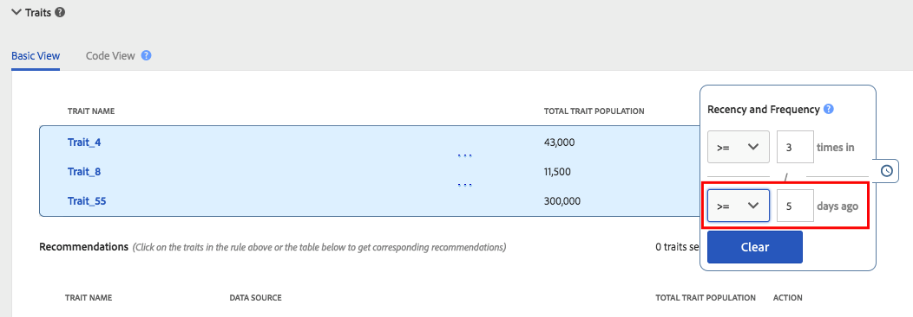

# Recency och frekvens {#recency-and-frequency}

I [!UICONTROL Segment Builder] kan du segmentera besökare utifrån åtgärder som inträffar eller upprepas under ett visst dagligt intervall.

Audience Manager definierar [!DNL recency] och [!DNL frequency] enligt följande:

* **[!UICONTROL Recency]:** Hur nyligen en användare har tittat på eller kvalificerat sig för en (eller flera)  [!UICONTROL traits].
* **[!UICONTROL Frequency]:** Den hastighet med vilken en användare visar eller är kvalificerad för en (eller flera)  [!UICONTROL traits].

[!UICONTROL Recency] och  [!UICONTROL Frequency] inställningar hjälper er att segmentera besökarna utifrån deras faktiska (eller uppfattade) intressenivå på en webbplats, ett avsnitt eller en viss kreativ nivå. Användare som kvalificerar sig för ett segment med höga krav på senaste frekvens/frekvens kan till exempel vara mer intresserade av en webbplats eller produkt än användare som besöker mindre ofta eller mindre ofta.

## Platsen för [!UICONTROL Recency and Frequency]-inställningarna {#location}

I [!UICONTROL Segment Builder] finns inställningarna [!UICONTROL Recency] och [!UICONTROL Frequency] i avsnittet [!UICONTROL Basic View] på panelen [!UICONTROL Traits]. Klicka på klockikonen för att visa dessa kontroller.

## Begränsningar och regler {#limitations-rules}

Granska och förstå dessa gränser och regler när du vill använda senaste och återkommande för egenskaper i dina segment.

### [!UICONTROL Recency] {#recency}

<table id="table_026064124C694D75B7A960457D50170B"> 
 <thead> 
  <tr> 
   <th colname="col1" class="entry"> Begränsning eller regel </th> 
   <th colname="col2" class="entry"> Beskrivning </th> 
  </tr> 
 </thead>
 <tbody> 
  <tr> 
   <td colname="col1"> 
 <b>Minimivärde</b> 
 </td> 
   <td colname="col2"> 
Senaste aktivitet måste vara större än 0. 
 </td> 
  </tr>
  <tr> 
   <td colname="col1"> 
 <b>Trait Types</b> 
 </td> 
   <td colname="col2"> 
Du kan endast använda senaste kontroller för regelbaserade egenskaper och mappegenskaper. 
 </td> 
  </tr> 
  <tr> 
   <td colname="col1"> 
 <b>Tredjepartskunskaper</b> 
 </td> 
   <td colname="col2"> 
Du kan inte ange regler för senaste aktiviteter för enskilda tredjepartsegenskaper eller egenskapsgrupper som innehåller egenskaper från tredje part. Nyhet och frekvens gäller endast för dina egna egenskaper. 
 </td> 
  </tr> 
 </tbody> 
</table>

### [!UICONTROL Frequency] {#frequency}

<table id="table_EBD621D26C8B4D03933E8C0753C892A7"> 
 <thead> 
  <tr> 
   <th colname="col1" class="entry"> Begränsning eller regel </th> 
   <th colname="col2" class="entry"> Beskrivning </th> 
  </tr> 
 </thead>
 <tbody> 
  <tr> 
   <td colname="col1"> 
 <b>Tredjepartskunskaper</b> 
 </td> 
   <td colname="col2"> 
Du kan inte ange frekvensregler för enskilda egenskaper eller trait-grupper från tredje part som innehåller egenskaper från tredje part. Nyhet och frekvens gäller endast för dina egna egenskaper. 
 </td> 
  </tr> 
  <tr> 
   <td colname="col1"> 
 <b>Trait Types</b> 
 </td> 
   <td colname="col2"> 
Du kan endast använda frekvenskontroller för regelbaserade egenskaper och mappegenskaper. 
 </td> 
  </tr> 
  <tr> 
   <td colname="col1"> 
 <b>Krav för senaste</b> 
 </td> 
   <td colname="col2"> 
Du kan konfigurera frekvenskrav <i>utan att</i> konfigurera krav för senaste aktivitet. Ange bara ett frekvensvärde och lämna fältet för senaste aktivitet tomt. 
 </td> 
  </tr> 
  <tr> 
   <td colname="col1"> 
<b>Regler för profilsammanslagning</b> 
 </td> 
   <td colname="col2"> 
Se <a href="../../faq/faq-profile-merge.md#trait-freq-device-rules"> Tågfrekvens, Externa enhetsdiagram och regler för profilsammanslagning</a>. 
 </td> 
  </tr> 
 </tbody> 
</table>

## Exempel på senaste aktivitet {#recency-examples}

Här är två exempel på hur aktuell information fungerar, beroende på vad du har valt i användargränssnittet:

### Använda operatorn mindre än eller lika med (&lt;=)

I det här exemplet väljer du operatorn &lt;=, vilket visas i skärmbilden. Detta kvalificerar användaren för [!UICONTROL segment] om de kvalificerar sig för någon av de tre [!UICONTROL traits] minst tre gånger inom de senaste fem dagarna. Tidslinjen nedan visar [!UICONTROL segment]-kvalificeringen när [!UICONTROL segment] skapas, den 1 oktober och tio dagar senare.

### Använda operatorn större än eller lika med (=>)

I det här exemplet väljer du operatorn =>, vilket visas i skärmbilden. Detta berättigar din användare till [!UICONTROL segment] om de kvalificerar sig för någon av de tre [!UICONTROL traits] minst tre gånger varje gång mellan sin första kvalificering på Audience Manager-plattformen och avslutningstiden för fem dagar sedan. Tidslinjen nedan visar [!UICONTROL segment]-kvalificeringen när [!UICONTROL segment] skapas, den 1 oktober och tio dagar senare.

## Exempel på frekvensbegränsning {#frequency-capping}

Uttryck med frekvensbegränsning inkluderar alla användare vars antal [!UICONTROL trait]-realiseringar är under ett önskat värde. Här är några exempel på höger och fel:

* Fel - Uttrycket `frequency([1000T]) <= 5` innehåller alla användare som har fyllt i [!UICONTROL trait] med ID:t &quot;1000&quot; högst fem gånger, men även användare som inte har fyllt i [!UICONTROL trait]. Därför validerar inte Audience Manager det här uttrycket av prestandaskäl, eftersom det skulle kvalificera för många användare för [!UICONTROL segment].

* Höger - Om du vill inkludera alla användare som har fyllt i [!UICONTROL trait] med ID:t &quot;1000&quot; högst fem gånger, lägger du till ytterligare ett villkor i uttrycket för att se till att användarna har kvalificerat sig för [!UICONTROL trait] minst en gång:  `frequency([1000T]) >= 1  AND  frequency([1000T]) <= 5`

* Höger - Om du vill att kraven på aktuell/frekvens ska vara mindre än ett visst antal gånger eller dagar ansluter du [!UICONTROL trait] till en annan med en `AND`-operator. Med hjälp av exemplet i den första punktpunkten blir det här uttrycket giltigt när det förenas med en annan [!UICONTROL trait] som visas här: `frequency([1000T]) <= 5 AND isSiteVisitorTrait`.

* Höger - För annonseringsfall med frekvensbegränsning kan du skapa en [!UICONTROL segment]-regel som ser ut så här: `(frequency([1000T] <= 2D) >= 5)`. Det här uttrycket innehåller alla användare som har fyllt i [!UICONTROL trait] med ID:t &quot;1000&quot; de senaste två dagarna minst fem gånger. Ange frekvensbegränsning genom att skicka denna [!UICONTROL segment] till annonsservern med en `NOT`-uppsättning på [!UICONTROL segment] på annonsservern. Den här metoden ger bättre prestanda i [!DNL Audience Manager] samtidigt som den har samma syfte för frekvensbegränsning.

>[!MORELIKETHIS]
>
>* [Segment Builder Controls: Traits Section](../../features/segments/segment-builder.md#segment-builder-controls-traits)
>* [Kodsyntax som används i Segment Expression Editor](../../features/segments/segment-code-syntax.md)

