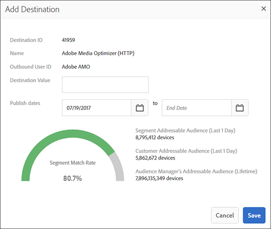

# [!UICONTROL Segment Builder] {#segment-builder}

Beskriver de obligatoriska och valfria stegen som skapar ett segment i [!UICONTROL Segment Builder].

## Videodemonstration

Börja med att titta på videon Skapa segment i Audience Manager. Videon visar hur du skapar segment. Läs avsnitten nedan för mer information.

## Skapa en [!UICONTROL Segment] {#create-segment}

### Segmentbyggaravsnitt

<!-- t_create_segment.xml -->

[!UICONTROL Segment Builder] består av tre separata avsnitt: [!UICONTROL Basic Information], [!UICONTROL Traits]och [!UICONTROL Destinations Mapping]. Om du vill skapa en [!UICONTROL segment]fil fyller du i de obligatoriska fälten i [!UICONTROL Basic Information] - och [!UICONTROL Traits] -avsnitten. [!UICONTROL Destinations Mapping] inställningarna är valfria. Se instruktionerna nedan för ytterligare hjälp.

1. Under [Grundläggande information](../../features/segments/segment-builder.md#segment-builder-controls-basics) :

   

   * Namnge [!UICONTROL segment]. Ett [!UICONTROL segment] namn får innehålla högst 255 tecken.
   * Ange [!UICONTROL segment] status (aktiv är standard).
   * Välj en [!UICONTROL data source]. Använd den första listrutan för att filtrera mellan Audience Manager [!UICONTROL data sources], Adobe Analytics rapporteringsprogram eller båda. Välj sedan den andra listrutan [!UICONTROL data source]. Om du inte använder Adobe Analytics rapportprogramsviter är typväljaren inaktiverad och standardinställningen är endast för datakällor i Audience Manager. [!UICONTROL data source]
   * Välj en [!UICONTROL profile merge rule] som ska användas för [!UICONTROL segment] kvalificering.
   * Tilldela [!UICONTROL segment] till en lagringsmapp.

1. I avsnittet [Traits](../../features/segments/segment-builder.md#segment-builder-controls-traits) :
   
   * Sök efter de [!UICONTROL trait] du vill lägga till i ett segment och klicka på **[!UICONTROL Add Trait]**. Lägg till en annan [!UICONTROL trait] för att skapa en [!UICONTROL trait] grupp.
   * Lyft fram det modala [!UICONTROL Advanced Search] genom att klicka **[!UICONTROL Browse All Traits]**. Sök efter [!UICONTROL traits] namn, ID, beskrivning eller [!UICONTROL data source]. Klicka på en mapp medan du söker för att begränsa resultatet till den mappen och dess undermappar. Du kan också filtrera [!UICONTROL traits] efter [!UICONTROL trait type] ([!UICONTROL Folder Trait], [!UICONTROL Rule-based], [!UICONTROL Onboarded]och [!UICONTROL Algorithmic]) eller populationstyp ([enhets-ID](../../reference/ids-in-aam.md) och [enhets-ID](../../reference/ids-in-aam.md)).
      
   * Få rekommendationer [för](trait-recommendations.md) de vanligaste funktionerna när du bygger upp [!UICONTROL segment]dem.
   * Klicka och dra [!UICONTROL traits] för att skapa separata grupper.
   * Hovra mellan grupper för att ange relationer med booleska värden [!UICONTROL AND], [!UICONTROL OR]och [!UICONTROL AND NOT] värden.
   * Håll pekaren över klockikonen för att lägga till regler för [senaste](../../features/segments/recency-and-frequency.md) och frekvens i [!UICONTROL trait].
   * Visa segmentpopulationsdata när du lägger till eller tar bort [!UICONTROL traits]. Klicka **[!UICONTROL Calculate Estimates]** för att visa (eller uppdatera) de beräknade populationssiffrorna. Läs mer om [segmentpopulationsdata](../../features/segments/segment-builder-data.md#segment-populations) i [!UICONTROL Segment Builder].
   * Klicka **[!UICONTROL Save]** när du är klar.

1. *(Valfritt)* Mappa en [!UICONTROL segment] till en [!UICONTROL destination] i avsnittet [Målmappning](../../features/segments/segment-builder.md#segment-builder-controls-destinations) :
   * Sök efter [!UICONTROL destination] och klicka **[!UICONTROL Add Destination]**. Observera att [!UICONTROL destination] filen måste finnas innan du kan lägga till den i en [!UICONTROL segment].
   * Klicka **[!UICONTROL Save]** när du är klar.

Titta på videon nedan för att få en detaljerad bild av hur enhetsövergripande mätvärden fungerar.

>[!VIDEO](https://docs.adobe.com/content/help/en/audience-manager-learn/tutorials/build-and-manage-audiences/profile-merge/understanding-cross-device-metrics-in-audience-manager.html)

## [!UICONTROL Segment Builder] Kontroller: [!UICONTROL Basic Information] Avsnitt {#segment-builder-controls-basics}

I [!UICONTROL Segment Builder]kan du [!UICONTROL the Basic Information] skapa nya eller redigera befintliga egenskaper. Om du vill skapa en ny [!UICONTROL segment]mapp anger du ett namn, en [!UICONTROL data source]och väljer en lagringsmapp. Alla andra fält är valfria. Gå vidare till [!UICONTROL Traits] avsnittet när du är klar.

<!-- r_segment_basic_info_section.xml -->

<!--

<table id="table_39DA4BC9470448B48F6654F2774EE0D5"> 
 <thead> 
  <tr> 
   <th colname="col1" class="entry"> Field </th> 
   <th colname="col2" class="entry"> Description </th> 
  </tr> 
 </thead>
 <tbody> 
  <tr> 
   <td colname="col1"> <b>Name</b> </td> 
   <td colname="col2"> 
Give the segment a short, logical name that describes its function or purpose. Avoid abbreviations and special characters. The maximum length of a segment name is 255 characters. 
 </td> 
  </tr> 
  <tr> 
   <td colname="col1"> <b>Description</b> </td> 
   <td colname="col2"> 
A field for additional descriptive information about the segment. 
 </td> 
  </tr> 
  <tr> 
   <td colname="col1"> <b>Integration Code</b> </td> 
   <td colname="col2"> 
A field for a user-defined ID or other company-specific information. 
 </td> 
  </tr> 
  <tr> 
   <td colname="col1"> <b>Data Source</b> </td> 
   <td colname="col2"> 
Associates the segment with a specific data provider. 
Use the first drop-down menu to filter between Audience Manager data sources, Adobe Analytics report suites, or both. Then, use the second drop-down menu to choose your data source.

 If you are not using Adobe Analytics report suites, the data source type selector is disabled and defaulted to Audience Manager data sources only.

 </td> 
  </tr> 
  <tr> 
   <td colname="col1"><b>Profile Merge Rule</b> </td> 
   <td colname="col2"> 
Selects the Profile Merge Rule to use for segment qualification. 
 </td> 
  </tr> 
  <tr> 
   <td colname="col1"> <b>Status</b> </td> 
   <td colname="col2"> 
Activates or deactivates the segment (active by default). 
 </td> 
  </tr> 
  <tr> 
   <td colname="col1"> <b>Folder Storage</b> </td> 
   <td colname="col2"> 
Determines which storage folder the segment belongs to. 
 </td> 
  </tr> 
 </tbody> 
</table>

-->

| Fält | Beskrivning |
---------|----------
| **[!UICONTROL Name]** | Ge segmentet ett kort logiskt namn som beskriver dess funktion eller syfte. Undvik förkortningar och specialtecken. Segmentnamnet får innehålla högst 255 tecken. |
| **[!UICONTROL Description]** | Ett fält för ytterligare beskrivande information om segmentet. |
| **[!UICONTROL Integration Code]** | Ett fält för ett användardefinierat ID eller annan företagsspecifik information. |
| **[!UICONTROL Data Source]** | Associerar segmentet med en viss DataProvider.   Använd den första listrutan för att filtrera mellan Audience Manager och datakällor, Adobe Analytics rapportsviter eller båda. Använd sedan den andra listrutan för att välja datakälla.   Om du inte använder Adobe Analytics rapportprogramsviter är datakälltypväljaren inaktiverad och standardinställningen är endast Audience Manager datakällor. |
| **[!UICONTROL Profile Merge Rule]** | Väljer den profilkopplingsregel som ska användas för segmentkvalificering. |
| **[!UICONTROL Status]** | Aktiverar eller inaktiverar segmentet (aktivt som standard). |
| **Mapplagring** | Avgör vilken lagringsmapp som segmentet tillhör. |

## [!UICONTROL Segment Builder] Kontroller: [!UICONTROL Traits] Avsnitt {#segment-builder-controls-traits}

I [!UICONTROL Segment Builder]det här [!UICONTROL Traits] avsnittet kan du hantera [!UICONTROL traits] i en [!UICONTROL segment], skapa [!UICONTROL trait] grupper och ange kvalificeringskriterier. Om du vill lägga till en bild [!UICONTROL trait] i en [!UICONTROL segment]fil skriver du [!UICONTROL trait] namnet i sökfältet och klickar på [!UICONTROL Add Trait]. Spara [!UICONTROL trait] (om du är klar) eller gå vidare till [!UICONTROL Destinations Mapping].

<!-- r_segment_traits_section.xml-->

**Förutsättningar:** Fyll i de obligatoriska fälten i [!UICONTROL Basic Information] avsnittet.

| Fält | Beskrivning |
|--- |--- |
| **[!UICONTROL Basic View]** | I det här avsnittet finns visuella kontroller som du kan använda för att: <ul><li>Bygg nya och hantera befintliga [!UICONTROL segments]versioner.</li><li>Ta bort [!UICONTROL traits] från en [!UICONTROL segment].</li><li>Lägg till upp till 50 (maximalt) [!UICONTROL traits] i en [!UICONTROL segment].</li><li>Dra och släpp [!UICONTROL traits] för att skapa nya grupper.</li><li>Visa [!UICONTROL traits] och [!UICONTROL trait] grupper i en [!UICONTROL segment].</li><li>Ange kvalificeringskriterier med booleska uttryck, jämförelseoperatorer och inställningar för senaste frekvens/frekvens.</li></ul> |
| **[!UICONTROL Code View]** | Öppnar en utvecklingsmiljö där du kan skapa och hantera [!UICONTROL traits], grupper och kvalificeringskrav med kod i stället för med det visuella gränssnittet. Kodvyn är användbar om du [!UICONTROL segments]: <ul><li>Innehåller mer än 50 [!UICONTROL traits] i en individ [!UICONTROL segment]. Obs! [!UICONTROL Segments] begränsas till 5000 [!UICONTROL traits] (max).</li><li>Innehåller många [!UICONTROL trait] grupper.</li><li>ha komplexa kvalifikationskrav.</li></ul> |
| Sök | Hjälper dig att hitta [!UICONTROL traits] att lägga till i en [!UICONTROL segment]. |
| Recommendations | Få live-rekommendationer för liknande [!UICONTROL traits]funktioner från den första parten [!UICONTROL traits] och de [!UICONTROL Audience Marketplace] dataflöden du prenumererar på. Lägg till de här rekommendationerna i [!UICONTROL segment] regeln för att utöka er målgrupp. Läs mer i [Trait Recommendations](trait-recommendations.md). |
| **[!UICONTROL Marketplace Recommendations]** | Få live-rekommendationer för liknande [!UICONTROL traits]typer av [!UICONTROL Audience Marketplace] dataflöden som du inte prenumererar på. Läs mer i [Trait Recommendations](trait-recommendations.md). |
| Reella och beräknade [!UICONTROL Segment] storleksdata | Se [Trait- och segmentpopulationsdata i Segment Builder](segment-builder-data.md). |

## Ta bort [!UICONTROL Traits] från en [!UICONTROL Segment] {#remove-traits}

Att hantera [!UICONTROL traits] i er [!UICONTROL segments] är en viktig del i att hålla er [!UICONTROL segments] livskraftiga. Följ de här stegen om du behöver ta bort [!UICONTROL traits] från en [!UICONTROL segment].

Så här tar du bort [!UICONTROL traits] från en [!UICONTROL segment]:

1. Gå till **[!UICONTROL Audience Data > Segments]**. Bläddra igenom listan eller använd sökfunktionen för att hitta det [!UICONTROL segment] du vill arbeta med.
2. Klicka på [!UICONTROL segment] namnet för att öppna skärmen med [!UICONTROL segment] information.
3. Klicka på **Redigera** för att öppna [!UICONTROL Segment Builder] och klicka sedan på **Tålar** för att öppna [!UICONTROL traits] panelen.
4. Håll muspekaren över det [!UICONTROL trait] du vill ta bort och klicka sedan på krysset. Den här åtgärden tar omedelbart bort [!UICONTROL trait] från din [!UICONTROL segment].

## [!UICONTROL Segment Builder] Kontroller: [!UICONTROL Destinations Mappings] Avsnitt {#segment-builder-controls-destinations}

I [!UICONTROL Segment Builder]det valfria [!UICONTROL Destinations Mapping] avsnittet kan du skicka [!UICONTROL segment] data till en tredje part [!DNL cookie], [!DNL URL]eller [!UICONTROL server-to-server destination]. Om du vill lägga till en [!UICONTROL destination]bild söker du efter (eller bläddrar) en bild [!UICONTROL destination], anger [!UICONTROL destination] specifik information och klickar på **[!UICONTROL Add Destination]**.

<!-- r_segment_destinations_map.xml -->

### Förutsättningar

Fyll i de obligatoriska fälten i [!UICONTROL Basic Information] - och [!UICONTROL Traits] -avsnitten. Målet måste också finnas.

### [!UICONTROL Destination Mappings] Sökverktyg

Panelen innehåller **[!UICONTROL Destination Mappings]** sökverktyg som beskrivs i tabellen nedan.

| Söktyp | Beskrivning |
|---|---|
| **[!UICONTROL Search by Destination Name]** | Gör att du kan söka efter en viss [!UICONTROL destination] namntyp. Börja skriva om du vill söka. Fältet fylls i automatiskt baserat på dina sökord. Klicka **[!UICONTROL Add Destination]** när du är klar. |
| **[!UICONTROL Browse All Destinations]** | Bläddra i en lista över *alla* tillgängliga [!UICONTROL destinations] . Välj och lägg [!UICONTROL destinations] till i [!UICONTROL segment] popup-listan. |

## Fält i [!UICONTROL Destination Mappings] popup-fönster {#fields-in-dest-mappings}

I [!UICONTROL Segment Builder]visas [!UICONTROL Add Destination] dialogrutan när du har valt en [!UICONTROL destination]. I det här fönstret visas statisk information om [!UICONTROL destination] och fält som varierar beroende på [!UICONTROL destination] typ. Ange nödvändig information i de tomma fälten för att konfigurera en [!UICONTROL destination mapping].

>[!NOTE]
>
>Publiceringsdatum är valfria. Om det är tomt blir målet aktivt och upphör aldrig att gälla.

<!-- r_add_mappings_pop.xml -->

### [!UICONTROL Cookie Destination] Fält

I [!UICONTROL Destination Mapping] fälten anger du nyckelvärdepar som används för att skicka data till [!UICONTROL destination]. Ange tangenten i det första fältet och värdena i det andra. Din [!UICONTROL cookie destination] pop kan se ut ungefär så här:

### [!UICONTROL URL Destination] Fält

I fälten [!UICONTROL URL] och [!UICONTROL Secure URL] anger du den fullständiga standardadress eller den säkra adress som används för att skicka data till [!UICONTROL destination].

### [!UICONTROL Server-to-Server Destination] Fält

I [!UICONTROL Destination Value] fältet anger du värdet (en del av ett nyckelvärdepar) som ska användas för att skicka data till [!UICONTROL destination].

>[!MORELIKETHIS]
>
>* [Skapa ett cookie-mål](../../features/destinations/create-cookie-destination.md)
>* [Skapa ett URL-mål](../../features/destinations/create-url-destination.md)

