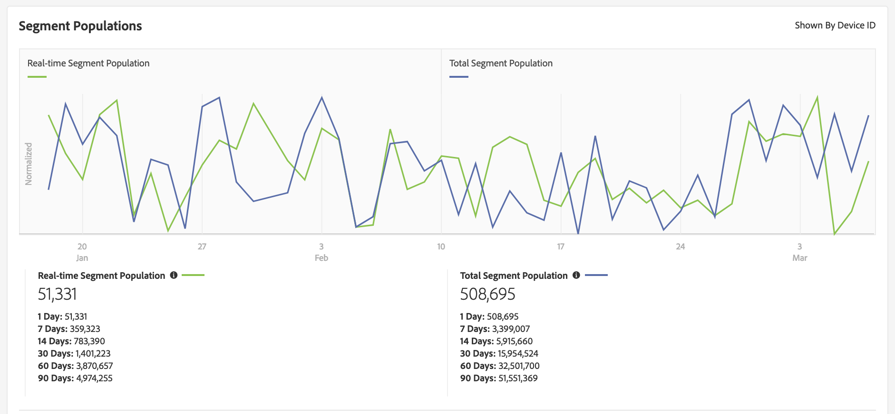

# Sidan Segmentinformation {#segment-summary-view}

Detaljsidan för ett enskilt segment innehåller en översikt över segmentinformationen, t.ex. segmentnamn, ID, prestandamått, regler som definierar segmentet och målmappningarna. Om du vill visa den här informationen går du till **[!UICONTROL Audience Data]** > **[!UICONTROL Segments]** och klickar på namnet på det segment du vill arbeta med.

## Segmenthanteringsverktyg {#segment-management-tools}

Överst på sidan med segmentinformation finns verktyg som du kan använda för att hantera dina segment:

1. **[!UICONTROL Add New]**: Använd det här alternativet om du vill aktivera [!UICONTROL Segment Builder] och skapa nya segment.
2. **[!UICONTROL Edit]**: Använd det här alternativet om du vill ändra konfigurationen för det aktuella segmentet.
3. **[!UICONTROL Duplicate]**: Använd det här alternativet om du vill skapa en kopia av det aktuella segmentet.
4. **[!UICONTROL Delete]**: Använd det här alternativet om du vill ta bort det aktuella segmentet från ditt Audience Manager-konto.
5. **[!UICONTROL Marketplace Recommendations]**: Använd det här alternativet för att hitta segment som liknar de som du visar, från [!UICONTROL Audience Marketplace] dataflöden som du inte prenumererar på. Mer information om hur du navigerar på Marketplace och hittar liknande segment finns i [Audience Marketplace for Data Buyers](../audience-marketplace/marketplace-data-buyers/marketplace-data-buyers.md) .

## Segmentinformation {#basics}

Under segmenthanteringsverktygen hittar du följande segmentinformation:

1. **[!UICONTROL Basic Information]:** Visar obligatorisk och valfri information som angavs när segmentet skapades. Se [Segmentbyggaren](segment-builder.md) för en detaljerad översikt över vad dessa fält betyder.
1. **[!UICONTROL Segment Graph]:** Visar prestandadata grafiskt och för fasta intervall på 1, 7, 14, 30, 60 och 90 dagar. Vi förklarar segmentpopulationsnummer i en [separat artikel](../../features/segments/segment-builder-data.md).

   

1. **[!UICONTROL Identity Type Breakdown]:** Rapporten visar antalet personer eller hushåll som är kvalificerade för ett segment genom att räkna antalet korsenhets-ID och/eller externa enhetsgraf-ID:n som är länkade till de enheter som är kvalificerade för segmentet (visas av [!UICONTROL Total Segment Population]). De olika enhets-ID:n och externa enhetsgraf-ID:n som visas i den här rapporten används för att sammanfoga profiler med den profilsammanfogningsregel som segmentet använder. Den här rapporten visas bara om du har valt en datakälla för olika enheter eller ett externt enhetsdiagram i den profilkopplingsregel som segmentet använder.

   

   >[!NOTE]
   >
   >Audience Manager visar bara rapporten [!UICONTROL Identity Type Breakdown] om du har ett ID mellan olika enheter som är kvalificerat för segmentet.

   I videon nedan visas en översikt över [!UICONTROL Identity Type Breakdown].

   >[!VIDEO](https://video.tv.adobe.com/v/27977/)

1. **[!UICONTROL Segment Rules]:** Visar egenskaper i segmentet tillsammans med kvalificeringsregler.
1. **[!UICONTROL Destination Mappings]:** Visar målmappningar för segmentet.
1. **[!UICONTROL Management Tools]:** Kontroller som gör att du kan skapa, redigera, klona och ta bort segment.
