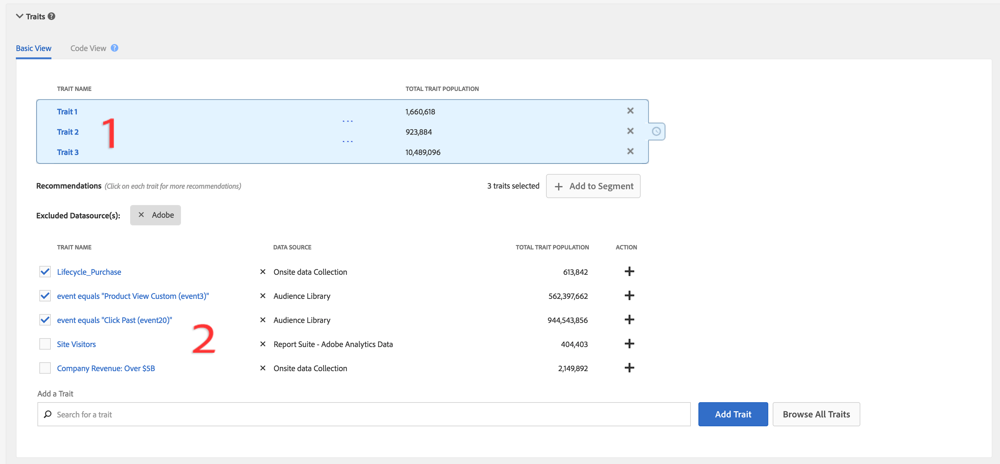

# Trait-rekommendationer

Få rekommendationer för Live-egenskaper när du skapar segment, från egna egenskaper och [!UICONTROL Audience Marketplace]-dataflöden.

## Videodemonstration

Börja med att titta på videon [!UICONTROL Trait Recommendations] nedan och läs sedan vidare för mer information. Videodemonstrationen visar hur du kan arbeta med rekommendationer från dina egna egenskaper, samt hur du kan följa rekommendationer från [!UICONTROL Audience Marketplace]-dataflöden som *du redan prenumererar på*.

>[!VIDEO](https://video.tv.adobe.com/v/26228/)

I nästa video visas arbetsflödet för [!UICONTROL Marketplace Recommendations] och hur du lägger till egenskaper i dina segment utifrån rekommendationer från dataflöden i [!UICONTROL Audience Marketplace]. Dessa rekommendationer baseras på dataflöden som *du inte prenumererar på*.

>[!VIDEO](https://video.tv.adobe.com/v/29363/)

## Översikt

[!UICONTROL Trait Recommendations], som drivs av  [!DNL Adobe Sensei], för in datavetenskap i era vardagliga arbetsflöden i Audience Manager.
När du skapar eller redigerar ett segment i [Segment Builder](segment-builder.md) får du rekommendationer om ytterligare egenskaper som du kan inkludera, som liknar egenskaperna i segmentregeln.[!UICONTROL Trait Recommendations]

Audience Manager visar dina rekommendationer både från dina egna egenskaper, i **[!UICONTROL Recommendations]**-avsnittet och från **[!UICONTROL Audience Marketplace]** i **[!UICONTROL Recommendations from Marketplace]**-avsnittet.

Lägg till de rekommenderade egenskaperna i ert segment för att öka er målgrupp.

**I korthet:**

* Audience Manager visar egenskaper för första part i avsnittet [!UICONTROL Recommendations]. Marketplace-rekommendationer från offentliga och privata feeds som du inte prenumererar på visas i [!UICONTROL Recommendations from Marketplace]-avsnittet. Klicka på feed-namnet för att gå till [!UICONTROL Audience Marketplace] och prenumerera.
* Audience Manager visar högst femtio egenskaper som liknar den i segmentregeln.
* Du kan filtrera bort de datakällor som du inte vill se några rekommendationer från.
* Vid beräkning av likheter anser Audience Manager att [UID:n](../../reference/ids-in-aam.md) som är kvalificerade för egenskapen under de senaste 30 dagarna.
* Om felmeddelandet&quot;Inga liknande egenskaper hittades. Trait(s) kan vara för nytt.&quot;, vilket innebär att det inte har förekommit någon aktivitet för den egenskapen under de senaste 30 dagarna, eller att Audience Manager ännu inte har uppdaterat rekommendationerna för den egenskapen. Försök igen om 24 timmar.

## Användningsexempel

Med [!UICONTROL Trait Recommendations] kan du förbättra dina arbetsflöden beroende på hur du använder Audience Manager:

* Som marknadsförare kan ni snabbt hitta målgrupper som är intresserade av kompletterande produkter med hjälp av liknande egenskaper, så att ni kan öka er räckvidd.
* Om du använder Audience Manager som utgivare, med [!UICONTROL Trait Recommendations], kan du förstå målgruppernas beteende och bygga bättre segment för annonsförsäljning eller kundvärvning.
* Som [!UICONTROL Audience Marketplace]-datainköpare vill jag identifiera relevanta tredjepartsdata utan att behöva bläddra igenom ett stort antal feeds.
* Som [!UICONTROL Audience Marketplace]-dataleverantör vill jag rekommendera relevanta data till köpare så att jag kan dra nytta av optimala och relevanta prenumerationer.

## Skillnader mellan Trait Recommendations och algoritmiska modeller

### Algoritmiska modeller

[!UICONTROL Algorithmic Models] inte bara hittar de mest inflytelserika egenskaperna, utan även poängsätter användare baserat på dessa egenskaper och tilldelar varje användare en individuell poäng. Sedan skapar du algoritmiska traits som riktar sig till användarna. Med precision och räckvidd i [!UICONTROL Trait Builder] kan du ange vilka användare bland alla som har de inflytelserika egenskaper som du vill ha som mål.

[!UICONTROL Algorithmic Models] gör att du kan välja användare på olika noggrannhetsnivåer och testa i  [!UICONTROL Audience Lab] vilken grupp användare som konverterar bättre. Se det detaljerade användningsexemplet i [Jämför modeller i Audience Lab](../../features/audience-lab/audience-lab-use-cases.md#compare-models).

I [!UICONTROL Algorithmic Models] körs modellen var 8:e dag och uppdaterar de användare som är kvalificerade för algoritmiska egenskaper.

### Trait-rekommendationer

[!UICONTROL Trait Recommendations] är ett snabbt sätt att få insikter om andra egenskaper som liknar de du använder i ett segment.

Du bör använda [!UICONTROL Trait Recommendations] när:

* Ni behöver snabba insikter när ni skapar segment
* Ni använder segmenten för korta kampanjer eller när ni snabbt vill exkludera målgrupper som konverterar
* Ni försöker maximera räckvidden.

## Arbetsflöde

När du skapar eller redigerar ett segment i [Segment Builder](segment-builder.md) kan du utforska egenskaper som liknar egenskaperna i segmentregeln. Arbetsflödet i [Segment Builder](segment-builder.md) är mycket likt för nya och befintliga segment:

### Nya segment

1. Gå till **Målgruppsdata > Segment** och klicka på **Lägg till nya**.
1. I listrutan **Traits** lägger du till minst ett spår i segmentregeln.
1. I **[!UICONTROL Recommendations]**-avsnittet visas rekommenderade egenskaper och [!UICONTROL Audience Marketplace] rekommendationer för egenskaper för feeds som du prenumererar på. Avsnittet **[!UICONTROL Recommendations from Marketplace]** visar dina rekommendationer från feeds som du inte prenumererar på. Alla dessa rekommendationer liknar de egenskaper som du har lagt till i segmentregeln. Rulla ned för att se alla rekommenderade egenskaper.
1. (Valfritt) Om du vill utesluta rekommenderade egenskaper från första part från vissa datakällor klickar du på symbolen **X** för de datakällor som du vill utesluta.

   >[!NOTE]
   >
   >De utelämnade datakällorna visas alldeles ovanför listan med rekommenderade egenskaper. Klicka på **X** i den grå rutan om du vill ta bort undantagen och visa resultat från respektive datakälla igen.
1. Om du vill lägga till rekommenderade egenskaper i segmentregeln klickar du på symbolen **+**.

>[!IMPORTANT]
>
>När du lägger till [!UICONTROL Marketplace]-egenskaper i ett segment används egenskaperna bara för segmentberäkning, tills du prenumererar på motsvarande datafeed. Fällor som kommer från dataflöden som du inte prenumererar på markeras med en kundvagnsikon i listan. Klicka på namnet på trait för att gå till datafeedsidan och prenumerera på den.
>
>
>
>Du kan bara spara ett segment med egenskaper från tredje part efter att du har prenumererat på motsvarande dataflöden.

### Befintliga segment

1. Gå till **[!UICONTROL Audience Data]>[!UICONTROL Segments]**, markera det segment som du vill redigera och klicka på .
1. Bläddra nedåt till listrutan [!UICONTROL Traits].
1. Rekommenderade egenskaper som liknar de egenskaper som redan finns i segmentregeln visas. Rulla ned för att se alla rekommenderade egenskaper.
1. (Valfritt) Om du vill utesluta rekommenderade egenskaper från vissa datakällor klickar du på symbolen **X** för de datakällor som du vill utesluta.

   >[!NOTE]
   >
   >De utelämnade datakällorna visas alldeles ovanför listan med rekommenderade egenskaper. Klicka på **X** i den grå rutan om du vill ta bort undantagen och visa resultat från respektive datakälla igen.
1. Om du vill lägga till rekommenderade egenskaper i segmentregeln klickar du på symbolen **+**.

När du skapar eller redigerar ett segment och lägger till ett drag i segmentregeln, visas maximalt femtio rekommenderade egenskaper, liknande den som du har lagt till. Om segmentregeln innehåller mer än ett drag, använder Audience Manager en runda rader-metod för att visa den bästa matchningen för varje egenskap, den näst bästa matchningen för varje egenskap och så vidare, för de största femtio egenskaperna per population, i segmentregeln.

Om det till exempel finns tre egenskaper i segmentregeln, som visas nedan, är de rekommenderade egenskaperna:

1. Bästa matchning för trait 3 (egenskapen med den största befolkningen).
1. Best match for trait 1;
1. Best match for trait 2;
1. Andra bästa matchningen för trait 3;
1. Den näst bästa matchningen för trait 1 och så vidare tills du når femtio traits.

Om du vill få rekommendationer för en viss egenskap kan du klicka på egenskaperna i segmentregeln (1) eller i vyn med rekommenderade egenskaper (2).

När du klickar på ett spår från första part öppnas ett popup-fönster, vilket visas i bilden nedan. Om de rekommenderade egenskaperna inte är en del av segmentet kan du lägga till dem i segmentet genom att trycka på **+**.

>[!TIP]
>
>Undantagna datakällor från huvudsidan beaktas när rekommendationer genereras i popup-fönstret för trait-information. Om du exkluderar datakällor i den här vyn gäller undantagen för huvudsidan.

>[!NOTE]
>
>Rekommenderade egenskaper kan vara egna egenskaper eller egenskaper från tredje part för dataflöden som du prenumererar på i [!UICONTROL Audience Marketplace].

## Så här fungerar det

För att kunna skapa rekommendationer för egenskaper beräknar Audience Manager [Jaccard-likhet](https://en.wikipedia.org/wiki/Jaccard_index) mellan målegenskap och alla andra egenskaper som ditt konto har tillgång till, inklusive data från tredje part. Audience Manager visar sedan upp till femtio egenskaper med den största likheten.

## Spåra likhetsresultat {#trait-similarity-score}

Audience Manager beräknar [!UICONTROL Trait Similarity Score] mellan två egenskaper genom att beräkna skärningspunkten och unionen utifrån antalet [!UICONTROL UUID]s och sedan dividera de två. För de två egenskaperna A och B ser beräkningen ut så här:

Se även de två exemplen nedan.

### Exempel 1 - Likhetspunkt med låg tram

Med två egenskaper A och B kan vi säga att var och en av egenskaperna har en befolkning på 1 000 000 [!UICONTROL UUID]s, 25 000 [!UICONTROL UUID]s som kvalificerar sig för båda egenskaperna.
Om du använder formeln ovan resulterar detta i: 25 000 / 1 975 000 = 0,012. Detta är ett lågt [!UICONTROL Trait Similarity Score], de två egenskaperna skiljer sig mycket åt.

### Exempel 2 - Likhetspunkt för spår

Om samma egenskaper A och B hade 400 000 [!UICONTROL UUID]s som kvalificerar för båda egenskaperna är [!UICONTROL Trait Similarity Score] mycket högre:
400 000 / 1 600 000 = 0,25

### Så här tolkar du likhetspoängen för spår

Använd tabellen nedan som en grov stödlinje för att anpassa likheter. Den här guiden baseras på de likhetspoäng som observerats för en majoritet av egenskaperna.

| [!UICONTROL Trait Similarity Score] | Signifikans |
|---------|----------|
| 0.1 och senare | Hög likhet mellan egenskaper |
| 0.03-0.1 | Medelstor likhet mellan egenskaper |
| 0.01-0.03 | Låg likhet mellan egenskaper |
| 0 - 0,01 | Mycket låg likhet mellan egenskaper |

## Rollbaserad åtkomstkontroll (RBAC)

För företag som använder [!UICONTROL Role-Based Access Controls] ([!UICONTROL RBAC]) måste du ha behörighet att skapa och redigera segment för att kunna se rekommenderade egenskaper. De profilrekommendationer du ser är endast sådana från datakällor som du har åtkomst till via [!UICONTROL RBAC].

>[!IMPORTANT]
>
>Om du vill lägga till [!UICONTROL Marketplace Recommendations] i ett segment måste användarna först prenumerera på motsvarande dataflöden. Endast användare med administratörsbehörighet kan prenumerera på [!UICONTROL Audience Marketplace] dataflöden.

Läs mer om [!UICONTROL RBAC] kontroller [här](../administration/administration-overview.md).

## Begränsningar

* I Audience Manager visas för närvarande inte mappegenskaper som rekommenderade egenskaper. Läs mer om mappegenskaper [här](../traits/manage-folder-traits.md).
* När Trait Recommendations visas tar Audience Manager inte hänsyn till [!DNL Boolean]-operatorer ([!DNL AND], [!DNL OR], [!DNL NOT]) i segmentreglerna.
