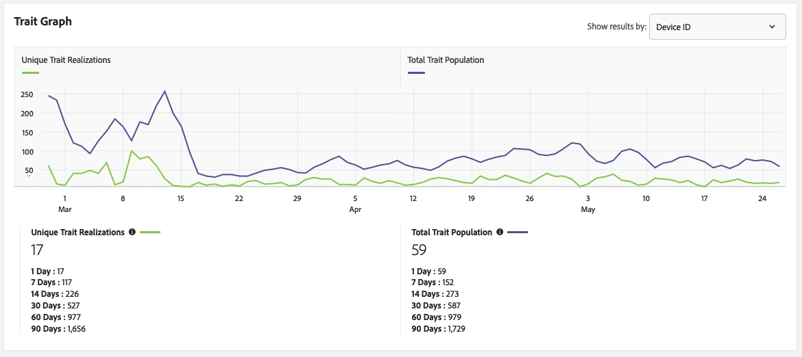

# [!UICONTROL Trait] Detaljsida  {#trait-details-page}

Informationssidan för en enskild [!UICONTROL trait] ger en översikt över [!UICONTROL trait]-informationen, t.ex. [!UICONTROL trait] namn, ID, prestandamätningar, uttryck som definierar [!UICONTROL trait], segment som den tillhör samt granskningsloggen för [!UICONTROL trait]. Om du vill visa den här informationen går du till **[!UICONTROL Audience Data]** > **[!UICONTROL Traits]** och klickar på namnet på [!UICONTROL trait] som du vill arbeta med.

## [!UICONTROL Trait] Hanteringsverktyg  {#trait-management-tools}

Den övre delen av informationssidan [!UICONTROL trait] innehåller verktyg som du kan använda för att hantera din [!UICONTROL traits]:

1. **[!UICONTROL Add New]**: Använd det här alternativet om du vill skapa nytt  [!UICONTROL rule-based],  [!UICONTROL algorithmic]eller  [!UICONTROL onboarded traits].
2. **[!UICONTROL Edit]**: Använd det här alternativet om du vill ändra konfigurationen för aktuell  [!UICONTROL trait].
3. **[!UICONTROL Delete]**: Använd det här alternativet om du vill ta bort den aktuella filen  [!UICONTROL trait] från ditt Audience Manager-konto.
4. **[!UICONTROL Marketplace Recommendations]**: Använd det här alternativet för att hitta liknande  [!UICONTROL traits] som den du tittar på, från  [!UICONTROL Audience Marketplace] dataavgifter som du inte prenumererar på. Mer information om hur du navigerar i [!UICONTROL Marketplace] och söker efter liknande egenskaper finns i [Audience Marketplace för Datainköpare](../audience-marketplace/marketplace-data-buyers/marketplace-data-buyers.md).

## [!UICONTROL Trait] Information  {#basics}

Avsnittet [!UICONTROL Trait Information] innehåller information om obligatoriska och valfria fält som du slutförde när du skapade [!UICONTROL trait]. Detta inkluderar saker som typen [!UICONTROL trait], [!UICONTROL trait] ID, beskrivning, [!UICONTROL data source] och andra metadata. De här detaljerna varierar beroende på typen [!UICONTROL trait] ([!UICONTROL folder], [!UICONTROL onboarded] eller [!UICONTROL rule-based]).

## [!UICONTROL Trait Graph] {#trait-graph}

[!UICONTROL Trait Graph] ger snabböverskådliga prestandamått för den [!UICONTROL trait] du valt. Håll markören över en trendlinje om du vill se ytterligare data för den markerade [!UICONTROL trait].

[!UICONTROL Unique Trait Realizations] representerar ett antal unika användare som har lagt till det här  [!UICONTROL trait] i sin profil under det angivna tidsintervallet. [!UICONTROL Total Trait Population] anger antalet unika användare som för närvarande är kvalificerade för denna [!UICONTROL trait].

För [!UICONTROL rule-based traits] sker [!UICONTROL trait]-kvalificeringen i realtid eftersom användare kvalificerar sig för [!UICONTROL trait] i sina webbläsare.

För [!UICONTROL onboarded traits] inträffar [!UICONTROL trait]-kvalificeringen efter att en inkommande fil har bearbetats, d.v.s. den inkommande filen [matas in i Audience Manager](../../faq/faq-inbound-data-ingestion.md) och det är när [!UICONTROL trait]-kvalificeringen inträffar.

[!UICONTROL Trait Graph] visar följande information:

* **[!UICONTROL Show results by]**
   * **[!UICONTROL Cross-Device ID]**: Välj det här alternativet om du vill se resultat för  [!UICONTROL traits] vilka samlar in data för autentiserade profiler. När du väljer det här alternativet visas bara data i [!UICONTROL Cross-Device ID]-rapporten, och inga data kommer att finnas under [!UICONTROL Device ID]-rapporten.
   * **[!UICONTROL Device ID]**: Välj det här alternativet om du vill se resultat för  [!UICONTROL traits] vilka samlar in data för enhetsprofiler. När du väljer det här alternativet visas bara data i [!UICONTROL Device ID]-rapporten, och inga data kommer att finnas under [!UICONTROL Cross-Device ID]-rapporten.

      

* **[!UICONTROL Unique Trait Realizations]**: Antal unika användare som har lagt till detta  [!UICONTROL trait] i sin profil under det angivna tidsintervallet.
* **[!UICONTROL Total Trait Population]**: Antalet unika användare som för närvarande är kvalificerade för detta  [!UICONTROL trait].

* **[!UICONTROL Identity Type Breakdown]**: De första tre posterna visar de tre översta  [!UICONTROL cross-device data sources] med det högsta populationsantalet som har kvalificerat för  [!UICONTROL trait], i fallande ordning. Den fjärde posten visar summan av alla andra [!DNL DPUUIDs] ([!DNL CRM IDs]) som är kvalificerade för [!UICONTROL trait], från [!UICONTROL cross-device data sources] som inte finns i de tre översta. Den här rapporten visas bara om du väljer [!UICONTROL Cross-device ID] i listrutan [!UICONTROL Show Results By] längst upp till höger på sidan. Standardalternativet är [!UICONTROL Device ID], där den här rapporten inte visas.

   

   >[!NOTE]
   >
   >Audience Manager visar endast [!UICONTROL Identity Type Breakdown]-rapporten om du har [!UICONTROL cross-device] ID:n som är kvalificerade för [!UICONTROL trait].

   >[!VIDEO](https://video.tv.adobe.com/v/27977/)

## [!UICONTROL Trait] Uttryck  {#trait-expression}

Avsnittet [!UICONTROL Trait Expression] visar vilka villkor som användare måste uppfylla för att vara kvalificerade för [!UICONTROL trait]. Dessa regler anges när du [skapar eller redigerar en egenskap](../../features/traits/about-trait-builder.md).

## [!UICONTROL Trait]Segment {#trait-segments}

I avsnittet [!UICONTROL Segments with this Trait] visas alla segment som det markerade [!UICONTROL trait] tillhör. Du kan klicka på ett segmentnamn om du vill se information om det segmentet.

## [!UICONTROL Trait] Gransknings-/historiklogg  {#trait-audit-history}

För [!UICONTROL rule-based] och [!UICONTROL onboarded traits] visar [!UICONTROL Trait Expression Change History] de 10 senaste ändringarna som gjorts i [!UICONTROL trait]-uttrycksreglerna och vem som gjorde dem. Om [!UICONTROL trait] innehåller fler än 10 ändringar klickar du på **[!UICONTROL Export to CSV]** för att hämta hela granskningsloggen. Granskningsloggen är inte tillgänglig för [!UICONTROL folder] eller [!UICONTROL algorithmic traits].

>[!NOTE]
>
>[!UICONTROL Not Available] i  [!UICONTROL By User] kolumnen betyder att kontot för den användaren har tagits bort.

