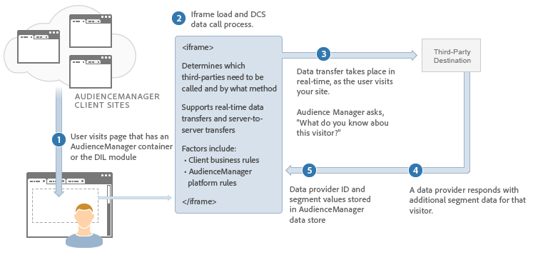

# Dataöverföringsprocessen i realtid beskrivs{#real-time-data-transfer-process-described}

En allmän översikt över hur Audience Manager utför dataöverföringar i realtid med en tredjepartsleverantör av innehåll.

<!-- real-time-data-transfer-explained.xml -->

## Dataöverföringar i realtid

Dataöverföringar i realtid skickar och tar emot segment-ID:n när en användare besöker eller vidtar åtgärder på webbplatsen. Synkrona dataöverföringar är vanligtvis användbara när du behöver kvalificera eller segmentera användare direkt när de navigerar i lagret.

## Dataintegreringssteg

Integreringen av data i realtid fungerar på följande sätt:

1. En användare besöker en kunds webbplats som innehåller Audience Manager-kod.
1. Audience Manager läser in en iframe och anropar vår [!UICONTROL Data Collection Server] ( [!UICONTROL DCS]).
1. Servern [!UICONTROL DCS] anropar tredjepartsservern (i realtid) för att kontrollera om leverantören har någon segmentinformation om användaren.
1. Innehållsleverantören returnerar segmentinformation om den användaren till Audience Manager.
1. Audience Manager tar emot denna segmentinformation och gör den tillgänglig för målinriktning och framtagning av nya egenskaper och segment.

