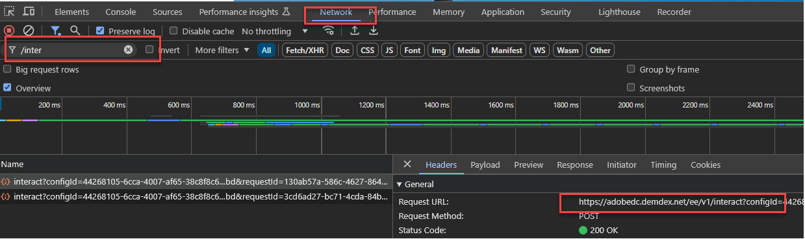
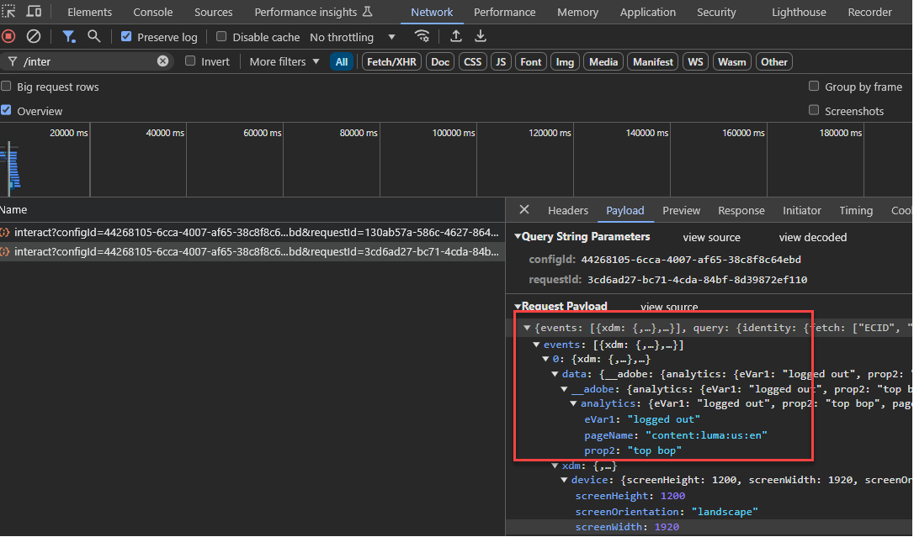
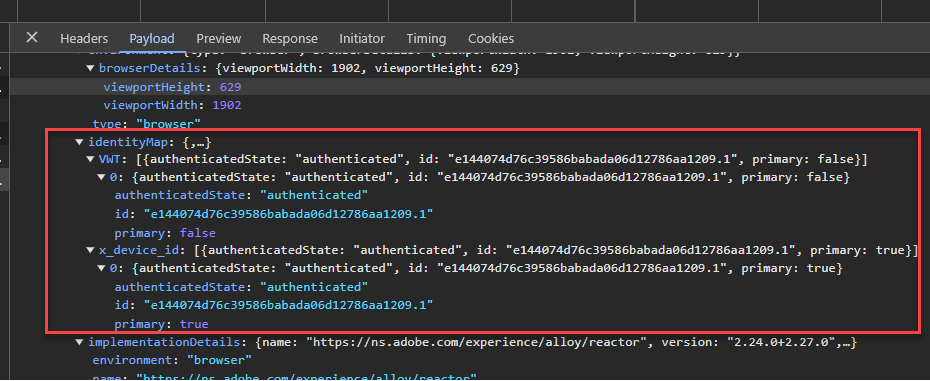

# Uppdatera datainsamlingsbiblioteket för Audience Manager från AppMeasurement till Web SDK

## Målgrupp {#intended-audience}

Den här sidan är till för Audience Manager- och Adobe Analytics-kunder som använder JavaScript-biblioteket [!DNL AppMeasurement] för att skicka webbdata till Audience Manager.

I tabellen nedan finns anvisningar om hur du migrerar till Web SDK, beroende på vilken datainsamlingsmetod du använder.

| Din befintliga datainsamlingsmetod | Migreringsinstruktioner för SDK |
|---------|----------|
| [!DNL AppMeasurement] JavaScript-bibliotek med modulen AudienceManagement | Följ instruktionerna i den här handboken. |
| [!DNL Audience Manager] [taggtillägg](https://experienceleague.adobe.com/sv/docs/experience-platform/tags/extensions/client/audience-manager/overview) | Följ instruktionerna i [Uppdatera ditt datainsamlingsbibliotek från Audience Manager-taggtillägget till SDK-webbtaggtillägget](dil-extension-to-web-sdk.md). |
| [!DNL AppMeasurement] JavaScript-bibliotek + fristående [!DNL Audience Manager] [DIL-bibliotek](../dil/dil-overview.md) | Följ instruktionerna i [Uppdatera ditt datainsamlingsbibliotek från Audience Manager-taggtillägget till SDK-webbtaggtillägget](dil-extension-to-web-sdk.md). |

## Migreringsöversikt {#overview}

Migrering från [!DNL AppMeasurement] till [Web SDK](https://experienceleague.adobe.com/sv/docs/experience-platform/web-sdk/home) är i första hand en Adobe Analytics-migrering. För Audience Manager-kunder omfattar migreringen även Audience Manager. Båda måste migreras tillsammans. Om du huvudsakligen arbetar med Audience Manager måste du se till att Analytics-teamet deltar i migreringen.

Om du använder [!DNL AppMeasurement] för Audience Manager datainsamling använder du för närvarande [!DNL Server-side Forwarding (SSF)]-metoden för att skicka Analytics-data till Audience Manager. I den här konfigurationen vidarebefordras begäran om insamling av analysdata till Audience Manager, som även hanterar Audience Manager svar på sidan.

Detta har varit standardmetoden i många år och är sannolikt din nuvarande konfiguration. Om ditt [!DNL AppMeasurement]-bibliotek innehåller modulen `AudienceManagement` och dina datainsamlingsanrop innehåller sökvägen `/10/` i begäran (`/b/ss/examplereportsuite/10/`) är den här handboken till dig.

## Dataflöden mellan SSF och SDK på webben {#data-flows}

För instruktionerna nedan är det viktigt att förstå dataflödesskillnaderna mellan Analytics och Audience Manager när man går över till Web SDK (och Edge Network).

Med vidarebefordran på serversidan samlar den regionala datainsamlingsnoden för Analytics in data, omvandlar dem till en signal som accepteras av Audience Manager, skickar den till Audience Manager och returnerar Audience Manager svar till sidan. Modulen [!DNL AudienceManagement] i biblioteket [!DNL AppMeasurement] hanterar sedan svaret (t.ex. att cookies släpps, URL-mål skickas). Den här processen kallas för vidarebefordran på serversidan eftersom Analytics vidarebefordrar data till Audience Manager med hjälp av Adobe-servrar.

Med Web SDK skickar Edge Network data till Analytics och Audience Manager i olika åtgärder. Web SDK är ett enda bibliotek som skickar data till alla lösningar, och Edge Network omvandlar lösningsbaserade datapunkter till lösningsspecifika format.

I det nya dataflödet skickas alla data till en [datastream](https://experienceleague.adobe.com/sv/docs/experience-platform/datastreams/overview) från Edge Network, som du kan [konfigurera](https://experienceleague.adobe.com/sv/docs/experience-platform/datastreams/configure) att skicka data till Adobe-lösningar efter behov. Om du aktiverar Audience Manager-tjänsten på datastream för Audience Manager omvandlas [!DNL XDM]- och Analytics-data till signaler som accepteras av Audience Manager. Edge Network returnerar också Audience Manager svar på sidan, där Web SDK hanterar svaret, som exempelvis [!DNL AppMeasurement] och [!DNL AudienceManagement] -modulen.

## Överföring av taggar jämfört med andra taggar {#tags-vs-non-tags}

Oavsett om du använder taggar med tillägget [!DNL AppMeasurement], biblioteket [!DNL AppMeasurement] i ett annat tagghanteringssystem eller placerar [!DNL AppMeasurement] direkt på sidan är stegen för att migrera Audience Manager till Web SDK desamma. Eftersom Audience Manager-migreringen är beroende av Analytics-migreringen bestäms stegen för att migrera från [!DNL AppMeasurement] till Web SDK under Analytics-migreringen.

Den informationen beskrivs i Analytics-dokumentationen för [Tags](https://experienceleague.adobe.com/sv/docs/analytics/implementation/aep-edge/web-sdk/analytics-extension-to-web-sdk)- eller [JavaScript](https://experienceleague.adobe.com/sv/docs/analytics/implementation/aep-edge/web-sdk/appmeasurement-to-web-sdk)-baserade implementeringar.

## XDM och `data.__adobe.`-noderna {#xdm-data-nodes}

En av huvudfunktionerna i [Web SDK](https://experienceleague.adobe.com/sv/docs/experience-platform/web-sdk/home) är att skicka data till [Real-Time Customer Data Platform (RTCDP)](https://experienceleague.adobe.com/sv/docs/experience-platform/rtcdp/home). För att uppnå detta och fortfarande samla in data för andra Experience Cloud-lösningar utan en fullständig omimplementering, delas lösningsspecifika data upp i serveranropet för datainsamling. Det här anropet använder ett standardiserat JSON-schema som kallas [Experience Data Model (XDM)](https://experienceleague.adobe.com/sv/docs/experience-platform/xdm/home)

Lösningsmedvetna element, som information om webbläsaren och enheten, skickas till Edge Network i en förbestämd XDM-struktur. Edge Network omvandlar dessa data till lösningsspecifika format. Data som är specifika för Target, Analytics och Audience Manager lagras dock i en dedikerad `data.__adobe`-nod i XDM-nyttolasten.

Exempel:

* Analysvariabeln `s.eVar1` representeras i XDM-nyttolasten som `data.__adobe.analytics.evar1`.
* En Target-parameter som är relaterad till kundlojalitetsstatusen lagras som `data.__adobe.target.loyaltyStatus`.

Data i noden `__adobe` skickas till respektive lösningar (som Analytics och Audience Manager) utan att skickas till Experience Platform, även om Experience Platform-tjänsten är aktiverad på dataströmmen. Det innebär att du kan behålla dina nuvarande konfigurationer för Analytics och Audience Manager samtidigt som du har flexibilitet att mappa nödvändiga dataelement till XDM-schemaelement för användning i realtid i Experience Platform med [Dataprep för datainsamling](https://experienceleague.adobe.com/sv/docs/experience-platform/datastreams/data-prep).

Strängen Analytics `s.products`, som används för att rapportera kundvagnens innehåll under utcheckningen, kan till exempel fortfarande skickas till Analytics och Audience Manager i det ursprungliga formatet. Samtidigt kan du använda elementen i den här strängen för att skapa mer intuitiva XDM-kundvagnsscheman för Experience Platform.

Eftersom de flesta Audience Manager-implementeringar förlitar sig på analysdata som vidarebefordrats till Audience Manager, är många av dina Audience Manager-uttryck troligen baserade på Analytics-variabler (`c_evar#`, `c_prop#` och `c_events`). För att undvika att återskapa trait-uttryck med XDM-format under migreringen är Edge Network som standard konfigurerat att omvandla alla Analytics-variabler som finns i noden `data.__adobe.analytics` till Audience Manager-signaler. En liknande transformeringsprocess sker i arbetsflödet för vidarebefordran på serversidan.

Edge Network kan utföra den här omvandlingen eftersom ett enda datainsamlingsanrop från sidan skickas till ett enda datastream som matar flera Adobe-lösningar. Därför kommer de flesta migreringar från [!DNL AppMeasurement] till Web SDK för både Analytics och Audience Manager främst att använda noden `data.__adobe.analytics`.

Edge Network omvandlar enhets- och webbläsardata från XDM-nyttolasten och pakethuvuden till Audience Manager-signaler. Detta gör att du kan fortsätta använda `h_` och `d_` plattformstangenter i Audience Manager-uttryck för egenskaper.

## Noden `data.__adobe.audiencemanager` {#data-note}

Noden `data.__adobe.audiencemanager` används för Audience Manager-implementeringar som inte är beroende av Analytics. Det lagrar anpassade nyckelpar/värdepar från Audience Manager som tidigare skickats via [DIL-biblioteket](../dil/dil-overview.md), vilket beskrivs i [migreringsguiden för taggtillägg](dil-extension-to-web-sdk.md).

Även om noden `data.__adobe.audiencemanager` inte behövs för den migrering som beskrivs i den här guiden, tillåter det nya dataflödet som beskrivs här att data skickas till Audience Manager utan att registreras i Analytics.

Om du behöver skicka ett anpassat nyckel/värde-par till Audience Manager utan att inkludera det i Analytics, kan du använda noden `data.__adobe.audiencemanager`. Alla datauppsättningar i den här noden läggs till i Audience Manager-transformerade Analytics-data i datainsamlingsserveranropet.

## Fördelar och nackdelar med implementeringsvägen

Att använda den här migreringsmetoden har både fördelar och nackdelar. Väg noga in varje alternativ för att avgöra vilken metod som är bäst för er organisation.

| Fördelar | Nackdelar |
| --- | --- |
| <ul><li>**Använder din befintliga implementering**: Även om den här metoden kräver vissa implementeringsändringar krävs ingen helt ny implementering från början. Du kan använda ditt befintliga datalager och kod med minimala ändringar av implementeringslogiken.</li><li>**Kräver inget schema**: För den här migreringsfasen till Web SDK behöver du inget XDM-schema. I stället kan du fylla i objektet `data`, som skickar data direkt till Audience Manager. När migreringen till Web SDK är klar kan du skapa ett schema för din organisation och använda datastream-mappning för att fylla i tillämpliga XDM-fält. Om det krävs ett schema i det här skedet av migreringsprocessen måste din organisation använda ett Audience Manager XDM-schema. Om du använder det här schemat blir det svårare för din organisation att använda ditt eget schema i framtiden.</li></ul> | <ul><li>**Implementering av teknisk skuld**: Eftersom den här metoden använder en modifierad form av din befintliga implementering, kan det vara svårare att spåra implementeringslogik och utföra ändringar i framtiden vid behov.</li><li>**Kräver mappning för att skicka data till plattformen**: När din organisation är redo att använda Real-Time CDP måste du skicka data till en datauppsättning i Adobe Experience Platform. Den här åtgärden kräver att alla fält i objektet `data` är en post i datastream-mappningsverktyget som tilldelar det till ett XDM-schemafält. Mappning behöver bara göras en gång för det här arbetsflödet, och implementeringen behöver inte ändras. Det är dock ett extra steg som inte krävs när du skickar data i ett XDM-objekt.</li></ul> |

Adobe rekommenderar följande implementeringsväg i följande scenarier:

* Du har en befintlig implementering som använder Adobe Analytics AppMeasurement JavaScript-biblioteket. Om du har en implementering med taggtillägget Audience Manager följer du [Migrera från taggtillägget Audience Manager till taggtillägget Web SDK](dil-extension-to-web-sdk.md) i stället.
* Du avser att använda Real-Time CDP i framtiden, men vill inte ersätta din Audience Manager-implementering med en Web SDK-implementering från grunden. Alternativet att ersätta implementeringen från grunden med Web SDK kräver mest arbete, eftersom du måste återskapa alla dina Audience Manager-egenskaper för att kunna söka efter XDM-formaterade data. Men det är också den mest lönsamma långsiktiga implementeringsarkitekturen. Om din organisation vill använda en ren implementering av Web SDK läser du [dokumentationen för Web SDK](https://experienceleague.adobe.com/sv/docs/experience-platform/web-sdk/home) i stället för att använda den här guiden.

## Steg som krävs för att migrera till SDK för webben

Följ stegen nedan för att migrera din datainsamlingsintegrering till Web SDK.

+++**1. Planera din Analytics-migrering**.

Arbeta med ert Analytics-team för att följa stegen för Analytics-migrering i de [Tags](https://experienceleague.adobe.com/sv/docs/analytics/implementation/aep-edge/web-sdk/analytics-extension-to-web-sdk)- eller [JavaScript](https://experienceleague.adobe.com/sv/docs/analytics/implementation/aep-edge/web-sdk/appmeasurement-to-web-sdk)-baserade implementeringarna. När ni har planerat er Analytics-migrering går ni tillbaka till den här guiden och fortsätter med Audience Manager-stegen för att avgöra vad ni behöver göra för Audience Manager så att ni kan distribuera Analytics och Audience Manager-migreringen tillsammans.

+++

+++**2. Lägg till Audience Manager-tjänsten i datastream**

Lägg till Audience Manager-tjänsten i den datastream som du använder i den Analytics-migrering som nämns i steg 1.

1. Navigera till [experience.adobe.com](https://experience.adobe.com) och logga in med dina autentiseringsuppgifter.
1. Använd hemsidan eller produktväljaren i det övre högra hörnet för att navigera till **[!UICONTROL Data Collection]**.
1. Välj **[!UICONTROL Datastreams]** i den vänstra navigeringen.
1. Välj den datastream som du skapade som en del av din Analytics-migrering i steg 1.
1. Välj **[!UICONTROL Add Service]**.
1. Välj **[!UICONTROL Audience Manager]** på den nedrullningsbara menyn för tjänster.
1. Kontrollera alternativen **[!UICONTROL Cookie Destinations Enabled]** och **[!UICONTROL URL Destinations Enabled]**. Med dessa alternativ kan Edge Network returnera dessa måltyper från Audience Manager till sidan.
1. Kontrollera att **[!UICONTROL Enable XDM Flattened Fields]** är inaktiverad. Med det här alternativet inaktiveras den automatiska omvandlingen av Analytics-variabler till Audience Manager-signaler. Det här alternativet är utformat för att behålla bakåtkompatibilitet för användare som migrerade till Web SDK innan Edge Network automatiskt omvandlade Analytics-data till Audience Manager-signaler.

   >[!NOTE]
   >
   >Om du migrerar till Web SDK med alternativet **[!UICONTROL Enabled XDM Flattened Fields]** aktiverat måste alla data som behövs i Audience Manager formaterade som XDM och alla Audience Manager-egenskaper som använder props, eVars eller händelser uppdateras för att i stället söka efter XDM-formaterade data. Adobe rekommenderar att du lämnar det här alternativet inaktiverat.

    {style="border:1px solid lightslategray"}

1. Välj **[!UICONTROL Save]** om du vill spara dataströmskonfigurationen.

Din datastream är nu redo att ta emot och skicka data till Audience Manager. Observera dataStream ID, eftersom detta ID krävs när du konfigurerar Web SDK i koden.

+++

+++**3. Aktivera synkronisering av tredjeparts-ID och ange Audience Manager-behållar-ID**

1. Navigera till [experience.adobe.com](https://experience.adobe.com) och logga in med dina autentiseringsuppgifter.
1. Använd hemsidan eller produktväljaren i det övre högra hörnet för att navigera till **[!UICONTROL Data Collection]**.
1. Välj **[!UICONTROL Datastreams]** i den vänstra navigeringen.
1. Välj den datastream som du skapade som en del av din Analytics-migrering i steg 1.
1. Välj **[!UICONTROL Edit]** i det övre högra hörnet på konfigurationssidan för datastream.
1. Expandera listrutan **[!UICONTROL Advanced Options]** och aktivera funktionen **[!UICONTROL Third Party ID Sync]** om den inte redan är aktiverad. Det här alternativet anger för Edge Network att returnera Partner ID Syncs för Audience Manager och Experience Platform datapartner.

    {style="border:1px solid lightslategray"}

1. I de flesta fall kan du lämna fältet **[!UICONTROL Third Party ID Sync Container ID]** tomt. Standardvärdet är `0`. Om du däremot föredrar att se till att rätt behållar-ID används följer du de här stegen:
   * Öppna ett webbläsarfönster i inkodat eller privat läge och navigera till en sida som är en del av migreringen.
   * Använd webbläsarens utvecklarverktyg för att filtrera efter nätverksanropet till `dpm.demdex.net/id`. Det här samtalet utlöses endast på första sidan av ett första besök, och därför behövs en inkognito eller en privat webbläsare.
   * Visa nyttolasten för begäran. Om parametern `d_nsid` inte är noll kopierar du den till fältet **[!UICONTROL Third Party ID Sync Container ID]**.

1. Välj **[!UICONTROL Save]**.

Din datastream kan nu både skicka data till Audience Manager och skicka Audience Manager svar till Web SDK.

+++

+++**4. Lägg till kund-ID:n på identitetskartan**

De flesta Audience Manager-implementeringar använder [profilkopplingsregler](../features/profile-merge-rules/merge-rules-overview.md) i personaliseringsscenarier mellan olika enheter och för att styra vilka segment besökarna kan kvalificera sig för beroende på autentiseringsstatus (inloggad eller utloggad). Regler för profilsammanslagning kräver att en kundägd identifierare (CRM-ID, kontonummer osv.) skickas till Audience Manager vid varje datainsamlingsanrop efter autentiseringen. Tidigare användes funktionen `setCustomerIDs` i Visitor ID-tjänsten ([!DNL visitor.js]) för att lägga till kund-ID:n i varje anrop till Analytics-datainsamling, som sedan vidarebefordrades till Audience Manager.

Med Web SDK måste dessa identiteter skickas till Edge Network med en speciell XDM-konstruktion som kallas [IdentityMap](https://experienceleague.adobe.com/sv/docs/experience-platform/xdm/field-groups/profile/identitymap).

Att skicka identiteter korrekt i en identitetskarta kräver förståelse för [identitetsnamnutrymmen](https://experienceleague.adobe.com/sv/docs/experience-platform/identity/features/namespaces) och att du noga undersöker vilka identiteter som ska skickas, särskilt när du skickar data till en Experience Platform-sandlåda. [I den här artikeln](https://experienceleague.adobe.com/sv/docs/experience-cloud-kcs/kbarticles/ka-21305) beskrivs dessa överväganden och instruktioner.

När du har fastställt vilka identiteter som ska skickas och när, följer du guiderna för hur du använder [!UICONTROL Identity map] **[!UICONTROL Identity map]** [dataelementet](https://experienceleague.adobe.com/sv/docs/experience-platform/tags/extensions/client/web-sdk/data-element-types#identity-map) i Taggar eller ställer in det manuellt så som beskrivs i [översikten över identitetsdata](https://experienceleague.adobe.com/sv/docs/experience-platform/web-sdk/identity/overview) för att anpassa dig till din distributionsstrategi för Web SDK.

+++

+++**5. (Valfritt) Ange cookie-filen `aam_uuid` från första part**

Ett standardtillvägagångssätt i många år var att placera Audience Manager UUID (värdet i en demodex-cookie från tredje part) i en cookie från första part som vanligtvis heter `aam_uuid`.

Om du vill ange cookie-filen måste du ange ett cookie-namn i fältet **[!UICONTROL Name]** i avsnittet **[!UICONTROL Unique User ID Cookie]** i taggtillägget Analytics eller i fältet `uuidCookie` när du konfigurerar `audienceManagementModule`. Även om cookien är konfigurerad i koden användes den sällan eftersom Audience Manager UUID-värdet är en enhetsspecifik, domänövergripande identifierare som används av annonsplattformar och inte ger något värde som förstapartidentifierare.

Om implementeringen kräver att den här `aam_uuid`-cookien fortsätter att anges efter migreringen till Web SDK kan du hämta Audience Manager UUID på två sätt.

1. Varje svar från [Edge Network interact-slutpunkten](https://developer.adobe.com/data-collection-apis/docs/endpoints/interact/) innehåller en nyttolast med `id` noder. Noden `id` i namnområdesnyttolasten `CORE` innehåller Audience Manager UUID.

2. Använd kommandot [getIdentity](https://experienceleague.adobe.com/sv/docs/experience-platform/web-sdk/commands/getidentity) för Web SDK för att hämta det. Använd namnutrymmet `CORE` enligt beskrivningen i dokumentationen och hämta värdet från fältet `identity.CORE` i svaret.

Oavsett vilken metod som används för att hämta Audience Manager UUID är det upp till ditt utvecklingsteam att analysera svaret, hämta UUID och ange cookien. Det finns inget automatiskt sätt att ställa in denna cookie via Web SDK.

+++

## Konfigurera vidarebefordran på serversidan och Audience Analytics i gränssnittet för Analytics Report Suite Manager {#configure-ssf-analytics}

Om du känner till funktionen [Vidarebefordran](https://experienceleague.adobe.com/sv/docs/analytics/admin/admin-tools/manage-report-suites/edit-report-suite/report-suite-general/server-side-forwarding/ssf) på serversidan i Analytics *kan du undra: Ska jag inaktivera inställningen för vidarebefordran på serversidan i gränssnittet i Analytics Report Suite Manager för att förhindra att Analytics-data skickas till Audience Manager två gånger?*&quot;.

Svaret är nej, du bör inte inaktivera den här inställningen av följande skäl:

1. När Audience Manager-tjänsten är aktiverad på en datastream, lägger Edge Network till variabeln `cm.ssf` i alla datainsamlingsbegäranden som skickas till Analytics. Detta förhindrar även att analysdata skickas till Audience Manager. Eventuella Assurance-loggar som används för att validera Analytics-migreringen visar variabeln `cm.ssf=1` när Audience Manager-tjänsten är aktiverad på datastream. Mer information finns på sidan [Analytics and GDPR compliance page focused on server-side forward](https://experienceleague.adobe.com/sv/docs/analytics/admin/admin-tools/manage-report-suites/edit-report-suite/report-suite-general/server-side-forwarding/ssf-gdpr).

1. Den här inställningen aktiverar även dataflödet för [!DNL Audience Analytics]-integreringen. Som beskrivs i [Audience Analytics-översikten](https://experienceleague.adobe.com/sv/docs/analytics/integration/audience-analytics/mc-audiences-aam) krävs vidarebefordran på serversidan för den här integreringen eftersom Audience Manager-svaret på analysdatainsamlingsservern läggs till i Analytics-träffen innan bearbetningen. En liknande process sker i Edge Network. När vidarebefordran på serversidan är aktiverat lägger Edge Network till de segment som behövs från Audience Manager svar till data som skickas till Analytics.

Sammanfattningsvis är det viktigt att den här inställningen är aktiverad så att Audience Analytics fortsätter att fungera med en Web SDK-implementering och att inga data räknas dubbelt i Audience Manager.

## Validera migreringen {#validation}

När alla Adobe-lösningar nu hanteras av ett enda Web SDK-anrop kan valideringsstegen ändras beroende på vilka lösningar Web SDK har.

Om Adobe Target eller Adobe Journey Optimizer (inklusive [!DNL Decisioning]) är en del av lösningsstacken som hanteras av implementeringen, kommer du att ha flera nätverksanrop till Edge Network på sidan. Vissa av dessa är avsedda för att hämta personaliseringar och erbjudanden medan andra är avsedda för datainsamling och rapportering.

Oberoende av implementering gäller de allmänna principerna nedan för att validera att data flödar korrekt till och från Audience Manager via Web SDK.

1. Det första nätverksanropet för en förstasidesbesökare är till domänen `adobedc.demdex.net` och slutpunkten `/interact`. Du kan se nätverksanrop från Web SDK genom att öppna utvecklarfliken i webbläsaren, klicka på fliken Nätverk och sedan filtrera efter `/interact`.
Det finns andra typer av Web SDK-anrop, men bara `interact` anrop skickar data till och hämtar en svarsnyttolast från Edge Network.

   

1. Svaret på det första nätverksanropet har flera nyttolaster. En av dessa nyttolastnoder innehåller flera undernoder av typen `url`. Dessa `url`-noder är synkroniseringar av tredje parts-ID som historiskt har utlösts av tjänsten [!DNL Visitor ID]. Det ska finnas en `url`-nod för varje synkronisering av tredje parts-ID som är konfigurerad i behållaren (se steg 3 ovan).

   

   Dessutom kan du filtrera efter `demdex` och hitta att var och en av de URL:er som refereras i nyttolasten utlöste en egen nätverksbegäran om ID-synkronisering, precis som med tjänsten [!DNL Visitor ID]. Dessa ID-synkroniseringar ska bara aktiveras på första sidan av en förstagångsbesökare och endast en gång var 14:e dag därefter.

1. Alla efterföljande `/interact`-begäranden som används för Analytics- och Audience Manager-datainsamling ska innehålla `data.__adobe.analytics`-noderna i nyttolasten.

   

   Audience Manager-egenskaper som förlitar sig på dessa Analytics-variabler, samt egenskaper som använder `h_`- eller `d_`-plattformstangenterna, bör även fortsättningsvis fyllas i.

   >[!TIP]
   >
   >Du kanske vill skapa en testegenskap med ett regeluttryck som bara kan uttryckas om Web SDK-data samlas in. Eftersom det inte finns någon utvecklingsmiljö i Audience Manager och flera webbplatser kan skicka data till samma Audience Manager-instans, behöver du inte validera alla populationsantal.

1. I samma `/interact`-anrop där Analytics-variabler skickas, kan alla cookie-mål eller URL-mål hittas i nyttolastnoderna för svaret. URL-mål kommer att finnas i nyttolaster av typen `url` (precis som i synkroniseringar med tredje parts-ID) och cookie-mål kommer att finnas i nyttolaster av typen `cookie`.

   

   Du bör också se till att cookies har tagits bort i webbläsarens cookie-lagring.

   >[!TIP]
   >
   >På samma sätt som i föregående valideringssteg är det ett visst sätt att säkerställa att data flödar till och från Audience Manager att kvalificera ett segment som ska returnera en cookie-destination.

1. Om du behöver skicka ytterligare kund-ID:n via identitetskartan autentiserar du webbplatsen och ser till att identiteter och deras associerade parametrar skickas i identitetskartan för nyttolasten.

   

   >[!TIP]
   >
   >Om Adobe Target är en av de mottagande lösningarna och det finns Target-aktiviteter som är beroende av Audience Manager-segment som kräver att rätt identitet skickas, kontrollerar du att identitetskartan skickas i de `/interact` anrop som används för att hämta personaliseringar och inte bara i datainsamlingsanrop. Adobe Target kommer att använda dessa identiteter i serveranropet till Audience Manager när segmentinformation hämtas.

