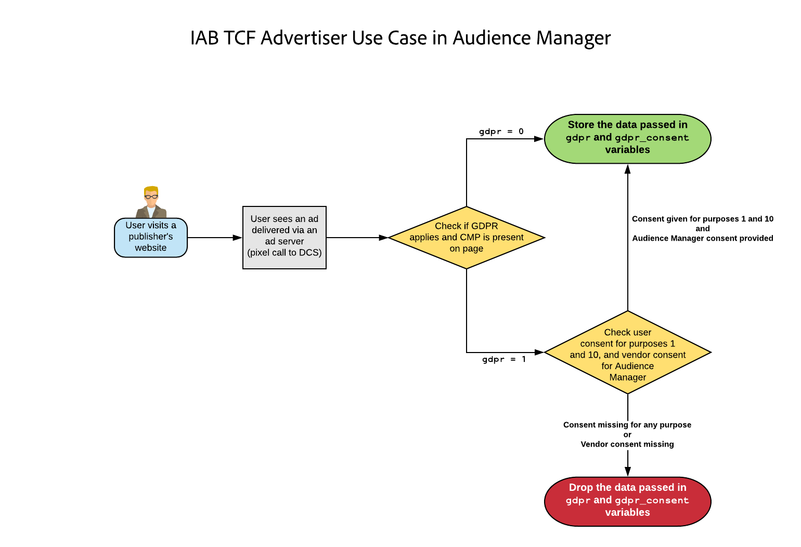

# Plugin-program för Audience Manager för IAB TCF {#aam-iab-plugin}

## Översikt

En viktig aspekt av de integritetsskyldigheter du har gentemot dina användare är att man får tag i och överför användarval över hur deras personuppgifter kan användas (dvs.&quot;syften&quot;) och av vem (dvs.&quot;företag&quot;).

Adobe ger er möjlighet att hantera och förmedla användarnas valmöjligheter i fråga om integritet genom [valfunktionen](https://marketing.adobe.com/resources/help/en_US/mcvid/overview.html) och stödet för [IAB Transparency and Consent Framework (TCF)](https://iabtechlab.com/standards/gdpr-transparency-and-consent-framework/) .

I den här artikeln beskrivs de fall där Audience Manager har stöd för IAB TCF och hur man implementerar stöd för IAB TCF i Audience Manager. Audience Manager är registrerat i IAB TCF med leverantörs-ID 565.

Plugin-programmet Audience Manager för IAB TCF använder [Opt-in-funktionen](https://marketing.adobe.com/resources/help/en_US/mcvid/iab.html), som i sin tur är en del av Adobe [Adobe Experience Platform Identity Service-biblioteket (ECID)](https://marketing.adobe.com/resources/help/en_US/mcvid/) .

## Tillämpningsområde och begränsningar {#scope-and-limitations}

Som utgivare eller annonsör som arbetar med Audience Manager kan du förmedla användarval till Audience Manager enligt IAB TCF. Det är ett enkelt och konsekvent sätt att förmedla användarval till alla partners du arbetar med, och Audience Manager kan hjälpa dig att respektera användarnas valmöjligheter vad gäller integritet.

Stöd för IAB TCF som beskrivs i den här artikeln är den första fasen i Audience Managers planerade stöd för IAB-ramverket. Audience Manager har för närvarande inte stöd för:

* Arbetsflöden för mobila enheter.
* Enhetsoberoende samtyckeshantering,
* Bifoga samtycke till URL:er som skickas till [URL-adresser](../../features/destinations/create-url-destination.md).
* Lägger till samtycke till segment.

## Förutsättningar {#prerequisites}

Du måste uppfylla följande krav för att kunna använda IAB TCF med Audience Manager:

1. Du måste använda Adobe Experience Platform Identity Service (ECID) version 4.1 eller senare. [Ladda ned](https://github.com/Adobe-Marketing-Cloud/id-service/releases) vår senaste ECID-version.
1. Du måste använda Audience Manager Data Integration Library (DIL) version 9.0 eller senare, som kan hämtas [här](https://github.com/Adobe-Marketing-Cloud/dil/releases). Läs om [DIL i dokumentationen](../..//dil/dil-overview.md)till Audience Manager.
1. Om du använder SSF (Server-Side Forwarding) för att importera data till Audience Manager måste du uppgradera till den senaste versionen av AppMeasurement. Hämta AppMeasurement med [Analytics Code Manager](https://marketing.adobe.com/resources/help/en_US/reference/code_manager_admin.html).
1. Du måste använda en CMP (Consent Management Platform), antingen kommersiell eller egen, som har stöd för IAB TCF och är registrerad med IAB TCF. Se listan över [CMP som registrerats i IAB-ramverket](https://advertisingconsent.eu/cmp-list/).

## Rekommendationer och hur man implementerar {#recommendations}

Om du vill aktivera stöd för IAB TCF i Audience Manager läser du vår dokumentation om [hur du konfigurerar IAB med deltagande](https://docs.adobe.com/content/help/en/id-service/using/implementation/opt-in-service/iab.html).

Detta görs enklast genom att använda [Adobe Experience Platform Launch](https://docs.adobelaunch.com/) för att få tillgång till ECID-instrumentavanmäl på era egenskaper. Läs dokumentationen för tillägget [](https://docs.adobelaunch.com/extension-reference/web/experience-cloud-id-service-extension#opt-in) ECID Opt-in om du vill veta hur du konfigurerar tillägget Launch.

## Arbetsflöde för användarval när IAB-ramverket används {#user-choice-workflow}

När du besöker en webbegenskap kan dina användare ange hur deras data ska användas av utgivaren och av tredjepartsleverantörer som utgivaren arbetar med. Användarna kan välja i *standardsyfte* och med standardbehörigheter för *tredjepartsleverantörer* som är registrerade i den globala leverantörslistan. Bilden nedan representerar ett exempel på en CMP-dialogruta som visas för en förstagångsbesökare på en webbplats. Tänk på att den här dialogen ser mycket annorlunda ut beroende på hur kunden implementerar den.


Standardmålen i IAB-ramverket är följande:

* Lagring och åtkomst av information
* Personalisering
* Val, leverans och rapportering av annonser
* Val, leverans och rapportering av innehåll
* Mått

Se [IAB-ramverkets specifikationssida](https://github.com/InteractiveAdvertisingBureau/GDPR-Transparency-and-Consent-Framework/blob/master/Consent%20string%20and%20vendor%20list%20formats%20v1.1%20Final.md#purposes-features) för en beskrivning av de fem standardsyftena.

Användarna kan ge sitt samtycke för en kombination av standardsyften och leverantörer. Användarna kan till exempel ge sitt samtycke till lagring, personalisering och mätning och ge sitt samtycke till alla tredjepartsleverantörer som visas av CMP. Eller, i ett annat exempel, skulle de kunna ge sitt samtycke för alla fem standardändamål, men bara ge medgivande till ett fåtal av de leverantörer som visas av CMP.

När användaren har valt sina sekretessval registreras användarens val i IAB TCF-medgivandesträngen. IAB TCF-medgivandesträngen lagrar en kombination av godkända syften och leverantörer, tillsammans med annan metadatainformation (mer information finns på [IAB-sidan](https://github.com/InteractiveAdvertisingBureau/GDPR-Transparency-and-Consent-Framework/blob/master/Consent%20string%20and%20vendor%20list%20formats%20v1.1%20Final.md#Consent-string-and-vendor-list-format) ). Alla leverantörer som är registrerade i IAB TCF utvärderar IAB TCF-medgivandesträngen och fattar beslut baserat på användarnas sekretessval. Tänk på att användarnas sekretessval är giltiga för alla godkända leverantörer.

## Standardsyften som behövs av Audience Manager {#aam-standard-purposes}

Audience Manager utvärderar användarnas val som lagras i IAB TFC-medgivandesträngen för:

* Lagring och åtkomst av information (syfte-ID 1 i den [globala leverantörslistan](https://vendorlist.consensu.org/vendorlist.json))
* Personalisering (syfte-ID 2)
* Mätning (syfte-ID 5)
* Audience Manager-leverantörens samtycke till att lagra, bearbeta eller aktivera data för en utgivare.

>[!IMPORTANT]
>
>Audience Manager behöver samtycke för *alla tre syften, plus leverantörssamtycke* för att kunna distribuera cookies och initiera eller respektera ID-synkroniseringar.

## Audience Manager-beteendet beror på om användaren godkänner det {#aam-behavior-consent}

Audience Manager fungerar på olika sätt beroende på om Audience Manager i IAB TCF-medgivandesträngen identifierar att användaren har gett sitt samtycke för de tre syftena (lagring, personalisering, mätning) eller inte.

| När användaren *ger sitt samtycke*, Audience Manager: | När användaren *avböjer* samtycke, Audience Manager: |
|---|---|
| <ul><li>Genomför alla de användningsfall för Audience Manager som du har begärt.</li><li>Medgivande skickas till tredje part i ID-synk (genom att gdpr = 1 skickas och medgivandesträngen skickas som gdpr_medgivande vid ID-synkroniseringsanrop).</li><li>Utvärderar och respekterar samtycke som skickas från annonsserverns pixlar.</li><li>Tar hänsyn till partnerinitierade ID-synkroniseringar.</li></ul> | <ul><li>Lagrar inga nya användardata i din instans. Detta inkluderar partner-ID, signaler, egenskaper eller pixeldata.</li><li>Initierar inte synk av tredje parts-ID.</li><li>Uppfyller inte synkronisering av partnerinitierade ID:n.</li></ul> |

## Användningsfall för utgivare {#publisher-use-case}

Genom att implementera IAB TCF behöver du inte ha anpassad kod för samtyckeshantering på dina webbegenskaper via en annan mekanism med Adobe eller andra tredjepartsleverantörer. Användningssättet beskrivs i bilden och i stegen nedan. Börja från vänster om bilden:

1. En användare besöker en av dina webbegenskaper. Så länge du använder de senaste versionerna av ECID- och DIL-biblioteken (se [Förutsättningar](/help/using/overview/data-security-and-privacy/aam-iab-plugin.md#prerequisites)) aktiveras anmälningsflödet.
2. Audience Manager kontrollerar om IAB-flödet gäller (`isIabContext=true`). Se [Rekommendationer och implementera](aam-iab-plugin.md#recommendations).
3. Audience Manager kontrollerar om GDPR gäller (`gdpr = 1`) och om det finns en CMP som registrerats med IAB på din webbegenskap. Detta skulle till exempel gälla användare som besöker från EU-området. Observera att det är ditt ansvar som utgivare att sätta GDPR-flaggan.
4. Om GDPR tillämpas kontrollerar Audience Manager om IAB TCF-medgivandesträngen, som skickats i parametern, `gdpr_consent`har de behörigheter som krävs. Audience Manager behöver behörigheter för lagring, personalisering, mätning plus Audience Manager-leverantörens samtycke för att lagra, bearbeta eller aktivera data.
5. Om IAB TCF-medgivandesträngen finns och den innehåller de behörigheter som krävs skickar Audience Manager IAB TCF-medgivandesträngen till våra [datainsamlingsservrar](../../reference/system-components/components-data-collection.md) (DCS).
6. Audience Manager svarar genom att ställa in en [demdexcookie](https://marketing.adobe.com/resources/help/en_US/whitepapers/cookies/cookies_am.html) i webbläsaren. Audience Manager initierar och följer även synk för tredjeparts-ID.
7. Om den IAB TCF-medgivandesträng som skickades i steg 5 inte innehåller alla behörigheter som krävs, kan Audience Manager inte samla in, bearbeta eller aktivera data och följer eller initierar inte ID-synk.


## Handläggarens användningsfall {#advertiser-use-case}

Audience Manager utvärderar och efterlever det medgivande som skickas i [pixelanrop](../../integration/sending-audience-data/real-time-data-integration/pixel-based-data-transfer.md), i enlighet med IAB TCF.

Pixlar placeras vanligtvis av Audience Manager-kunder på deras partnersidor eller placeras i annonsservrar för att inkluderas i annonssvar. I det första fallet måste din partner hämta parametern för medgivande och lägga till den i pixeln innan den aktiveras. I det andra fallet, som är vanligare och beskrivs i detalj nedan, lägger annonsservrar till de medgivandeparametrar som de får från SSP-plattformen (Supply-Side Platform) eller utgivarens annonsservrar på alla pixlar.

Audience Manager använder två parametrar för att skicka användarens samtycke i pixelanrop:

* `gdpr` kan vara 0 (GDPR gäller inte) eller 1 (GDPR gäller),
* `gdpr_consent` är URL-säker base64-kodad GDPR-medgivandesträng (se [specifikation](https://github.com/InteractiveAdvertisingBureau/GDPR-Transparency-and-Consent-Framework/blob/master/URL-based%20Consent%20Passing_%20Framework%20Guidance.md#specifications)). Ett samplingsanrop för en pixel med ett intryck med de två parametrarna kan se ut så här:

```
http://yourcompany.demdex.net/event?d_event=imp&gdpr=1&gdpr_consent=consentstring&d_src=datasource_id&d_site=siteID&d_creative=creative_id&d_adgroup=adgroup_id&d_placement=placement_id
```

Användningssättet beskrivs i bilden och i stegen nedan. Börja från vänster om bilden:

1. Användaren får ett intryck via en annonsserver. Detta innebär ett pixelanrop till våra datainsamlingsservrar (DCS).
2. Audience Manager kontrollerar om GDPR-flaggan gäller. Om så inte är fallet lagrar Audience Manager de data som skickas i makrovariabler i pixelanrop.
3. Om medgivandesträngen finns och den innehåller de behörigheter som krävs lagrar Audience Manager de data som skickas i makrovariabler i pixelanrop.
4. Om medgivandesträngen saknas eller saknar de behörigheter som krävs, utelämnar Audience Manager de data som skickas i makrovariabler i pixelanrop.



## Aktiveringspartners som stöder IAB TCF {#aam-activation-partners}

Plugin-programmet Audience Manager för IAB TCF gör att du kan vidarebefordra IAB TCF-medgivandesträngen till aktiveringspartners med respekt för användarnas sekretessinställningar. Information om vilka aktiveringspartners som stöder IAB TCF finns i vår [lista över enhetsbaserade mål](/help/using/features/destinations/device-based-destinations-list.md).

## Testa implementeringen av IAB {#test-iab-implementation}

Om du vill testa att du har implementerat Audience Manager-plugin-programmet för IAB TCF korrekt läser du [Use Case 4 i Validation Methods for Opt-in and IAB implementation](https://docs.adobe.com/content/help/en/id-service/using/implementation/opt-in-service/testing-optin-and-iab-plugin.html#section-64331998954d4892960dcecd744a6d88).

## IAB och avanmäl dig i Audience Manager. Prioritetsordning. {#iab-and-optout}

Ett annat sekretessalternativ för användarna är möjligheten att välja bort all datainsamling. Adobe ger användarna möjlighet att göra detta på sidan [Dina sekretessval](https://www.adobe.com/privacy/opt-out.html#customeruse) .

Audience Manager behandlar avanmälningsförfrågningar i en [separat artikel i vår dokumentation](data-privacy-requests.md).

>[!NOTE]
>
>**Prioritetsordning** - Om användaren väljer att inte samla in data med hjälp av ett globalt avanmälningsverktyg, vilket beskrivs i länken ovan, har detta företräde framför avanmälnings- och IAB-verifieringar.

## Ytterligare resurser {#additional-resources}

* [Adobe Experience Platform Identity Service-deltagande](https://marketing.adobe.com/resources/help/en_US/mcvid/overview.html)
* [IAB Europe GDPR Transparency and Consent Framework](https://iabtechlab.com/standards/gdpr-transparency-and-consent-framework/)
* [Tekniska specifikationer för IAB Europe GDPR Transparency och Consent Framework](https://github.com/InteractiveAdvertisingBureau/GDPR-Transparency-and-Consent-Framework/blob/master/Consent%20string%20and%20vendor%20list%20formats%20v1.1%20Final.md)
* [IAB TCF-plugin - videodemonstration](https://helpx.adobe.com/audience-manager/kt/using/iab-tcf-support-audience-manager-technical-video-implement.html)