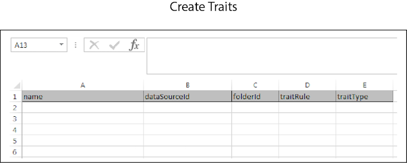

# Skapa satsvis{#bulk-create}

Med Skapa gruppvis kan du skapa flera datakällor, härledda signaler, segment, egenskaper och andra objekt med en enda åtgärd. Följ de här instruktionerna för att göra en begäran om att skapa en grupp.

>[!IMPORTANT]
>
>Masshanteringsverktygen är inte ett officiellt Adobe-erbjudande som stöds. Felsökning och support via kundtjänst hanteras från fall till fall.

<!-- 

t_bulk_create.xml

 -->

>[!NOTE]
>
>[RBAC-gruppbehörigheter](../../features/administration/administration-overview.md) som har tilldelats i [!DNL Audience Manager] Gränssnittet respekteras i [!UICONTROL Bulk Management Tools].

>[!CAUTION]
>
>Blanda inte objekttyper i en gruppskapandebegäran. Rubrikerna för varje objekt är unika och kan inte kombineras. Rensa kalkylbladet och gör en separat begäran för olika objekt.

Öppna [!UICONTROL Bulk Management Tools] och:

1. Klicka på **[!UICONTROL Headers]** och kopiera de nya rubrikerna för det objekt som du vill lägga till.
2. Klicka på **[!UICONTROL Create]** -fliken.
3. Klistra in de skapade rubrikerna på den första raden i uppdateringskalkylbladet.
4. Klistra in eller skriv in data som du vill ändra i en motsvarande kolumn baserat på rubriketiketten.
5. Klicka i verktygsfältet för kalkylblad på knappen Skapa som matchar det objekt du uppdaterar.
Åtgärden öppnar [!UICONTROL Account Information] -dialogrutan.
6. Ange nödvändig [inloggningsinformation](../../reference/bulk-management-tools/bulk-management-intro.md#auth-reqs) och klicka **[!UICONTROL Submit]**.

Kalkylbladet skapar en [!UICONTROL Results] kolumn. The [!UICONTROL Results] kolumn returnerar JSON-svaret för en slutförd åtgärd. Se [REST API:er](../../api/rest-api-main/rest-api-main.md) till exempel. Innan du anger data bör kalkylbladet som du skapar gruppvis se ut som i följande exempel. Observera att alla olika skapandealternativ inte visas här. Här finns information som hjälper dig förstå hur ett ifyllt kalkylblad kan se ut.

Om gruppuppdateringen returnerar ett fel eller misslyckas finns mer information i [Felsökning för grupphanteringsverktyg](../../reference/bulk-management-tools/bulk-troubleshooting.md).
