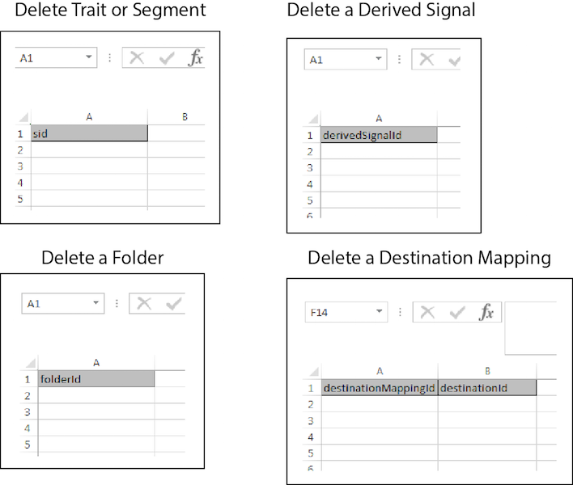

# Satsvis radering{#bulk-delete}

Med massborttagning kan du ta bort flera segment, egenskaper, mappar, härledda signaler, datakällor, modeller och mål med en enda åtgärd. Följ de här instruktionerna för att göra en begäran om massborttagning.

<!-- 

t_bulk_delete.xml 

 -->

>[!NOTE]
>
>[RBAC-gruppbehörigheter](../../features/administration/administration-overview.md) som har tilldelats i [!DNL Audience Manager] Gränssnittet respekteras i [!UICONTROL Bulk Management Tools].

>[!NOTE]
>
>En massborttagning för målmappningar misslyckas om du har segment mappade till målet. Ta bort dina segment från den destinationen i användargränssnittet innan du försöker att ta bort mål gruppvis. Dessutom måste trait- och segmentmappar vara tomma innan du kan ta bort dem.

Om du vill ta bort flera objekt öppnar du [!UICONTROL Bulk Management Tools] kalkylblad och:

1. Klicka på **[!UICONTROL Headers]** och kopiera de nya rubrikerna för det objekt som du vill lägga till.
2. Klicka på **[!UICONTROL Delete]** -fliken.
3. Klistra in borttagningsrubrikerna på den första raden i uppdateringskalkylbladet.
4. Klistra in eller skriv in ID:n för de objekt som du vill ta bort i kolumnen nedanför rubriken.
5. Ange nödvändig [inloggningsinformation](../../reference/bulk-management-tools/bulk-management-intro.md#auth-reqs) och klicka **[!UICONTROL Submit]**.

   Kalkylbladet skapar en [!UICONTROL Results] kolumn. The [!UICONTROL Results] kolumn returnerar ett meddelande som anger om objektet har tagits bort eller ett felmeddelande.
Innan du anger data bör kalkylbladet för bulkuppdatering se ut ungefär så här:

Om gruppuppdateringen returnerar ett fel eller misslyckas finns mer information i [Felsökning för grupphanteringsverktyg](../../reference/bulk-management-tools/bulk-troubleshooting.md).
