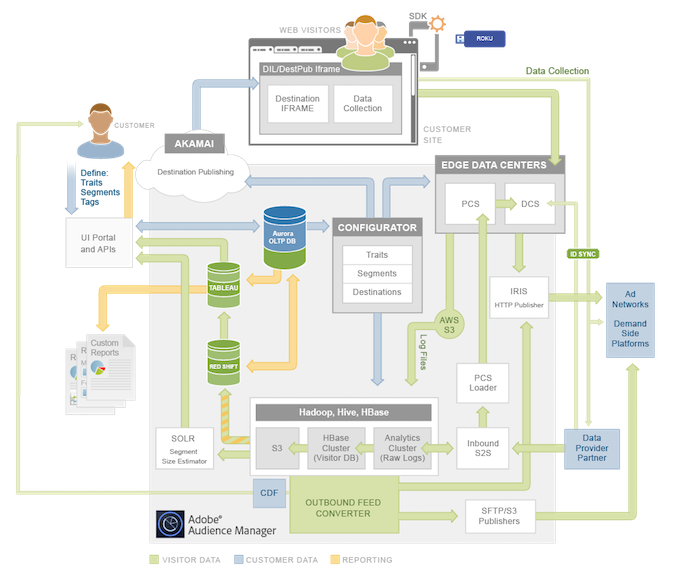

# Plattformsarkitektur: Dataflödesschema{#platform-architecture-data-flow-map}

Kartan innehåller de större Audience Manager-systemen. Det visar visuellt hur data flödar in i, ut ur och mellan Audience Manager-komponenter.

## How to read this map {#compmap}

<!-- 

c_compmap.xml

 -->

På kartan innehåller den grå rutan [!DNL Audience Manager] system. Vissa komponenter är helt interna och andra sitter på gränsen mellan [!DNL Audience Manager] och omvärlden. Som [!DNL Audience Manager] kund är interna komponenter ofta transparenta eller otillgängliga. Men ibland kan ni interagera med dessa system via användargränssnittet eller dataintegreringar. Systemen på kanten av paketet samlar in och skickar data mellan [!DNL Audience Manager] och utanför världen.

Färger definierar den typ av data som flödar in och ut [!DNL Audience Manager]. Grönt är klientdata, blått är kunddata (personer som besöker er webbplats) och orange är data som används för rapportering.

Systembeskrivningar och sammanfattningar finns i avsnitten om [dataåtgärd](../../reference/system-components/components-data-action.md), [insamling](../../reference/system-components/components-data-collection.md), [bearbetning](../../reference/system-components/components-data-processing.md)och [tagghantering](../../reference/system-components/components-tag-management.md) .

