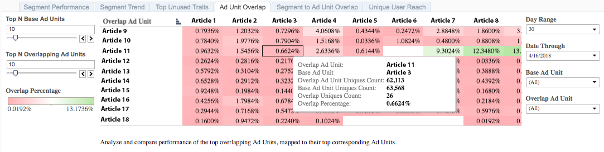

# Annonsenhetsöverlappning{#ad-unit-overlap}

**[!UICONTROL Ad Unit Overlap]**-rapporten visas som ett värmediagram som markerar höga och låga överlappningar mellan annonsenheter.

## Användningsexempel {#use-cases}

Med **[!UICONTROL Ad Unit Overlap]**-rapporten får ni insikt i var era målgrupper överlappar era webbegenskaper. I rapporten behandlas dina 100 mest relaterade egenskaper och hur de överlappar varandra.

## Använda överlappningsrapporten för annonsenhet {#using-the-report}

Använd kontrollerna **[!UICONTROL Top N Base Ad Units]** och **[!UICONTROL Top N Overlapping Ad Units]** för att välja önskat antal annonsenheter för överlappningen. Du kan välja maximalt 100 objekt för varje.

Använd kontrollerna **Dagintervall** och **Datum till och med** för att justera backupintervallet. Observera att 7-dagars och 30-dagars summeringsperioder endast är tillgängliga för söndagsdatum.

Använd kontrollerna **[!UICONTROL Base Ad Unit]** och **[!UICONTROL Overlap Ad Unit]** för att välja vilka av dina annonsenheter du vill visa i överlappningsrapporten.

>[!IMPORTANT]
>
>När du aktiverar [!UICONTROL Audience Optimization for Publishers] måste du inkludera beskrivande metadata för [!UICONTROL Ad Unit IDs], enligt beskrivningen i steg 3 av [Importera Google Ad Manager-datafiler (tidigare DFP) till Audience Manager](../../../reporting/audience-optimization-reports/aor-publishers/import-dfp.md). Genom att göra detta försäkrar du dig om att rapporten anger webbegenskapen som [!UICONTROL Ad Unit] i stället för [!UICONTROL Ad Unit ID].

## Tolka resultaten {#interpreting-results}

Din [!UICONTROL Ad Unit Overlap]-rapport kan se ut ungefär som den nedan. Håll muspekaren över en cell för att få mer information om just den överlappningen. Se beskrivningarna för ytterligare information i tabellen nedan.

<table id="table_22340F45B1B94D3796174CB30A60E212"> 
 <thead> 
  <tr> 
   <th colname="col1" class="entry"> Objekt </th> 
   <th colname="col2" class="entry"> Beskrivning </th> 
  </tr>
 </thead>
 <tbody> 
  <tr> 
   <td colname="col1"> 
 Överlappa annonsenhet 
 </td> 
   <td colname="col2"> 
Namnet på lagerartikeln. Detta kan till exempel vara en av dina webbplatser eller en artikel på din webbplats. I bilden ovan är basannonsenheterna artiklarna 9-18. 
 </td> 
  </tr> 
  <tr> 
   <td colname="col1"> 
 Basannonsenhet 
 </td> 
   <td colname="col2"> 
Namnet på lagerartikeln. Detta kan till exempel vara en av dina webbplatser eller en artikel på din webbplats. I bilden ovan är basannonsenheterna artiklarna 1-8. 
 </td> 
  </tr> 
  <tr> 
   <td colname="col1"> 
 Antal överlappande annonsenheter 
 </td> 
   <td colname="col2"> 
Antalet användare som har besökt annonsenheten 9-18. Den här informationen extraheras från Google Ad Manager-loggarna. 
 </td> 
  </tr> 
  <tr> 
   <td colname="col1"> 
 Antal basannonsenheter 
 </td> 
   <td colname="col2"> 
Antalet användare som har besökt annonsenhetsposterna 1-8. Den här informationen extraheras från Google Ad Manager-loggarna. 
 </td> 
  </tr> 
  <tr> 
   <td colname="col1"> 
 Överlappa antal unika 
 </td> 
   <td colname="col2"> 
Överlappningen mellan användare som har besökt en  basannonsenhet och  överlappande annonsenhet. 
 </td> 
  </tr> 
  <tr> 
   <td colname="col1"> 
 Överlappningsprocent 
 </td> 
   <td colname="col2"> 
Överlappningen mellan användare som har besökt en  basannonsenhet och  överlappande annonsenhet. Detta är  Överlappa antal unika enheter, uttryckt i procent av  basannonsenhet. 
 </td> 
  </tr> 
 </tbody> 
</table>
