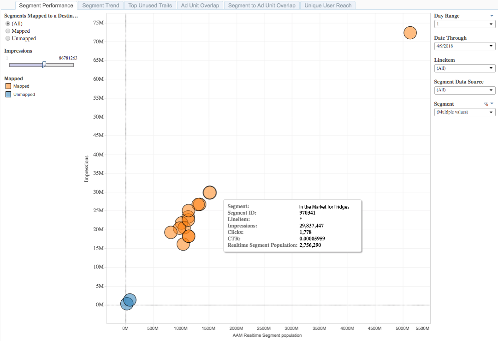
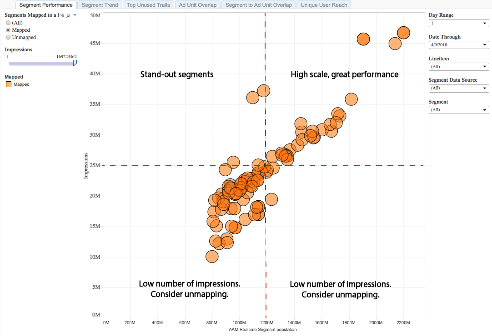

# Resultatrapport för segment{#segment-performance-report}

I rapporten Segment Performance jämförs mappade och omappade segment med visningar och Real-Time Segment Uniques.

Ett mappat segment är ett segment som du skapar och skickar till ett mål för målanpassning. Ett omappat segment är ett segment som du har skapat men inte skickat till ett mål för målgruppsanpassning.

Genom att jämföra dessa olika segmenttyper inom och mellan rapporter kan ni optimera befintliga kampanjer och hitta förbisedda segment som ni kanske vill skicka till en målgrupp för målinriktning.

## Använd fall {#use-cases}

Med [!UICONTROL Segment Performance]-rapporten kan du:

* Identifiera mappade målgruppssegment som driver skala eller prestanda framåt.
* Identifiera omappade segment som ska introduceras i framtida kampanjer, baserat på en målgrupps bidrag till tidigare resultat.

## Använda rapporten om segmentprestanda {#using-segment-performance-report}

Växla mellan **[!UICONTROL Mapped]** och **[!UICONTROL Unmapped]** för att markera segment som är mappade till ett mål eller inte. Välj **[!UICONTROL All]** om du vill inkludera alla dina segment i rapporten.

Använd kontrollerna **Dagintervall** och **Datum till och med** för att justera backupintervallet. Observera att 7-dagars och 30-dagars summeringsperioder endast är tillgängliga för söndagsdatum.

Använd listrutan **[!UICONTROL Line Item]** för att välja de webbegenskaper som du vill returnera information för.

I listrutan **[!UICONTROL Segment Data Source]** markerar du datakällorna som innehåller de segment som du vill se i rapporten.

Använd listrutan **[!UICONTROL Segment]** för att välja vilka segment du vill se i rapporten.

>[!IMPORTANT]
>
>När du aktiverar [!UICONTROL Audience Optimization for Publishers] måste du inkludera beskrivande metadata för [!UICONTROL Line Item IDs], enligt beskrivningen i steg 3 av [Importera Google Ad Manager-datafiler (tidigare DFP) till Audience Manager](../../../reporting/audience-optimization-reports/aor-publishers/import-dfp.md). Genom att göra detta försäkrar du dig om att rapporten anger webbegenskapen som [!UICONTROL Line Item] i stället för [!UICONTROL Line Item ID].

## Tolka resultaten {#interpreting-results}

Din [!UICONTROL Segment Performance]-rapport kan se ut ungefär som den nedan. Klicka på en bubbla i rapporten för att visa underliggande data. Se beskrivningarna för ytterligare information i tabellen nedan.

<table id="table_AFE2540583C34835B04584693ADFD26A"> 
 <thead> 
  <tr> 
   <th colname="col1" class="entry"> Objekt </th> 
   <th colname="col2" class="entry"> Beskrivning </th> 
  </tr>
 </thead>
 <tbody> 
  <tr> 
   <td colname="col1"> 
Segment 
 </td> 
   <td colname="col2"> 
Det alfanumeriska namn som du tilldelade det här segmentet. 
 </td> 
  </tr> 
  <tr> 
   <td colname="col1"> 
Segment-ID 
 </td> 
   <td colname="col2"> 
Det unika ID:t för det här segmentet. 
 </td> 
  </tr> 
  <tr> 
   <td colname="col1"> 
Radartikel 
 </td> 
   <td colname="col2"> 
Den webbegenskap som du ser den här rapporten för. 
 </td> 
  </tr> 
  <tr> 
   <td colname="col1"> 
Klickningar 
 </td> 
   <td colname="col2"> 
Antalet gånger som medlemmar i den här egenskapen har klickat på objekt i din webbegenskap. 
 </td> 
  </tr> 
  <tr> 
   <td colname="col1"> 
Impressions 
 </td> 
   <td colname="col2"> 
Antalet gånger som medlemmar i den här egenskapen har exponerats för ditt lager. 
 </td> 
  </tr> 
  <tr> 
   <td colname="col1"> 
CTR 
 </td> 
   <td colname="col2"> 
Klickfrekvens. 
 
Det här måttet visar hur många procent av intrycken som ska följas av klickningar. Dela upp klickningarna efter Impressions för att få detta mätresultat. 
 </td> 
  </tr> 
  <tr> 
   <td colname="col1"> 
Realtime-segmentpopulering 
 </td> 
   <td colname="col2"> 
Det faktiska antalet unika besökare som visas i realtid för det angivna tidsintervallet och som var kvalificerade för segmentet när de sågs av  Audience Manager. 
 </td> 
  </tr> 
 </tbody> 
</table>

## Så här läser du mappade segmentresultat {#read-mapped-segment}

Positionen för de mappade segmenten i en rapport kan tala om för dig mycket om vilka segment som fungerar bra och var du kan behöva göra vissa justeringar.

Om du vill läsa rapporten kan du dela upp resultaten i fyra avsnitt med imaginära rader (i rött) och de kategorier som visas i exempelrapporten nedan. Etiketterna i exemplet kan hjälpa dig att förstå segmentets prestanda och hur du ska svara på dessa resultat.

## Så här läser du omappade segmentresultat {#read-unmapped-segment}

Att titta på omappade segment i en [!UICONTROL Segment Performance]-rapport är ett bra sätt att hitta nya segment som du inte har tänkt dig som målinriktning. Vissa av dessa segment kanske överträffar dina mappade segment.

Om du vill läsa den här rapporten kan du dela upp resultaten i fyra avsnitt med imaginära rader (i rött) och kategorier som visas i exempelrapporten nedan.

