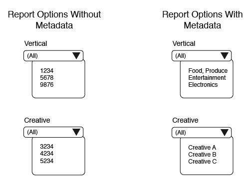

# Översikt och mappningar för metadatafiler{#overview-and-mappings-for-metadata-files}

En metadatafil länkar numeriska ID:n med namn som du kan läsa och förstå. Rapporterna om målgruppsoptimering visar läsbara namn på de olika rapportalternativmenyerna.

## Översikt {#overview}

En granskning av metadata och hur de används. En metadatafil måste åtföljas av en datafil. Innehållet i metadatafilen matchar informationen i datafilen med relaterade, läsbara etiketter på rapportmenyerna. Mer information finns i [Datafiler för målgruppsoptimeringsrapporter och åtgärdsloggfiler](../../../reporting/audience-optimization-reports/metadata-files-intro/datafiles-intro.md).

### Metadatafiler innehåller data om andra data

En metadatafil innehåller information om andra typer av data. För att du ska få en förståelse för hur detta fungerar måste vi granska hur data [!DNL Audience Manager] tas emot.

Under en intrycks- eller klickhändelse tar emot data i en URL-sträng som kallas för ett [!DNL Audience Manager] händelseanrop **.

Händelseanropet ordnar information i uppsättningar med definierade nyckelvärdepar. Värdena i ett nyckelvärdepar innehåller numeriska data. Metadatafilen innehåller namn och annan läsbar information som motsvarar ID:t i varje nyckelvärdepar.

### Metadatalänkar-ID:n till läsbara namn

Metadatafilen krävs för att koppla ett numeriskt ID till ett läsbart namn. Anta att ett eventanrop innehåller ett kreativt ID i ett nyckelvärdepar enligt följande: `d_creative:1234`. Utan en metadatafil visas den här kreativa sidan som 1 234 i en alternativmeny.

En korrekt formaterad metadatafil kan dock knyta denna kreativitet till ett verkligt namn som&quot;Advertiser Creative A&quot;, ett namn som du kan läsa och känna igen i en rapport.

### När behöver du en metadatafil

Först krävs en metadatafil och alla parametrar som anges nedan i ett händelseanrop när du vill använda [måloptimeringsrapporter](../../../reporting/audience-optimization-reports/audience-optimization-reports.md).

För det andra behöver ni en metadatafil om ni skickar egna data till [!DNL Audience Manager] eller om ni vill se data från andra leverantörer som vi inte är integrerade med. Exempel: [!DNL Audience Manager] har en integrering med Googles [dubbelklickade Campaign Manager](../../../reporting/audience-optimization-reports/aor-advertisers/import-dcm.md) (DCM). På grund av den här relationen kan [!DNL Audience Manager] associera ID:n med namn och beskrivningar som används av rapportalternativen. Utan integrering kan vi fortfarande importera data, men rapportalternativen visar numeriska ID:n i stället för beskrivande namn.

## Filmappningar {#file-mappings}

I följande tabell visas nyckelvärdepar som innehåller data som används av [!UICONTROL Audience Optimization] rapporterna. Om du behöver använda en metadatafil innehåller den läsbar information som motsvarar värdena i dessa nyckelvärdepar. Värdena för de här tangenterna accepterar endast heltal (datatypen INT). Obs! *Kursiv* anger en variabelplatshållare. Andra element är konstanter eller nycklar och ändras inte.

>[!IMPORTANT]
>
>Om du använder [!UICONTROL Audience Optimization] rapporterna krävs *alla* dessa värden i händelseanropet.

<table id="table_B2C8C493080E449CA71C4EF07D9476BD"> 
 <thead> 
  <tr> 
   <th colname="col1" class="entry"> Rapportalternativ </th> 
   <th colname="col2" class="entry"> Nyckelvärdepar för metadata </th> 
  </tr> 
 </thead>
 <tbody> 
  <tr> 
   <td colname="col1"> 
Annonsör 
 </td> 
   <td colname="col2"> 
 <code>d_adsrc = <i>data source ID or integration code</i></code> 
 
Det här är annonsörens datakälla-ID eller integreringskod som anges när en datakälla skapas. See <a href="../../../features/manage-datasources.md#create-data-source"> Create a Data Source</a>. 
 </td> 
  </tr> 
  <tr> 
   <td colname="col1"> 
Affärsenhet (BU) 
 </td> 
   <td colname="col2"> 
 <code>d_bu = <i>business unit ID</i></code> 
 </td> 
  </tr> 
  <tr> 
   <td colname="col1"> 
Campaign 
 </td> 
   <td colname="col2"> 
 <code>d_campaign = <i>campaign ID</i></code> 
 </td> 
  </tr> 
  <tr> 
   <td colname="col1"> 
Kreativ 
 </td> 
   <td colname="col2"> 
 <code>d_creative = <i>creative ID</i></code> 
 </td> 
  </tr> 
  <tr> 
   <td colname="col1"> 
Exchange 
 </td> 
   <td colname="col2"> 
Accepterar två olika nyckelvärdepar: 
 
    <ul id="ul_3B3B751A8A134096B0912E81A0983B9D"> 
     <li id="li_57BAC45A7B274AB695945E174A4D8A35"> <code>d_exchange = <i>ID for the exchange that served the ad</i></code> </li> 
     <li id="li_CCDF00DE59D3451C8EF590DD3E1A806D"> <code>d_site = <i>ID for the site an ad served on</i></code> </li> 
    </ul> </td> 
  </tr> 
  <tr> 
   <td colname="col1"> 
Infogningsordning (IO) 
 </td> 
   <td colname="col2"> 
 <code>d_io = <i>insertion order ID</i></code> 
 </td> 
  </tr> 
  <tr> 
   <td colname="col1"> 
Platform 
 </td> 
   <td colname="col2"> 
 <code>d_src = <i>data source ID</i></code> 
 
Detta är <a href="../../../features/datasources-list-and-settings.md#data-sources-list-and-settings"> datakällans</a> ID för plattformen som tillhandahåller metadatainformation (t.ex. DFA, Atlas, GBM, MediaMath). 
 </td> 
  </tr> 
  <tr> 
   <td colname="col1"> 
Taktisk 
 </td> 
   <td colname="col2"> 
 <code>d_tactic = <i>tactic ID</i></code> 
 </td> 
  </tr> 
  <tr> 
   <td colname="col1"> 
Lodrätt 
 </td> 
   <td colname="col2"> 
 <code>d_vert = <i>vertical ID</i></code> 
 </td> 
  </tr> 
 </tbody> 
</table>

## Hur ID:n för händelsesamtal formfilnamn, innehåll och leveranssökvägar {#how-ids-shape-file-names}

De ID:n som skickas av dessa nyckelvärdepar hjälper till att skapa metadatafilens namn och dess innehåll. I följande avsnitt och illustrationer visas hur det fungerar. De här exemplen skapar en fil som innehåller namnet på en kreatör i en kampanj, men andra kombinationer är möjliga.

### Händelseanrop

I det här exemplet skapar vi en metadatafil som samlar in kreativa namn i en [!UICONTROL Audience Optimization] rapport. För att göra detta måste vi extrahera ID:n för skapande, kampanj och datakälla från ett eventsamtal.

### Filnamn

Filnamnet baseras på ID:n för kreativitet, kampanj och datakälla. I det här fallet ska du jämföra skillnaderna här mellan nyckelvärdesdata i ett händelseanrop och hur de används i ett filnamn.

I ett filnamn:

* Datakällnyckeln ändras till `dpid` från `d_src`.

* Kampanj-ID:n för kreativa projekt och kampanjer representerar en kategori i stället för en faktisk identifierare.

See [Naming Conventions for Metadata Files](../../../reporting/audience-optimization-reports/metadata-files-intro/metadata-file-names.md).

### Filinnehåll

I det här exemplet återspeglar filinnehållet de kreativa ID:n och kampanj-ID:n som skickades i eventsamtalet. Det nya elementet här är ett läsbart namn. När du har bearbetat filen visas namnet i den här filen som ett alternativ på menyn Creative i en [!UICONTROL Audience Optimization] rapport.

See [Content Format for Metadata Files](../../../reporting/audience-optimization-reports/metadata-files-intro/metadata-file-contents.md).

### Filleverans

När du har namngett och lagt till data i en fil skickar du den till en Amazon S3-lagringskatalog som tillhandahålls av [!DNL Audience Manager]. See [Delivery Methods for Metadata Files](../../../reporting/audience-optimization-reports/metadata-files-intro/metadata-delivery-methods.md).

>[!MORELIKETHIS]
>
>* [Datafiler för målgruppsoptimeringsrapporter](../../../reporting/audience-optimization-reports/metadata-files-intro/datafiles-intro.md)
>* [Samla in klickdata för kampanjer med pixelanrop](../../../integration/media-data-integration/click-data-pixels.md)
>* [Samla in annonsvisningsdata för kampanjer med pixelanrop](../../../integration/media-data-integration/impression-data-pixels.md)

