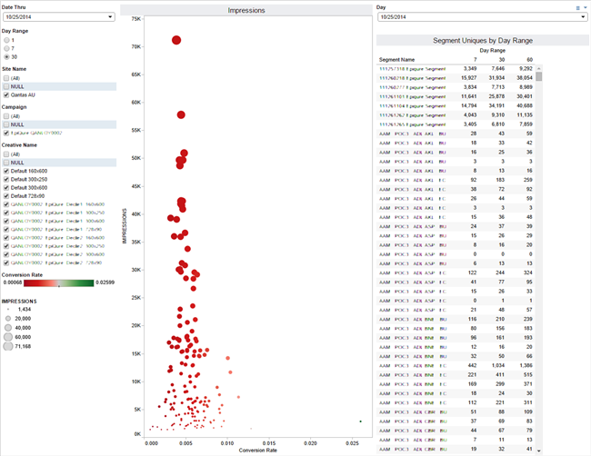

# Rapport om leverans och prestanda{#delivery-and-performance-report}

Returnerar segmentnivådata om visningar och klickfrekvens.

<!-- 

c_delivery_reports.xml

 -->

Med hjälp av [!UICONTROL Delivery and Performance] rapporten kan du utvärdera hur segment fungerar på olika annonsörwebbplatser. Den här rapporten är ett optimeringsverktyg som hjälper dig att:

* Identifiera högpresterande segment för återanvändning i andra kampanjer eller på andra webbplatser.
* Hitta och ta bort segment från underpresterande webbplatser.
* Analysera segmentens visningsstorlek och klickfrekvens visuellt.

>[!NOTE]
>
>Dagsvyer uppdateras dagligen. 7-dagars och 30-dagars summeringsperioder uppdateras varje vecka.

Markera en enskild punkt om du vill visa datainformation i ett popup-fönster. Du kan också klicka och dra markören över en grupp punkter om du bara vill returnera data om dessa dataelement. Dessa åtgärder uppdaterar automatiskt rapportresultaten.

## Fält för leverans- och prestandadata har definierats {#field-definitions}

Beskriver de mått som visas i popup-fönstret när du klickar på en enskild datapunkt.

<!-- 

r_delivery_data_pop.xml

 -->

Popup-fönstret för leverans- och resultatrapporten innehåller följande mått:

| Mått | Beskrivning |
|---|---|
| **[!UICONTROL Date Range Start]** | Startdatum som används av rapporten. |
| **[!UICONTROL Date Range End]** | Slutdatum som används av rapporten. |
| **[!UICONTROL Segment ID]** | Unikt numeriskt ID för det segmentet. |
| **[!UICONTROL Segment Name]** | Segmentets namn. |
| **[!UICONTROL Clicks]** | Antal klipp som spelats in för det segmentet. |
| **[!UICONTROL Impressions]** | Antal inspelade visningar för det segmentet. |
| **[!UICONTROL Reach]** | Antal unika besökare. |
| **[!UICONTROL Click Through]** | Antal gånger en besökare klickat på en annons. |

>[!MORELIKETHIS]
>
>* [Förbättra bearbetningstiden för loggfiler med uppslagstabeller](../../reporting/dynamic-reports/lookup-tables.md)
>* [Filtrera rapportresultat med datareglagen](../../reporting/dynamic-reports/data-sliders.md)
>* [Fält för leverans- och prestandadata har definierats](../../reporting/dynamic-reports/delivery-performance-report.md#field-definitions)
>* [Former, färger och storlekar som används i interaktiva rapporter](../../reporting/dynamic-reports/interactive-report-technology.md#shapes-colors-sizes)

