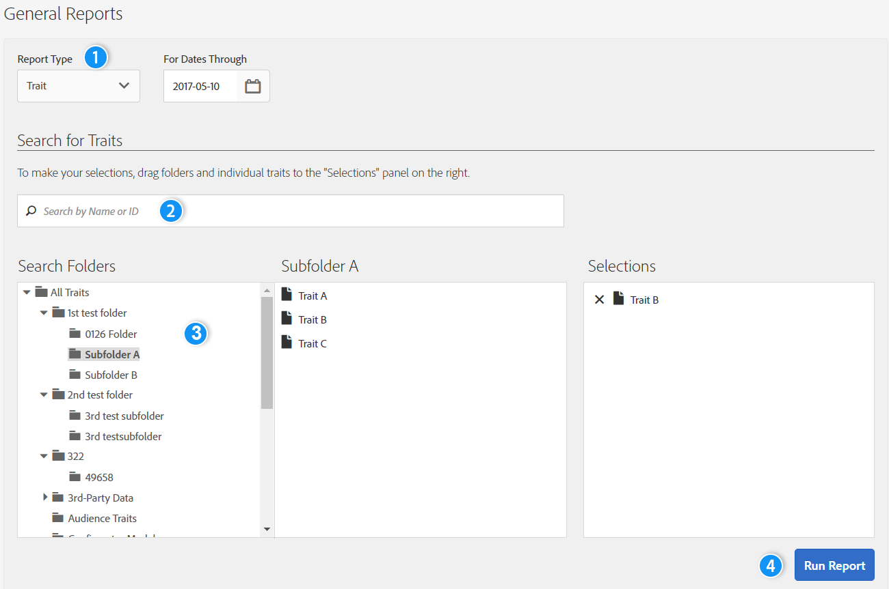

# Allmänna rapporter{#general-reports}

En [!UICONTROL General]-rapport returnerar prestandadata för egenskaper, segment och mål.

## Översikt {#general-reports-overview}

<!-- 

c_general_reports.xml

 -->

[!DNL Audience Manager] använder [!UICONTROL Role Based Access Control] ([!UICONTROL RBAC]) för att utöka användargruppsbehörigheter till [!UICONTROL General]-rapporter. Användarna kan bara se de egenskaper och segment i rapporter som de har behörighet att visa. Med funktionen [!UICONTROL RBAC] kan du styra vilka rapportdata interna team kan visa. En byrå som till exempel hanterar olika annonsörkonton kan konfigurera användargruppbehörigheter så att ett team som hanterar Advertiser A:s konto inte kan se annonsörens B:s rapportdata.

Kör en [!UICONTROL General]-rapport när du behöver:

* Granska prestanda efter egenskaper, segment eller mål.
* Spåra visningar (totalt och unikt) med 1, 7, 14, 30, 60 och 90 dagars intervall.
* Granska totalt och unikt lastantal.
* Jämför egenskaper och segmentprestanda.
* Identifiera starka eller dåliga prestationsegenskaper och segment, analysera efterfrågan eller jämför lastnings-/branddata med tredjepartsrapporter.
* Exportera data (.csv-format) för vidare analys och delning.

Följande bild ger en översikt på hög nivå över nyckelelement i rapporten [!UICONTROL General].

1. Konfigurera följande alternativ:

   * **Rapporttyp:** Välj önskad rapporttyp (Trait, Segment eller Destination).

   * **För datum till:** Ange datumintervallet för rapporten.

2. Sök efter ett varumärke, segment eller mål efter namn eller ID.
3. Dra och släpp de egenskaper, segment eller mål som du vill rapportera i mapplistan till panelen [!UICONTROL Selections] till höger.
4. Generera rapporten som ska visas i en exporterbar rapport.

## Kör en allmän rapport {#run-general-report}

I det här avsnittet beskrivs hur du kör en [!UICONTROL General]-rapport och anger tid och andra prestandaalternativ.

<!-- 

t_run_general_report.xml

 -->

1. Klicka på **[!UICONTROL General Reports]** på kontrollpanelen **[!UICONTROL Analytics]**.
1. Välj önskad typ i listrutan **[!UICONTROL Report Type]**: Trait, Segment eller Destination.
1. *Villkorlig* Klicka i datumrutan för att visa en kalender och välj sedan slutdatumet för rapporten om du vill ange ett annat datum än dagens.
1. Sök efter ett varumärke, segment eller mål efter namn eller ID.
1. Dra och släpp de egenskaper, segment eller mål som du vill rapportera i mapplistan till panelen [!UICONTROL Selections] till höger.
1. Klicka på **[!UICONTROL Run Report]**.

   Resultaten visas i en tabell som kan exporteras. Klicka på kolumnrubrikerna för att sortera resultaten i stigande eller fallande ordning.
1. Välj önskad alternativknapp längst upp i rapporten om du vill filtrera data efter prestanda ( [!UICONTROL Unique Trait Realizations], [!UICONTROL Total Trait Realizations] eller [!UICONTROL Total Trait Population]) eller efter tid (1, 7, 14, 30, 60 eller 90-dagarsintervall).

   >[!NOTE]
   >
   >[!UICONTROL Total Trait Realizations] beräknas endast för [!UICONTROL Rule-based Traits].

1. *Valfritt* Klicka **[!UICONTROL Export to CSV]**. Detta exporterar [!UICONTROL Unique Trait Realizations], [!UICONTROL Total Trait Realizations] och [!UICONTROL Total Trait Population] för alla dagintervall.

## Allmänna rapportresultat förklaras {#general-reports-explained}

Numren i [!UICONTROL General Reports] genereras direkt från [!UICONTROL User Profile Store]. Resultaten avspeglar antalet användare som [!DNL Audience Manager] fanns i serverdelen när dessa rapportnummer genererades.

* Dessa siffror inkluderar inte besökar-ID:n med mycket trafik. Trafik från bottar filtreras innan den når vårt serverdelssystem. Dessutom ignoreras viss robottrafik under en veckas rensningsjobb som körs i serverdelen.
* Om du bäddar in data via inkommande bearbetning som är avaktiverad för [!DNL Audience Manager] UUID, och dessa ID:n omfattar användare som inte längre är aktiva i vårt system, kommer dessa inaktiva [!DNL Audience Manager] UUID:n aldrig att nå [!UICONTROL User Profile Store] och rapporteras inte.
* [!UICONTROL Total Trait Realizations] beräknas endast för [!UICONTROL Rule-based Traits].

## Resultat av allmänna rapporter för egenskaper {#general-report-results-traits}

Filtren nedan är tillgängliga när du kör en allmän rapport och väljer **[!UICONTROL Trait]** som rapporttyp.

Vid filtrering av resultaten efter [!UICONTROL Device ID]:

* [!UICONTROL Unique Trait Realizations] är antalet anonyma enhetsbesökare som har lagt till egenskapen i sin profil inom det valda tidsintervallet.
* [!UICONTROL Total Trait Realization] är det totala antalet anonyma trait-realiseringar inom det valda tidsintervallet.
* [!UICONTROL Total Trait Population] är antalet anonyma enhetsbesökare som har den här egenskapen i sin profil.

Vid filtrering av resultaten efter [!UICONTROL Cross-Device ID]:

* [!UICONTROL Unique Trait Realizations] är antalet autentiserade besökare som har lagt till egenskapen i sin profil inom det valda tidsintervallet.
* [!UICONTROL Total Trait Realization] är det totala antalet autentiserade trait-realiseringar inom det valda tidsintervallet.
* [!UICONTROL Total Trait Population] är antalet autentiserade besökare som har den här egenskapen i sin profil.

<!-- 
### Unique Trait Realizations

This metric represents the unique number of [Audience Manager Unique User IDs (UUID)](../reference/ids-in-aam.md) that qualified for the trait in your selected time range. For example, if a user visited your homepage three times on 10/1, you would see one Unique Trait Realization.

### Total Trait Realizations

This metric represents the total amount of trait fires for the trait in your selected time range. For example, if a user visited your homepage, then navigated to your tech news and your sports news sections, they would appear in the General Report as three total trait realizations, and one unique trait realization.

### Total Trait Population

This metric represents the total amount of Audience Manager UUIDs that are currently qualified for the trait. Use this number to understand the total amount of users you could use for segmentation and targeting. Typically, users remain part of a trait for [120 days](../features/traits/create-onboarded-rule-based-traits.md#set-expiration-interval). For example, a user visiting your homepage three times today and never returning afterwards, would remain as a user in this population every day until 120 days from now. At the 120 day mark, they would be removed from the population. Read our [Trait and Segment Qualification Reference](../features/traits/trait-and-segment-qualification-reference.md) for more examples on the difference between Unique Trait Realizations and Total Trait Population.

The illustration below shows the results of running a general report for the Trait report type. -->
<!-- 
 -->

## Resultat av allmänna rapporter för segment {#general-report-results-segments}

Mätvärdena nedan är tillgängliga när du kör en allmän rapport och väljer **[!UICONTROL Segment]** som rapporttyp:

### Segmentpopulering i realtid

Detta mått visar det faktiska antalet unika besökare som har setts i realtid i det angivna tidsintervallet och som var kvalificerade för segmentet när de sågs av Audience Manager.

### Total segmentpopulation

Det här måttet representerar det totala antalet Audience Manager-UID:n som är kvalificerade för segmentet inom den summeringsperiod som du har valt. Den totala segmentpopulationen på en dag representerar den mest korrekta användarbasen för målinriktning.

>[!NOTE]
>
>Välj **[!UICONTROL Include Destination Mappings]** om du vill visa en uppdelning av segmentpopulationen för aktiverade destinationer.

Bilden nedan visar resultatet av att köra en allmän rapport för rapporttypen Segment.

## Allmänna rapportresultat för destinationer {#general-report-results-destinations}

Mätvärdena nedan är tillgängliga när du kör en allmän rapport och väljer **[!UICONTROL Destination]** som rapporttyp:

**Population av realtidssegment**

Detta mått visar det faktiska antalet unika besökare som har setts i realtid i det angivna tidsintervallet och som var kvalificerade för segmentet när de sågs av Audience Manager.

**Total segmentpopulation**

Det här måttet representerar det totala antalet Audience Manager UID som tillhör ett segment inom summeringsperioden och som skickades till ett mål.

Bilden nedan visar resultatet av att köra en allmän rapport för rapporttypen Destinationer.

