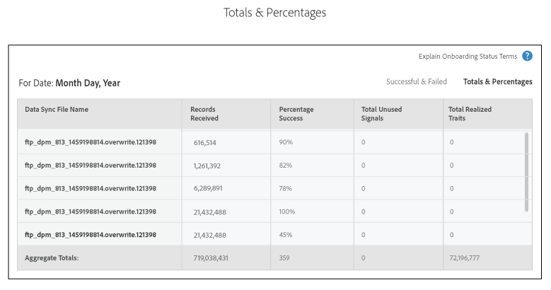
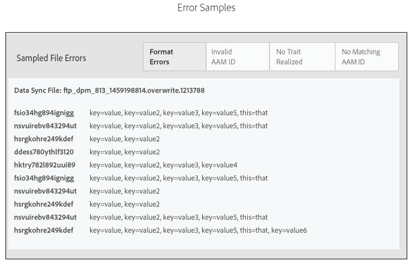

# Statusrapport för introduktion{#onboarding-status-report-about}

Statusrapporten för introduktion kontrollerar om det går att bearbeta poster i dina inkommande datakällfiler och om de misslyckas. Den här rapporten visar data i ett interaktivt stapeldiagram och ger sammanfattningsvärden i tabellform. Dessutom innehåller det ett alternativ som samplar filer för ett fast tidsintervall och visar de vanligaste felen för varje feltyp. Den här rapporten finns i Analytics > Onboarding Status Report. Den här rapporten är också tillgänglig när du skapar en inkommande datakälla.

>[!NOTE]
>
>Det är bara användare med administratörsbehörighet som kan se den här rapporten i Audience Manager användargränssnitt. Du kan låta användare som inte är administratörer informeras om status för de överförda inkommande filerna genom att lägga till deras e-postmeddelanden i rapporten. Se [Ta emot e-postmeddelanden](/help/using/reporting/onboarding-status-report.md#receive-email-notifications).

## Statusrapport för introduktion: Om {#onboarding-status-about}

[!UICONTROL Onboarding Status Report] kontrollerar om det går att bearbeta poster i dina inkommande datakällfiler. Den här rapporten visar data i ett interaktivt stapeldiagram och ger sammanfattningsvärden i tabellform. Dessutom innehåller det ett alternativ som samplar filer för ett fast tidsintervall och visar de vanligaste felen för varje feltyp. Den här rapporten finns i **[!UICONTROL Analytics > Onboarding Status Report]**. Den här rapporten är också tillgänglig när du skapar en inkommande datakälla.

## Felrapportering och felsampling {#error-reporting-sampling}

Felrapportering och felsampling är två separata funktioner i [!UICONTROL Onboarding Status]-rapporten.

<table id="table_4706D891D4C545E8BF9D8A0CC052CC48"> 
 <thead> 
  <tr> 
   <th colname="col1" class="entry"> Funktion </th> 
   <th colname="col2" class="entry"> Beskrivning </th> 
  </tr> 
 </thead>
 <tbody> 
  <tr> 
   <td colname="col1"> 
 <b>Felrapportering</b> 
 </td>
   <td colname="col2"> 
Felrapportering visar hur många lyckade och misslyckade poster som har bearbetats i en inkommande datakälla. Den returnerar data i ett interaktivt staplat stolpdiagram och som sammanfattningsmått i tabeller nedanför diagrammet. 
 
Felrapporteringen sker automatiskt. Den körs kontinuerligt för alla dina inkommande datakällor. Returnerar data baserat på intervallet med förinställda tidsintervall eller ett anpassat tidsintervall som du anger med en kalenderwidget. 
 </td> 
  </tr> 
  <tr> 
   <td colname="col1"> 
 <b>Felsampling</b> 
 </td>
   <td colname="col2"> 
Felsampling tolkar innehållet i datafilerna och returnerar de 10 vanligaste felen för varje feltyp. Felen i dina inkommande datafiler förhindrar att enskilda poster bearbetas. Använd den här rapporten som ett felsökningsverktyg för att minska antalet filfel och förbättra bearbetningsfrekvensen. 
 
Du måste aktivera felsampling manuellt. Den varar i 14 dagar från aktiveringsdagen och stänger sedan av sig själv. Du kan aktivera felsampling igen när 14-dagarsintervallet har gått ut. Du aktiverar felsampling när du <a href="../features/manage-datasources.md#create-data-source"> skapar en inkommande datakälla </a> eller genom att markera kryssrutan <b> Felsampling </b> i avsnittet  Data-Source-inställningar  i en befintlig inkommande datakälla. 
 
Felsampling är en beräkningsintensiv process. Därför returneras endast de första 10 felen för varje felkategori. Den är inte utformad för att returnera alla fel i en inkommande datakälla. Dessa fel är ett representativt urval av en potentiellt större grupp av liknande fel. Granska hela filen för de typer av fel som den här rapporten flaggar, formatera om filen och skicka in den igen. 
 
Mer information om hur du formaterar en datafil för en inkommande datakälla finns i <a href="../integration/sending-audience-data/batch-data-transfer-explained/inbound-file-contents.md"> Innehåll i den inkommande datafilen: Syntax, Variables och Examples</a>. 
 </td> 
  </tr> 
 </tbody> 
</table>

## Felrapportstapeldiagram {#error-report-bar-chart}

I felrapporten visas ett diagram över lyckade och misslyckade resultat för postbearbetning i ett staplat stolpdiagram, vilket visas i följande exempel. Diagrammet är interaktivt. Om du klickar på ett fält visas sammanfattningsmått för den dagen i en tabell nedanför diagrammet.

## Felrapporttabeller {#error-report-tables}

I felrapporten visas tabelldata under stapeldiagrammet. Tabellen visar antalet lyckade och misslyckade samt summor och procent.

**Slutförda och misslyckade poster**

I den här standardvyn visas antalet frekvenser för de totala posterna i rapporten och en beskrivning av felen per feltyp.

**Summor och procent**

Klicka på **[!UICONTROL Totals & Percentages]** för att se vilka % av dina filer som har bearbetats.

## Provtagningsrapport för 14 dagar {#error-reporting-14-days}

När felsamplingen är aktiv visas de 10 vanligaste felen för varje feltyp i rapporten. Klicka på en feltypsknapp högst upp i rapporten för att se alla uppsättningar exempeldata.

>[!NOTE]
>
>Rapporten visar inte postfel i den aktuella versionen. Om du vill hitta och åtgärda filfel bör du granska resultaten och jämföra dem med specifikationerna i dokumentationen för [inkommande datafiler](../integration/sending-audience-data/batch-data-transfer-explained/inbound-file-contents.md).

## Ta emot e-postmeddelanden {#receive-email-notifications}

Du kan lägga till e-postadresserna till de mottagare som du vill ska meddelas om status för de överförda inkommande filerna. Observera att du kan välja olika mottagare för olika datakällor.

## Skapa en statusrapport för introduktion {#create-onboard-status-report}

En [!UICONTROL Sample Error Report] returnerar antalet poster i en datakälla som bearbetades och hur många som misslyckades. Följ de här stegen för att skapa en [!UICONTROL Sample Error Report].

<!-- 

create-onboarding-status-report.xml

 -->

1. Gå till **[!UICONTROL Analytics > Onboarding Status Report]**. Sök efter en datakälla eller välj en i listan.

2. Välj ett datumintervall. Alternativen är:

   * En uppsättning fasta rapportintervall.
   * Kalenderwidgetar som gör att du kan skapa ett anpassat datumintervall.

3. Klicka på **[!UICONTROL OK]**.

## Villkor och definitioner för introduktionsstatusrapport {#report-terms-conditions}

En referenshandbok för de etiketter och termer som används i den här rapporten.

<table id="table_1D44A2E6B4C847848B818190DD336841"> 
 <thead> 
  <tr> 
   <th colname="col1" class="entry"> Villkor </th> 
   <th colname="col2" class="entry"> Definition </th> 
  </tr> 
 </thead>
 <tbody> 
  <tr> 
   <td colname="col1"> 
 <b>Namn på datasynkroniseringsfil</b> 
 </td> 
   <td colname="col2"> 
Visar filer som  Audience Manager har tagit emot och bearbetat från den valda inkommande datakällan. 
 
Filbearbetning misslyckas om filnamnet är felaktigt formaterat. Filnamnskraven varierar beroende på hur du skickar dessa data till  Audience Manager. Leveransmetoderna är  Amazon S3 och FTP. Instruktioner om hur du namnger filer finns i: 
 
 
     <ul id="ul_9A32906A14CA41C5AED0E13930DB31BA"> 
      <li id="li_A5A0E6ED711D4002B52092619F87C7D6"> <a href="../integration/sending-audience-data/batch-data-transfer-explained/inbound-s3-filenames.md"> Amazon S3-namnkrav för inkommande datafiler </a> </li> 
     </ul> 
 </td> 
  </tr> 
  <tr> 
   <td colname="col1"> 
 <b>Formatfel</b> 
 </td> 
   <td colname="col2"> 
Visar antalet poster som inte kunde bearbetas eftersom de inte matchade syntax- eller formateringskraven. Mer information om hur du formaterar data finns i <a href="../integration/sending-audience-data/batch-data-transfer-explained/inbound-file-contents.md"> Innehåll i den inkommande datafilen: Syntax, Variables och Examples</a>. 
 </td> 
  </tr> 
  <tr> 
   <td colname="col1"> 
 <b>Ogiltigt AAM-ID</b> 
 </td> 
   <td colname="col2"> 
Visar antalet felaktigt formaterade  Audience Manager-användar-ID:n (UUID). Vanligtvis anger detta ID: 
 
    <ul id="ul_8304250E8F0F44918A50CF9D8D8D1F83"> 
     <li id="li_B100B4C2623B4E099E022869A4978357">Matchade inte det förväntade 38-siffriga formatet. </li> 
     <li id="li_44E8A9AD13174A20A5742E56ED786634">Innehåller bokstäver. ID:n ska endast vara siffror. </li> 
    </ul> </td> 
  </tr>

<tr> 
   <td colname="col1"> 
 <b>Ogiltigt enhets-ID</b> 
 </td> 
   <td colname="col2"> 
Visar antalet felaktigt formaterade globala enhets-ID:n. Se <a href="../reference/ids-in-aam.md">Index för ID:n i Audience Manager</a> och <a href="../features/global-data-sources.md"> Globala datakällor</a> för mer information om hur enhets-ID ska formateras och vilka globala datakällor du ska använda, baserat på enhetstyp.

  
Felsamplingsavsnittet i rapporten innehåller detaljerad information om ogiltiga enhets-ID, som:

   <ul>
    <li>Datakällans ID som motsvarar ogiltigt enhets-ID.</li>
    <li>Ogiltigt enhets-ID;</li>
    <li>Typen av förväntat enhets-ID, baserat på datakällan.</li>
   </ul>
  </tr>

<tr> 
   <td colname="col1"> 
 <b>Inget matchande AAM-ID</b> 
 </td> 
   <td colname="col2"> 
Dessa är inbyggda ID:n  Audience Manager kan inte matcha ett befintligt ID. Inbyggda ID:n kan ha den här statusen när  Audience Manager ännu inte har utfört någon ID-synkronisering eller den fortfarande inte kan matcha ID:t även efter en synkronisering. 
 
För omatchade mobil-ID:n kommer  Audience Manager att: 
 
    <ul id="ul_B0D6AF9EB27D4017B35E36824B403879"> 
     <li id="li_D141000A50D3463182CBA4571DCC5373">Fortsätt lagra och försök synkronisera detta ID. </li> 
     <li id="li_2EFCEE716F254ABCBC5FBF749B7564E6">Registrera det som en  lagrad post  i rapporten om ID:t inte kan synkroniseras. </li> 
    </ul> 
Om din onboardfil innehåller mobila ID:n kan du behandla dessa siffror lite mer lätt än de andra måtten. De påverkar inte framgången och matchningsfrekvensen för efterföljande filer. 
 </td> 
  </tr> 
  <tr> 
   <td colname="col1"> 
 <b>Inget fack realiserat</b> 
 </td> 
   <td colname="col2"> 
Visar egenskaper som  Audience Manager inte kan matcha mot en introducerad egenskap. Detta kan bero på följande: 
 
    <ul id="ul_43619035AB6641B6949302FB50BDB5B1"> 
     <li id="li_D4C6306BF2B143198108702B309CE8CF">Felaktigt formaterade egenskaper i den inkommande datafilen. Mer information om hur du formaterar datafilen finns i <a href="../integration/sending-audience-data/batch-data-transfer-explained/inbound-file-contents.md"> Innehåll i den inkommande datafilen: Syntax, Variables och Examples</a>. </li> 
     <li id="li_A1C708A007D24EE09B7C629AFC6E43C3">Fällar som ännu inte har definierats i  Audience Manager. </li> 
    </ul> </td> 
  </tr> 
  <tr> 
   <td colname="col1"> 
 <b>Procent klart</b> 
 </td> 
   <td colname="col2"> 
Procentandelen poster i filen som har lagrats utan fel. Procent lyckade = poster bearbetade / antal poster i en fil. 
 </td> 
  </tr> 
  <tr> 
   <td colname="col1"> 
 <b>Mottagna poster</b> 
 </td> 
   <td colname="col2"> 
Det totala antalet mottagna poster. I de flesta fall bör det här antalet matcha det totala antalet poster (rader) i den inkommande datafilen. 
 </td> 
  </tr> 
  <tr> 
   <td colname="col1"> 
 <b>Lagrade poster</b> 
 </td> 
   <td colname="col2"> 
Antal poster som lagrats utan fel. På grund av filformatsfel kanske vissa av de mottagna posterna inte lagras av  Audience Manager. Antalet lagrade poster kan vara mindre än antalet mottagna poster. 
 </td> 
  </tr> 
  <tr> 
   <td colname="col1"> 
 <b>Totalt antal realiserade egenskaper</b> 
 </td> 
   <td colname="col2"> 
Antalet egenskaper för alla användare för alla inkommande filer som lagras på  Audience Manager -plattformen. 
 </td> 
  </tr> 
  <tr> 
   <td colname="col1"> 
 <b>Totalt antal oanvända signaler</b> 
 </td> 
   <td colname="col2"> 
Totalt antal oanvända signaler som tagits emot i rapporten. Summan baseras på det totala antalet poster som lagrats. 
 
Se <a href="../reporting/dynamic-reports/unused-signals.md"> Rapport om oanvända signaler </a> för mer information. 
 </td> 
  </tr> 
 </tbody> 
</table>
