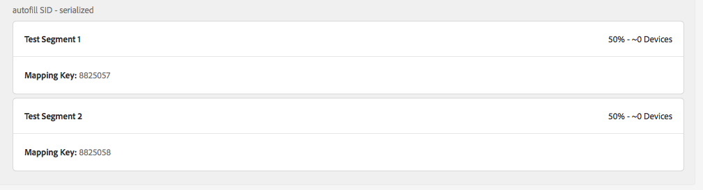

# Ska jag visa mappade segment för Audience Lab på sidan med målinformation? {#audience-lab-segments-destination-page}

## Fråga

Jag har skapat några testsegment i [!UICONTROL Audience Lab]och mappat dem till en destination. Men när jag söker efter dem på sidan med målinformation kan jag inte se dem.

Förväntas detta beteende eller är detta ett fel?

## Svar

Mappade segment som skapas inom [!UICONTROL Audience Lab] visas inte på sidan med målinformation.

I skärmbilderna nedan [!UICONTROL Test Segment 1] och [!UICONTROL Test Segment 2] mappas till [!UICONTROL autofill SID - serialized] målet.

Segmenten visas i segmenttestet Audience Lab:

Segmenten visas dock inte på sidan med målinformation:

